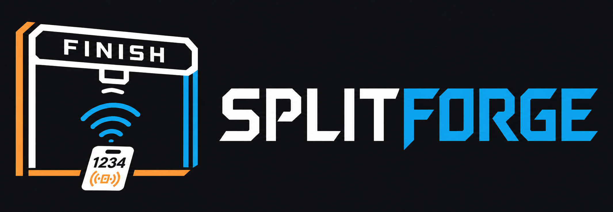

# SplitForge

<div align="center">
  
</div>

Offline-first, open-source race timing software written in Rust, built to run at a race
checkpoint on a Raspberry Pi.

> ### Status: pre-alpha — simulated events only
>
> The data path works end to end **against a synthetic reader**: reads are journalled
> durably, deduplicated into crossings, and emitted as JSON. **No RFID reader has been
> tested, and there is no results or scoring layer yet.** Do not use SplitForge to time a
> real event.
>
> Milestones [0](docs/roadmap.md#milestone-0--project-charter) and
> [1](docs/roadmap.md#milestone-1--simulation-first-vertical-slice) are complete.
> Milestone 3 is gated on physical hardware — see
> [hardware support](docs/hardware-support.md).

## What SplitForge is

SplitForge connects to RFID readers on the local network, records every chip read as
immutable evidence, and derives timing events and results from that evidence. It is
designed so that a race can be timed end to end with **no Internet connection**, on
hardware an organizer can carry to a trailhead in a backpack.

The core promise is narrow and deliberate:

> Every read the reader gives us is written down, exactly once, before anything else
> happens to it — and nothing that happens later can rewrite it.

Results, placements, and exports are all *derived* from that journal. If the scoring
rules were wrong, you re-derive. You never lose the underlying evidence.

## What SplitForge does

- Connects to networked RFID readers, starting with **LLRP**-capable models
- Persists every raw read locally to an append-only journal (SQLite, WAL mode)
- Maps chip identifiers to participants and bibs
- Applies configurable deduplication, checkpoint, and lap logic
- Supports manual entries and auditable correction workflows
- Produces immutable provisional and final **result revisions**
- Exports versioned CSV and JSON
- Optionally publishes to downstream services such as RaceDay Connect

## What SplitForge is not

These are non-goals, not "later" features. They are excluded on purpose:

| Not this | Why |
|---|---|
| A cloud service | Race day happens where there is no signal. Nothing on the read path may require the Internet. |
| A registration or payments platform | Different problem, different failure modes, different compliance burden. |
| A participant-facing mobile app | Out of scope. Exports and integrations serve that need. |
| A general RFID middleware layer | SplitForge targets race timing, not warehouse or retail RFID. |
| A RaceDay Connect client | RaceDay Connect is an **optional downstream integration**. SplitForge must be fully useful without it. |

SplitForge also will not claim support for a reader vendor or model until that physical
device has been tested against it. See [`docs/hardware-support.md`](docs/hardware-support.md)
for the current (empty) support matrix.

## Local-first promise

Four rules constrain every design decision in this repository:

1. **Offline first.** The Pi must run an entire event with no Internet access. Network
   connectivity is for optional sync, updates, and post-race publication — never for
   recording a read.
2. **Local ownership.** Each edge deployment owns its event database outright. No cloud
   credential, remote API, or third-party availability sits on the critical read path.
3. **Raw-read immutability.** Reads are evidence. They are stored before deduplication or
   scoring, and never rewritten. Corrections create new derived records.
4. **Hardware independence.** The timing engine only ever sees a normalized `RawRead`. It
   does not know LLRP exists.

## Expected hardware

| Component | First target |
|---|---|
| Compute | Raspberry Pi 3 Model B/B+, 64-bit Raspberry Pi OS |
| Build target | `aarch64-unknown-linux-gnu` |
| Storage | High-endurance microSD (A2 or better); USB SSD recommended for multi-day use |
| Network | **Wired Ethernet preferred.** On the Pi 3, Ethernet is routed over USB 2.0 — adequate for reader traffic, but race-day Wi-Fi is the bigger risk |
| Power | External battery/UPS with clean shutdown. Power loss during a write is an expected event, not an edge case |
| Clock | **DS3231 RTC strongly recommended; GPS + PPS recommended.** The Pi 3 has no battery-backed clock, and offline-first means no NTP — see [clock and time discipline](docs/clock-and-time-discipline.md) |
| Reader | One LLRP-capable networked RFID reader — **model TBD, none validated yet** |

## Documentation

| Document | What it covers |
|---|---|
| [Architecture](docs/architecture.md) | System context, crate boundaries, data flow, failure behavior |
| [Timing model](docs/timing-model.md) | Entities, timestamp semantics, dedup policy, result revisions, auditability |
| [Clock and time discipline](docs/clock-and-time-discipline.md) | Accuracy budgets, clock domains, GPS/RTC hardware, offset and drift measurement |
| [Roadmap](docs/roadmap.md) | Milestones 0–6 and their exit criteria |
| [Threat model](docs/threat-model.md) | Security and operational risk register |
| [Hardware support](docs/hardware-support.md) | Reader support matrix and validation requirements |
| [Open questions](docs/open-questions.md) | Decisions that need an owner, not a guess |
| [CI](docs/ci.md) | What CI checks, and what it deliberately cannot prove |
| [ADRs](docs/adr/) | Architecture decision records |

## Development quick start

Requires a current stable Rust toolchain (edition 2024, MSRV 1.85).

```bash
git clone git@github.com:truppelli/splitforge.git
cd splitforge

# Build and test everything
cargo test --workspace

# Formatting and lints, exactly as CI runs them
cargo fmt --all --check
cargo clippy --workspace --all-targets -- -D warnings
```

### Time a simulated race

No hardware, no network, no configuration. The simulator speaks the same `ReaderProvider`
port a real reader will, so nothing downstream can tell the difference.

```bash
# A 5K: 12 entrants over a start mat and a finish mat, one of them a DNF,
# plus one chip that is not on the roster.
cargo run --bin splitforge -- simulate --database event.db --fixture five-k

# Every read, exactly as recorded — hundreds of them, one crossing each.
cargo run --bin splitforge -- reads --database event.db --limit 5

# What the engine concluded from that evidence.
cargo run --bin splitforge -- accepted --database event.db --fixture five-k
```

```json
{
  "at": "2026-04-11T08:17:32.249Z",
  "checkpoint": "finish",
  "chip": "E28011606000020000000104",
  "bib": "104",
  "name": "Runner 104",
  "lap": 1,
  "burst_reads": 15,
  "rssi_dbm": -60,
  "source_raw_read": "16cde1ce-0c1f-4be8-b075-1e3ee2496457"
}
```

One crossing, fifteen raw reads behind it, and a pointer back to the read that was
credited. All fifteen are still in the journal, and each of the fourteen that were not
credited says which rule suppressed it.

The other fixture is `--fixture multi-lap`, a four-lap criterium including a rider who
loiters beside the mat and must **not** be credited with a 45-second lap.

Run `simulate` twice against the same database and the sequence continues rather than
restarting; run `derive` in any process afterwards and it reaches the same conclusions,
identifiers included.

### Cross-compiling for the Pi

```bash
rustup target add aarch64-unknown-linux-gnu
sudo apt-get install -y gcc-aarch64-linux-gnu   # linker, see .cargo/config.toml

cargo build --release --target aarch64-unknown-linux-gnu -p splitforge-edge
```

Cross-compilation catches build failures. It does **not** validate reader behavior,
storage performance, or recovery under power loss — only running on real hardware does.

## Workspace layout

```text
crates/
  splitforge-domain      Pure domain types, invariants, and port traits. No I/O.
  splitforge-storage     SQLite schema, migrations, repositories, backups
  splitforge-reader      Reader provider trait and normalized reader messages
  splitforge-llrp        LLRP implementation; isolated binary parsing and reconnect
  splitforge-engine      Read acceptance, dedup, participant assignment, checkpoints
  splitforge-results     Result revisions, ranking, DNF/DNS/DQ handling
  splitforge-export      CSV and JSON export contracts
  splitforge-api         Local REST API and status stream
  splitforge-sync        Opt-in outbound integrations
  splitforge-cli         Config, diagnostics, exports, backup/restore, admin
  splitforge-testkit     Fixtures and test doubles
apps/
  splitforge-edge        Raspberry Pi production service (composition root)
  splitforge-simulator   Synthetic readers and race scenarios
```

`domain`, `reader`, `storage`, `engine`, `simulator`, `testkit`, and `cli` have content.
`llrp`, `results`, `export`, `api`, `sync`, and `edge` are still empty — see the
[roadmap](docs/roadmap.md) for when each lands.

The dependency rules between them come from
[ADR-0001](docs/adr/0001-rust-workspace.md) and are **enforced by the test suite**, not by
review ([ADR-0012](docs/adr/0012-architecture-rules-enforced-by-tests.md)).

## Contributing

See [CONTRIBUTING.md](CONTRIBUTING.md). Security reports go through
[SECURITY.md](SECURITY.md), not public issues.

## License

**GPL-3.0-or-later** — see [LICENSE](LICENSE) and
[ADR-0007](docs/adr/0007-license-selection.md).

Copyleft is a deliberate choice for timing software: an organizer running SplitForge at an
event should always be able to obtain, inspect, and modify the source of the system that
produced their results.
