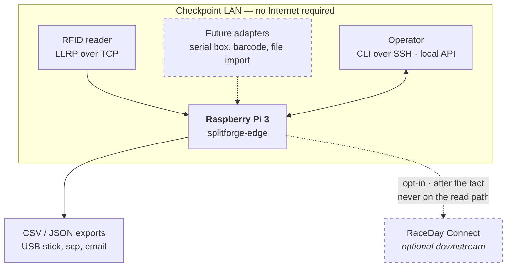
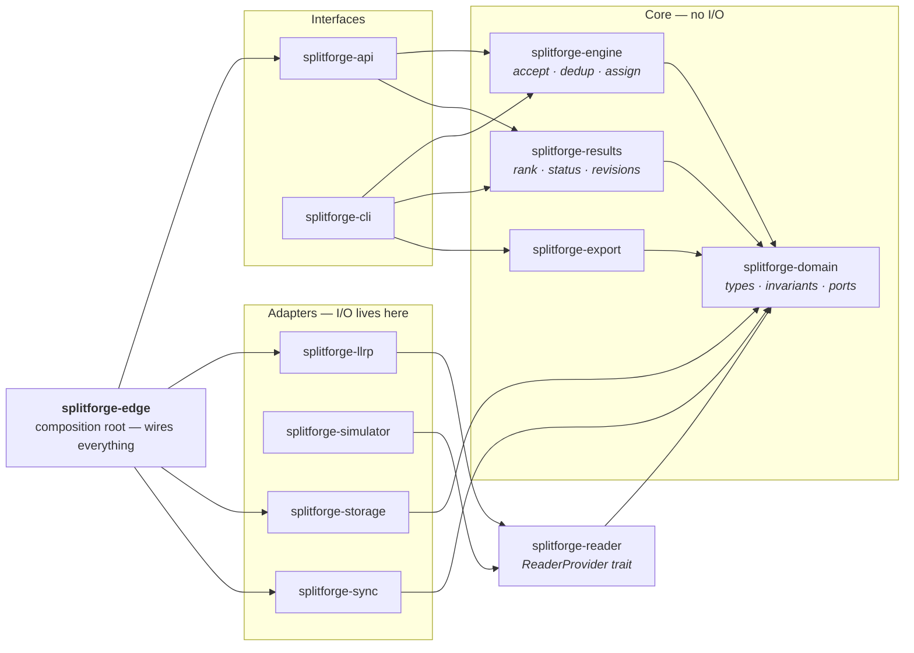
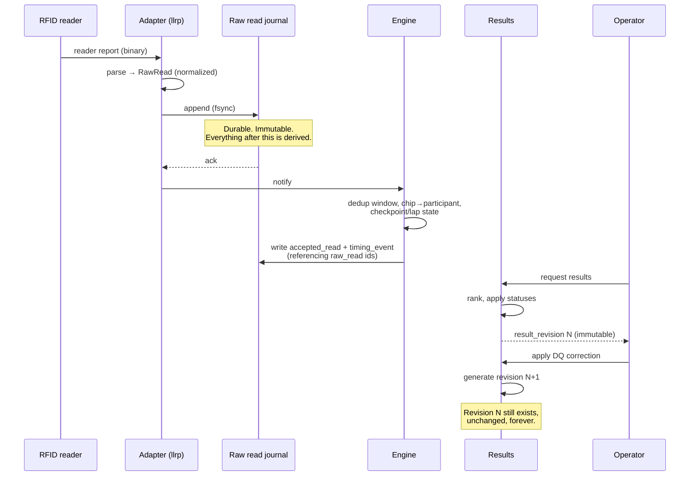

# SplitForge Architecture

> Status: partly implemented. `domain`, `reader`, `storage`, `engine`, `simulator`,
> `testkit`, and `cli` exist; `llrp`, `results`, `export`, `api`, `sync`, and `edge` are
> still empty — see the [roadmap](roadmap.md). Decisions marked **OPEN** are tracked in
> [open-questions.md](open-questions.md).

## 1. System context

SplitForge runs on a Raspberry Pi at a checkpoint. Everything inside the dashed boundary
must keep working with the uplink unplugged.



The single most important property of this diagram: **there is no arrow into the read
path from outside the dashed box.** A read is recorded because a reader sent it and the
local disk accepted it. Nothing else participates.

## 2. Component boundaries



### Dependency rules

| Crate | May depend on | Must never depend on |
|---|---|---|
| `splitforge-domain` | nothing in this workspace | any I/O crate, Tokio, SQLx, Axum |
| `splitforge-reader` | `domain` | any specific protocol crate |
| `splitforge-llrp` | `reader`, `domain` | `engine`, `storage`, `api` |
| `splitforge-storage` | `domain` | `engine`, `llrp`, `api` |
| `splitforge-engine` | `domain` | **`llrp`**, `api`, `sync` |
| `splitforge-results` | `domain` | `llrp`, `api`, `sync` |
| `splitforge-export` | `domain`, `results` | `llrp`, `storage` |
| `splitforge-api` | `domain`, `engine`, `results`, `export` | `llrp` |
| `splitforge-sync` | `domain`, `export` | `engine`, `llrp` |
| `splitforge-cli` | everything except `llrp` internals | — |
| `splitforge-testkit` | `domain`, `storage`, `reader` | — |
| `splitforge-edge` | everything | — |
| `splitforge-simulator` | `domain`, `reader` | `llrp` |

The rule that earns its keep is **`engine` must not depend on `llrp`**. It is what makes
a second reader protocol — or a serial timing box, or a barcode scanner, or a CSV import
of somebody else's reads — a new adapter rather than a rewrite.

These rules are **enforced**, not merely documented: `crates/splitforge-testkit/tests/dependency_rules.rs`
parses every member manifest and fails the test suite on a violation. See
[ADR-0012](adr/0012-architecture-rules-enforced-by-tests.md).

### Ports and adapters

`splitforge-domain` defines the traits; adapters implement them. Traits are not
dependencies, so the domain stays pure:

```rust
// splitforge-domain::ports (sketch — not yet implemented)
pub trait RawReadJournal {
    fn append(&self, read: &RawRead) -> Result<RawReadId, JournalError>;
}

pub trait ReaderProvider {
    fn subscribe(&self) -> impl Stream<Item = ReaderMessage>;
}
```

`splitforge-edge` is the only place that knows which concrete implementations exist. This
is also what makes `splitforge-simulator` a first-class citizen instead of a test hack:
it implements `ReaderProvider` and the engine cannot tell the difference.

## 3. Data flow



The ordering constraint is absolute: **the journal write completes before the engine is
told anything.** If the process dies between those two steps, the read survives and the
engine recomputes on restart. If they were reordered, a crash could produce a timing
event with no evidence behind it.

### Derivation is idempotent

Everything downstream of `raw_reads` is a pure function of (journal contents + policy
snapshot). Re-running derivation on the same inputs must produce the same outputs. This
is what makes crash recovery boring: on restart, re-derive from the journal and compare.

## 4. Failure behavior

| Failure | Expected behavior |
|---|---|
| Reader disconnects | Adapter reconnects with bounded exponential backoff, jittered. Journal untouched. Connection state exposed via health endpoint and `reader status` |
| Reader sends malformed data | Frame rejected, error counted and logged with a payload hash. **Process does not exit.** Raw bytes retained in diagnostic capture mode |
| Network uplink lost | No effect. Nothing on the read path uses it. Outbound sync queues to the local outbox |
| Power loss | SQLite WAL + `synchronous=FULL` on the journal write. Reads acknowledged before the cut are present after reboot |
| Disk full | Warn at a configurable threshold, refuse non-essential writes first (diagnostic captures, exports), keep the journal writable as long as possible, surface loudly |
| Database corruption | `splitforge doctor` runs integrity checks. Pre-race snapshot enables restore. **OPEN:** see [Q7](open-questions.md#q7-corruption-recovery-strategy) |
| Clock steps mid-race | Reads keep their reader timestamps. Device clock offset recorded per read so a step is visible in the audit trail rather than silently baked in |
| Operator error (wrong roster) | Roster import is versioned; re-import produces a new derivation, not a destroyed journal |
| RaceDay Connect unavailable | Nothing happens to timing. Outbox retries. Event completes normally |

### What "survived" means

A read is considered durable only after the journal append returns. The adapter must not
acknowledge, count, or forward a read before that point. Any metric that says "reads
received" and any metric that says "reads persisted" are different numbers, and the gap
between them is a monitored quantity.

## 5. The RaceDay Connect boundary

RaceDay Connect is an **optional, outbound, downstream** integration. This is an
architectural constraint, not a product preference:

- No SplitForge crate other than `splitforge-sync` may reference it
- `splitforge-sync` may not be a dependency of `engine`, `results`, or the read path
- Outbound messages are written to a local `outbox_messages` table and shipped
  asynchronously; failure to ship is a warning, never an error that blocks timing
- Credentials live in local config, are never required for startup, and their absence
  disables sync rather than the timer
- An event timed with sync disabled must produce byte-identical exports to one timed with
  it enabled

If SplitForge ever cannot time a race because RaceDay Connect is down, that is a P0 bug
in SplitForge, not an outage.

## 6. Deployment

```text
Raspberry Pi 3 · 64-bit Raspberry Pi OS
└── systemd
    └── splitforge-edge.service   Restart=always, After=network-online.target
        ├── /var/lib/splitforge/  event databases (append-only journal)
        ├── /etc/splitforge/      config, reader definitions
        └── /var/log/             tracing output via journald
```

Single service, single database, single machine. Multi-reader and multi-checkpoint
topologies are deliberately out of scope until one reader works reliably for a full event
— see the [roadmap](roadmap.md).

## 7. Technology choices

| Concern | Choice | Rationale |
|---|---|---|
| Async runtime | Tokio | Reader I/O, API, and sync are all concurrent I/O |
| Database | SQLite, WAL mode | Single device, transactional, no server. [ADR-0003](adr/0003-sqlite-wal-local-persistence.md) |
| SQLite crate | `rusqlite`, `bundled` | Thin and synchronous, so the durability contract stays legible. [ADR-0009](adr/0009-rusqlite-for-sqlite-access.md) |
| Serialization | Serde | — |
| CLI | Clap | — |
| CSV | `csv` | Roster and chip-assignment import. Deliberately not on the read path — nothing between a reader report and a durable write parses CSV |
| HTTP | Axum | Aligns with Tokio; local API only |
| Tracing | `tracing` + `tracing-subscriber` | Structured, journald-friendly |
| Time | `time`, UTC everywhere | Smaller surface, no local-time footgun. [ADR-0010](adr/0010-time-crate-for-timestamps.md) |
| Errors | `thiserror` in libs, `anyhow` at app boundaries | — |

No GUI framework. A local API plus a CLI is easier to test, deploy, recover, and drive
over SSH from a phone in a parking lot at 6 a.m. A browser console (`splitforge-web`) can
come later, consuming the same API.
