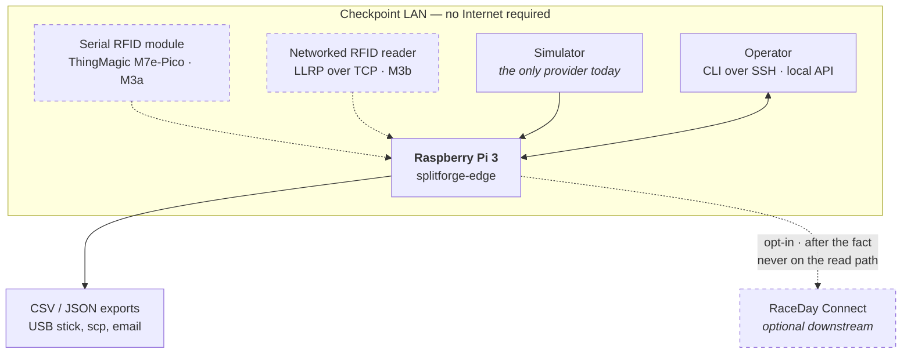
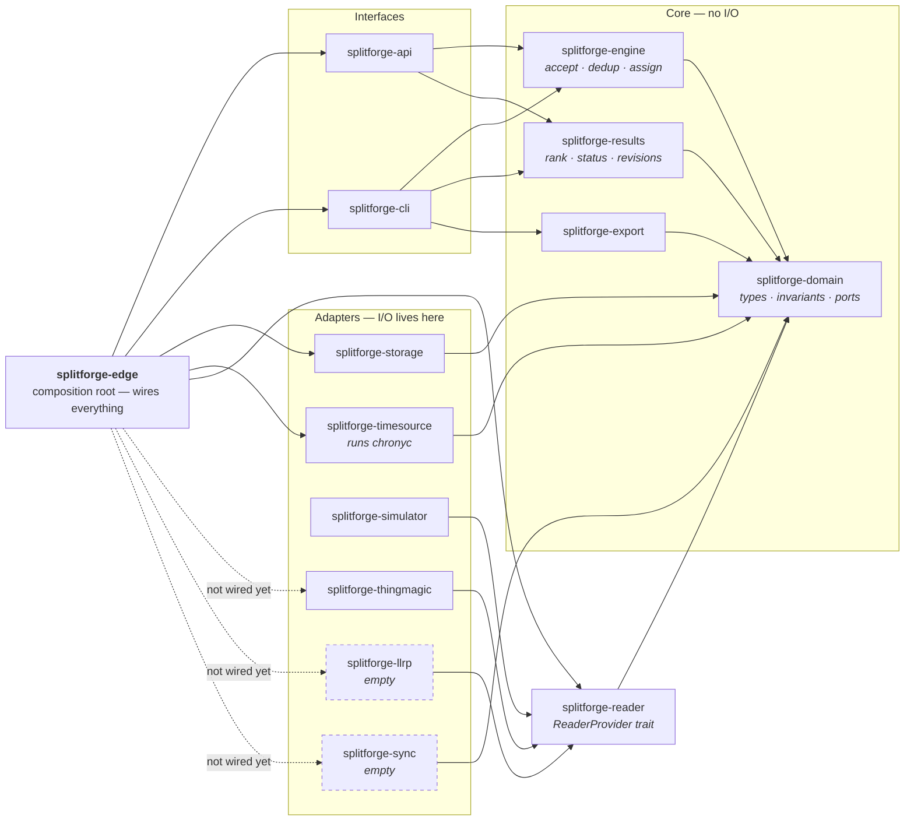
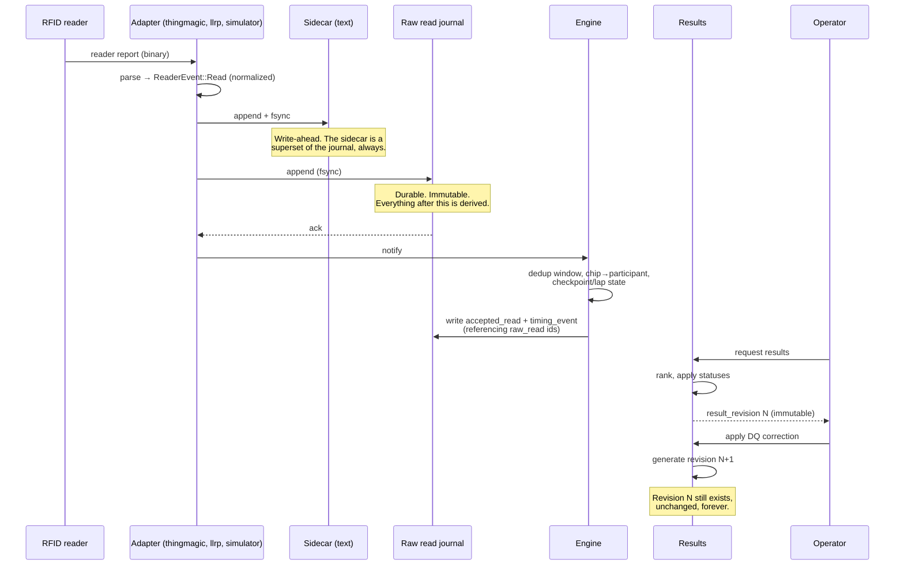

# SplitForge Architecture

> Status: partly implemented. `domain`, `reader`, `storage`, `engine`, `results`, `export`,
> `simulator`, `timesource`, `testkit`, `cli`, `api`, and `edge` exist and are in use.
> `thingmagic` holds the frame codec, the command set, and the whole connection lifecycle —
> what it does not hold is a `TagReportDecoder`, so it parses frames and produces no reads
> yet. `llrp` and `sync` are still empty. **No protocol adapter is composed by
> `splitforge-edge` yet**: the only provider the service can build is the simulator. See the
> [roadmap](roadmap.md). Decisions marked **OPEN** are tracked in
> [open-questions.md](open-questions.md).

## 1. System context

SplitForge runs on a Raspberry Pi at a checkpoint. Everything inside the dashed boundary
must keep working with the uplink unplugged.



The single most important property of this diagram: **there is no arrow into the read
path from outside the dashed box.** A read is recorded because a reader sent it and the
local disk accepted it. Nothing else participates.

The two reader arrows are dashed because **neither adapter has been composed into the service
yet**, and the reason differs for each: the serial module has not been bought, and no
LLRP reader is in the project's price range ([Q9b](open-questions.md#q9b-first-llrp-reader-model)).
The simulator's arrow is solid because it is what actually feeds the read path today — and it
enters through the same `ReaderProvider` port, which is what makes it a rehearsal rather than a
mock.

## 2. Component boundaries



**The dashed edges are permissions, not wiring.** `splitforge-edge` is *allowed* to name a
protocol adapter and is the only crate that is — but today it depends on none of them, and
the only provider it can compose is the simulator, reached through `splitforge-cli`. That is
the honest reading of Milestone 3a being gated on hardware: the port and the adapter both
exist, and nothing has plugged them together because there is nothing to plug in.

### Dependency rules

| Crate | May depend on | Must never depend on |
|---|---|---|
| `splitforge-domain` | nothing in this workspace | any I/O crate, Tokio, SQLx, Axum |
| `splitforge-reader` | `domain` | any specific protocol crate |
| `splitforge-llrp` | `reader`, `domain` | `engine`, `storage`, `api` |
| `splitforge-thingmagic` | `reader`, `domain` | `engine`, `storage`, `api` |
| `splitforge-storage` | `domain` | `engine`, any protocol adapter, `api` |
| `splitforge-timesource` | `domain` | `engine`, any protocol adapter, `api` |
| `splitforge-engine` | `domain` | **any protocol adapter**, `api`, `sync` |
| `splitforge-results` | `domain` | any protocol adapter, `api`, `sync` |
| `splitforge-export` | `domain`, `results` | any protocol adapter, `storage` |
| `splitforge-api` | `domain`, `engine`, `results`, `export` | any protocol adapter |
| `splitforge-sync` | `domain`, `export` | `engine`, any protocol adapter |
| `splitforge-cli` | everything except a protocol adapter's internals | `llrp`, `thingmagic` |
| `splitforge-testkit` | `domain`, `storage`, `reader` | — |
| `splitforge-edge` | everything | — |
| `splitforge-simulator` | `domain`, `reader` | any protocol adapter |

The rule that earns its keep is **`engine` must not depend on any protocol adapter**. It is
what makes a second reader protocol — or a serial timing box, or a barcode scanner, or a
CSV import of somebody else's reads — a new adapter rather than a rewrite.

That rule was written as `engine` must not depend on `llrp`, and for as long as `llrp` was
the only adapter the two sentences were indistinguishable — so only the narrow one was
being checked. `splitforge-thingmagic` ([ADR-0024](adr/0024-serial-reader-adapter-before-llrp.md))
is the second, which is why the table now names *any protocol adapter* and why
`dependency_rules.rs` grew a test saying only `splitforge-edge` may name one.

**`splitforge-timesource` is an adapter by the § 2 rule that I/O lives in one.** It runs
`chronyc` and classifies the answer, which is a subprocess and therefore I/O; it sits beside
`storage` rather than in the core for that reason alone. Two callers on opposite sides of the
workspace need it — `doctor` reports the clock once, and the service stamps a
`DeviceClockState` on every read it writes, because that state is permanent evidence.

These rules are **enforced**, not merely documented: `crates/splitforge-testkit/tests/dependency_rules.rs`
parses every member manifest and fails the test suite on a violation. See
[ADR-0012](adr/0012-architecture-rules-enforced-by-tests.md).

The table above is the prose form of that test's `ALLOWED` list, and the two are meant to be
read together. **The list is exhaustive rather than a wildcard**, deliberately: adding a crate
to the workspace fails the suite until somebody writes a rule for it, which is how
`splitforge-thingmagic` came to be *absent* from it rather than quietly included.

### Ports and adapters

Ports are traits; adapters implement them. Traits are not dependencies, so the core stays
pure. Both of these are built and in use — the signatures below are the ones in the tree:

```rust
// splitforge-domain::ports
pub trait RawReadJournal {
    fn append(&mut self, read: &RawRead) -> Result<StoredRawRead, JournalError>;
    fn append_batch(&mut self, reads: &[RawRead]) -> Result<Vec<StoredRawRead>, JournalError>;
    fn read_all(&self) -> Result<Vec<StoredRawRead>, JournalError>;
    fn read_since(&self, after_seq: u64) -> Result<Vec<StoredRawRead>, JournalError>;
    fn count(&self) -> Result<u64, JournalError>;
}
```

`append` takes `&mut self` and returns the row storage assigned, not just its id. Both are
load-bearing: the exclusive borrow is what makes "one writer" a compile-time fact rather than
a convention, and `StoredRawRead` carries the `seq` that makes *"did we lose a read?"*
answerable without consulting any clock.

```rust
// splitforge-reader — NOT splitforge-domain
pub trait ReaderProvider: Send {
    fn reader_id(&self) -> ReaderId;

    // Events, not reads. A provider that can only deliver reads cannot say it lost the
    // port, which leaves "no reads" meaning either a dead reader or a quiet checkpoint
    // (ADR-0027).
    fn start(self: Box<Self>) -> mpsc::Receiver<ReaderEvent>;
}
```

**`ReaderProvider` lives in `splitforge-reader` rather than in the domain, and the dependency
table above is the reason.** The domain must never depend on Tokio; this trait hands back a
Tokio channel. Rather than weaken that rule or invent an abstraction over channels that
nothing else would use, the port sits one crate out — still upstream of every adapter, still
implemented by three of them, and still something the engine cannot see.

Two shapes here are worth knowing before implementing the trait. It is **channel-based rather
than `async fn` in a trait**, so it stays dyn-compatible: `splitforge-edge` holds a
`Box<dyn ReaderProvider>` and cannot tell a simulator from a module. And it takes
`self: Box<Self>` rather than `&self`, because starting consumes the provider — a reader is
started once and owns its own connection lifecycle from then on, including reconnect and
backoff.

`splitforge-edge` is the only place that knows which concrete implementations exist. This
is also what makes `splitforge-simulator` a first-class citizen instead of a test hack:
it implements `ReaderProvider` and the engine cannot tell the difference.

## 3. Data flow



Two ordering constraints, both absolute.

**The sidecar write completes before the journal write.** That is what makes the sidecar a
superset rather than a race: a crash between them leaves a read on disk in a form that
needs no SQLite to read, and the next writer start replays it. Reversed, the same crash
would leave a read in a database nothing else has a copy of — which is the situation the
sidecar exists to prevent ([ADR-0018](adr/0018-write-ahead-sidecar-journal.md)).

**The journal write completes before the engine is told anything.** If the process dies
between those two steps, the read survives and the engine recomputes on restart. If they
were reordered, a crash could produce a timing event with no evidence behind it.

### The same channel carries the reader's connection lifecycle

A provider returns `mpsc::Receiver<ReaderEvent>`, and a `Read` is one of three variants; the
others say the transport came up or went down. **They travel on the reads' own queue, and that
is an ordering guarantee rather than a convenience** ([ADR-0027](adr/0027-a-reader-reports-connection-events-on-the-read-channel.md)).

The reads are already in flight on a bounded channel, because the back-pressure below is
deliberate. So at the moment a port dies, reads it already delivered may still be queued ahead
of the consumer. Announced on a *second* channel, a disconnection could overtake them — and
the reader gap it opens would then start before reads that are about to be written, which is
evidence contradicting itself with nothing to say which channel was drained first. One queue
makes that unrepresentable.

The consumer turns those two variants into rows: a disconnection the transport reported opens
a **confirmed** gap, a reconnection closes whatever is open, and a stream that merely goes
quiet is a **suspected** gap opened by a watchdog that is guessing
([ADR-0025](adr/0025-m3a-proves-durability-above-the-transport.md),
[ADR-0026](adr/0026-a-reader-gap-is-two-rows.md)). The two detectors are kept apart: while the
transport has reported its own failure, the watchdog stands down, because an inference from
quiet has nothing to add to a fact.

### Derivation is idempotent

Everything downstream of `raw_reads` is a pure function of (journal contents + policy
snapshot). Re-running derivation on the same inputs must produce the same outputs. This
is what makes crash recovery boring: on restart, re-derive from the journal and compare.

## 4. Failure behavior

| Failure | Expected behavior |
|---|---|
| Reader disconnects | Adapter reconnects with bounded exponential backoff, jittered. Journal untouched. The adapter **says so on the read channel**, and the service records a **confirmed** reader gap — two append-only rows bounding the outage, closed by the reconnection ([ADR-0026](adr/0026-a-reader-gap-is-two-rows.md), [ADR-0027](adr/0027-a-reader-reports-connection-events-on-the-read-channel.md)). An open gap degrades `/health`, which reads it from the rows rather than from memory so it survives a restart |
| Reader goes quiet without disconnecting | Indistinguishable from a checkpoint nobody is crossing, so it is recorded as a **suspected** gap after a configurable silence threshold, and never as confirmed. How long that should be is [Q14](open-questions.md#q14-reader-silence-threshold) and is unanswered; the default is chosen to be wrong in the safe direction. Zero disables the check |
| Reader sends malformed data | Frame rejected, error counted and logged with a payload hash. **Process does not exit.** Raw bytes retained in diagnostic capture mode |
| Network uplink lost | No effect. Nothing on the read path uses it. Outbound sync queues to the local outbox |
| Power loss | SQLite WAL + `synchronous=FULL` on the journal write. Reads acknowledged before the cut are present after reboot |
| Disk full | `doctor` warns approaching a configurable floor and errors below it; `race start` refuses below it, overridable with `--force --note` recorded in the audit trail ([ADR-0019](adr/0019-pre-race-gates-block-but-can-be-overridden.md)). Non-essential writes shed first — a snapshot that would not leave the floor intact is refused while the journal keeps writing. The journal itself is never gated: there is no free-space threshold at which declining to record a read is the better outcome |
| Database corruption | Every read is appended to a plain-text sidecar and fsynced **before** the database write, so the sidecar is always a superset ([ADR-0018](adr/0018-write-ahead-sidecar-journal.md)). `splitforge doctor` detects; `backup restore` brings back the configuration and `splitforge recover` replays the reads the snapshot predates |
| Clock steps mid-race | Reads keep their reader timestamps. Device clock offset recorded per read so a step is visible in the audit trail rather than silently baked in |
| Operator error (wrong roster) | Roster import is versioned; re-import produces a new derivation, not a destroyed journal |
| RaceDay Connect unavailable | Nothing happens to timing. Outbox retries. Event completes normally |

### What "survived" means

A read is considered durable only after the journal append returns. The adapter must not
acknowledge, count, or forward a read before that point. Any metric that says "reads
received" and any metric that says "reads persisted" are different numbers, and the gap
between them is a monitored quantity.

### Back-pressure, and why the channel is bounded

**When the journal cannot keep up, the adapter stops taking bytes off the port.** The channel
between a provider and the read path is bounded, and a provider that fills it blocks in
`blocking_send` rather than queueing. That is deliberate in both directions:

- **It is not a stall to be engineered away.** An unbounded queue in front of a consumer that
  has stalled turns a slow SD card into an out-of-memory kill, which loses the whole race
  rather than the tail of it. Blocking makes the slowness visible as `reads_persisted` falling
  behind `reads_received`, which is a number an operator can act on.
- **It is what makes ordering matter.** Because reads can be in flight when the transport
  fails, anything else the provider has to say — a disconnection, most of all — has to travel
  behind them rather than beside them. That is the constraint
  [ADR-0027](adr/0027-a-reader-reports-connection-events-on-the-read-channel.md) is built
  around, and this paragraph is what it refers to.

On a serial link this has a hard limit worth naming: the ThingMagic interface has **no flow
control**, so back-pressure stops at the process boundary. Reads the module emits while the
host is not reading are simply gone, and no count can reconcile them — which is why Milestone
3a's exit criterion asks that no read *that reached the host* be lost, and Milestone 3b keeps
the stronger wording that only a transport tracking delivery can answer
([ADR-0025](adr/0025-m3a-proves-durability-above-the-transport.md)).

## 5. The RaceDay Connect boundary

RaceDay Connect is an **optional, outbound, downstream** integration. This is an
architectural constraint, not a product preference.

**None of it is built.** `splitforge-sync` is an empty crate and there is no
`outbox_messages` table; Milestone 6 is gated behind Milestone 5's exit criterion, and
therefore behind hardware. What follows is the shape the work must take when it happens,
written down now because the constraint is the point and it is easier to hold to a boundary
that was drawn before the code than one negotiated after it:

- No SplitForge crate other than `splitforge-sync` may reference it
- `splitforge-sync` may not be a dependency of `engine`, `results`, or the read path
- Outbound messages are written to a local `outbox_messages` table and shipped
  asynchronously; failure to ship is a warning, never an error that blocks timing
- Credentials live in local config, are never required for startup, and their absence
  disables sync rather than the timer
- An event timed with sync disabled must produce byte-identical exports to one timed with
  it enabled

If SplitForge ever cannot time a race because RaceDay Connect is down, that is a P0 bug
in SplitForge, not an outage.

## 6. Deployment

```text
Raspberry Pi 3 · 64-bit Raspberry Pi OS
└── systemd
    └── splitforge-edge.service   Restart=always
        │                         After=network.target time-sync.target
        │                         (ordering only — no Wants=, no Requires=)
        ├── /var/lib/splitforge/  event database + write-ahead sidecar (StateDirectory=, 0750)
        ├── /run/splitforge/      the API socket, removed on stop (RuntimeDirectory=, 0750)
        └── journald              the process's stderr
```

The unit is [`deploy/splitforge-edge.service`](../deploy/splitforge-edge.service);
installation and what was observed running it are in [deployment.md](deployment.md).

Single service, single database, single machine. Multi-reader and multi-checkpoint
topologies are deliberately out of scope until one reader works reliably for a full event
— see the [roadmap](roadmap.md).

**Two corrections to this section as originally written.** `After=network-online.target`
became `After=network.target`: the original would have delayed startup by 90 seconds on a
Pi with an unplugged cable, which is the network a checkpoint actually has
([ADR-0022](adr/0022-the-service-never-waits-for-the-network.md)). And `/etc/splitforge/` is
not created, because nothing reads it — configuration lives in the database
([ADR-0014](adr/0014-mutable-configuration-immutable-evidence.md)), and provisioning a
directory nothing loads invites somebody to put a file in it.

## 7. Technology choices

| Concern | Choice | Rationale |
|---|---|---|
| Async runtime | Tokio | Reader I/O, API, and sync are all concurrent I/O |
| Database | SQLite, WAL mode | Single device, transactional, no server. [ADR-0003](adr/0003-sqlite-wal-local-persistence.md) |
| SQLite crate | `rusqlite`, `bundled` | Thin and synchronous, so the durability contract stays legible. [ADR-0009](adr/0009-rusqlite-for-sqlite-access.md) |
| Serialization | Serde | — |
| CLI | Clap | — |
| CSV | `csv` | Roster and chip-assignment import, and results export. Deliberately not on the read path — nothing between a reader report and a durable write parses CSV |
| HTTP | Axum | Aligns with Tokio; local API only, on a Unix socket that binds no port. [ADR-0021](adr/0021-local-api-listens-on-a-unix-socket.md) |
| Serial | `serialport`, default features off | The read path's one transport dependency, confined to `thingmagic`'s `port::open`. Defaults are off because they pull `libudev` for the *target* and the Pi cross-build installs no such thing; the port is named by a udev rule rather than discovered. [ADR-0024](adr/0024-serial-reader-adapter-before-llrp.md) |
| Diagnostics | `eprintln!` to stderr, captured by journald | **Not a tracing framework.** `tracing` was specified here and never adopted, and the entry is corrected rather than carried: the service writes plain sentences to stderr and systemd captures them. Structured logging is a real option later; claiming it now would have a reader grep for spans that do not exist |
| Time | `time`, UTC everywhere | Smaller surface, no local-time footgun. [ADR-0010](adr/0010-time-crate-for-timestamps.md) |
| Errors | `thiserror` in libs, `anyhow` at app boundaries | — |
| Hashing | `sha2` | Payload digests in the journal, and the per-bundle salt that makes a chip id correlate inside one diagnostic bundle and nowhere else. [ADR-0020](adr/0020-diagnostic-bundles-carry-no-participant-data.md) |

No GUI framework. A local API plus a CLI is easier to test, deploy, recover, and drive
over SSH from a phone in a parking lot at 6 a.m.

A browser console (`splitforge-web`) is **no longer a free addition.**
[ADR-0021](adr/0021-local-api-listens-on-a-unix-socket.md) puts the API on a Unix socket,
and a browser cannot open one — so a console needs an ADR superseding that decision, and
that ADR has to answer the authentication question ADR-0021 side-steps. Deliberate: the
health endpoint had been blocked for two milestones on a question that did not need
answering to build it, and speculatively keeping the door open for an interface with no
requirements yet is what kept it blocked.
