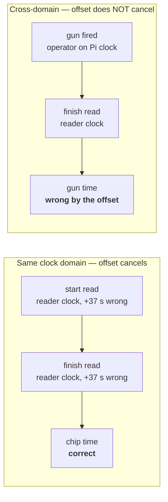

# Clock Accuracy and Time Discipline

> Status: analysis and recommendations. Decisions marked **OPEN** need an owner.
> Companion to [timing-model.md § 3](timing-model.md#3-timestamp-semantics).

## 1. The problem this document exists to solve

SplitForge has two requirements that pull against each other:

- **Offline first.** The Pi must time an entire event with no Internet connection.
- **Accurate absolute timestamps.** Results are times, and times need a trustworthy clock.

Normally the second is solved by NTP. But NTP needs a network, and the first requirement
removes it. So at a trailhead with no signal, **nothing in the default configuration knows
what time it is.** Worse, the Raspberry Pi 3 has *no battery-backed real-time clock* — on
boot it believes it is whenever it last shut down, and stays wrong until something
corrects it.

This is not a small correction. A Pi that has been in a box for three weeks can come up
believing it is three weeks ago, record an entire race, and produce a results file that is
internally consistent and absolutely wrong.

## 2. What accuracy does race timing actually need?

Error budgets differ enormously by discipline. Building to the tightest one is wasted
effort; building to the loosest one produces a timer nobody trusts.

| Discipline | Published resolution | Practical budget |
|---|---|---|
| Road race, chip time (5K–marathon) | 1 s | **±0.1 s** |
| Road race, gun time | 1 s | ±0.1 s |
| Multi-lap / ultra, elapsed | 1 s | ±0.5 s |
| Triathlon splits | 1 s | ±0.1 s |
| Track / sprint | 0.01 s | ±0.005 s — *not a target for SplitForge* |

**SplitForge's design target is ±0.1 s** across a full event day. Track-level timing
requires photo-finish equipment and is explicitly out of scope.

That budget is the number every choice below is measured against.

## 3. The three clocks

| Clock | Source | Property | Used for |
|---|---|---|---|
| **Reader clock** | RFID reader's oscillator | Free-running, often unsynchronized | `reader_timestamp_utc` — authoritative timing value |
| **Device wall clock** | Pi `CLOCK_REALTIME` | Can step, jump, or be plain wrong | `received_at_utc`, `recorded_at_utc` — diagnostics |
| **Device monotonic clock** | Pi `CLOCK_MONOTONIC` (`std::time::Instant`) | Never steps, never goes backward | Measuring *intervals* — backoff, timeouts, drift estimation |

**Rule:** any duration SplitForge measures itself is measured on the monotonic clock.
Subtracting two `SystemTime` values across an NTP step produces a negative or wildly wrong
duration; subtracting two `Instant` values cannot. Wall-clock timestamps are for recording
*when*, monotonic for measuring *how long*.

## 4. Where clock error actually matters

This is the insight that makes the problem tractable: **most race results are differences,
and a constant offset cancels out of a difference.**



| Measurement | Clock domains involved | Sensitive to offset? | Sensitive to drift? |
|---|---|---|---|
| Chip time, one reader at start and finish | 1 | **No** | Yes, over race duration |
| Chip time, different readers at start/finish | 2 | **Yes** | Yes |
| Gun time (gun on Pi, finish on reader) | 2 | **Yes** | Yes |
| Lap splits, same reader | 1 | No | Yes |
| Absolute time-of-day on the results sheet | 1 | **Yes** | Minor |

Two conclusions follow:

1. **A single-reader event is far more forgiving than it looks.** Even a badly wrong
   reader clock produces correct chip times, because both ends of the subtraction carry
   the same error. This is why a broken clock can go unnoticed for a long time.
2. **The moment a second clock domain enters — a second reader, a gun time, a manual
   entry typed on the Pi — offset becomes a direct error in the result.** Cross-domain
   comparison is where clock discipline stops being hygiene and becomes correctness.

### Drift is the part that never cancels

Offset cancels; *skew* does not. If the reader clock runs 50 ppm fast, then over a 4-hour
race the start and finish are not offset by the same amount, and the difference is wrong.

| Oscillator | Typical accuracy | Error per hour | Error per 24 h |
|---|---|---|---|
| Uncompensated crystal (typical Pi / reader) | ±20 to ±100 ppm | 0.07–0.36 s | 1.7–8.6 s |
| DS3231 TCXO module | ±2 ppm (0–40 °C) | 0.007 s | **0.17 s** |
| GPS-disciplined (PPS) | < 1 µs | negligible | negligible |

Against a ±0.1 s budget: an uncompensated oscillator **blows the budget within about
30 minutes to 1.5 hours**. A TCXO holds it for well over a day. This is the arithmetic
that drives the hardware recommendation.

## 5. Getting a time reference without the Internet

| Option | Absolute accuracy | Holdover | Cost | Notes |
|---|---|---|---|---|
| **Nothing (default Pi 3)** | Unbounded | None | £0 | Boots to last-shutdown time. **Not acceptable for timing** |
| **DS3231 RTC module** (I²C) | Set once, ±2 ppm after | Years on coin cell | ~£5 | Survives power-off. Needs initial sync from a good source |
| **GPS receiver + PPS** | < 1 µs | While it has sky view | ~£20–40 | Stratum-1 without Internet. Best fit for outdoor events |
| **LTE/Wi-Fi hotspot → NTP** | ~10–50 ms | None | varies | Violates offline-first if *required*; fine as opportunistic |
| **Operator sets clock manually** | ±1–2 s (human) | None | £0 | Fallback of last resort. Must be recorded as such |

### Recommendation

**GPS + PPS as primary, DS3231 as holdover.** For an outdoor sporting event this is close
to ideal: sky view is a given, GPS provides UTC with no infrastructure, and the RTC covers
the gap between power-on and first satellite fix.

And then the step that resolves most of the problem at once:

> **Make the Pi the LAN's NTP server, and point the readers at it.**

Once the Pi is GPS-disciplined and serving NTP (chrony with `local stratum 1`), the
readers discipline themselves to the same reference. Both clock domains collapse into one,
offsets go to near-zero, and cross-domain measurements stop being a source of error at
all. This is the single highest-leverage item in this document.

**OPEN:** confirm the chosen reader model can be pointed at an arbitrary LAN NTP server —
many can, some only accept a fixed vendor default. See
[Q10](open-questions.md#q10-gps-pps-time-reference).

## 6. LLRP timestamp specifics

The LLRP `Timestamp` parameter is a **choice of two types**, and which one arrives tells
you a great deal about the reader's state:

| Parameter | Meaning | What it implies |
|---|---|---|
| `UTCTimestamp` | Microseconds since the Unix epoch, per the reader's clock | Reader believes it knows UTC. It may still be wrong |
| `Uptime` | Microseconds since the reader booted | Reader has **no** UTC clock set |

An adapter that assumes `UTCTimestamp` will either fail to parse or, worse, interpret an
`Uptime` value as a date in 1970. Both cases must be handled explicitly:

- `UTCTimestamp` → candidate for `reader_timestamp_utc`, subject to trust config
- `Uptime` → stored separately as `reader_uptime_us`; `reader_timestamp_utc` is `NULL`,
  and the read falls back to `received_at_utc` with the reason recorded

`Uptime` is not useless. It is monotonic and high-resolution, so it gives *excellent
relative* timing within one reader session — precisely the single-clock-domain case from
§4 where offset cancels. A reader reporting `Uptime` can still produce accurate chip
times; it just cannot place them on a calendar without an anchor.

**Anchoring uptime:** record `(device_wall_time, reader_uptime_us)` pairs at connect and
periodically. That anchor converts uptime to UTC at derivation time, at the accuracy of
the device clock. The anchor is stored, not applied destructively.

## 7. Measuring reader offset and skew

SplitForge does not need a clock-sync protocol. It can estimate offset from the read
stream it is already receiving, using the standard **minimum filter**:

```text
For each read:  delta = received_at_utc - reader_timestamp_utc
                      = true_offset + network_delay + processing_delay

Since all delays are strictly positive:

    offset_estimate = min(delta) over a sliding window
```

The minimum observed delta is the sample least contaminated by queueing delay. On a wired
LAN the residual bias is the minimum one-way delay — sub-millisecond, i.e. two orders of
magnitude inside a ±0.1 s budget.

Tracking that minimum over time gives skew:

```text
skew_ppm = slope of offset_estimate over elapsed monotonic time × 1e6
```

Both are recorded in a `clock_samples` table:

```text
clock_samples
  id
  reader_id
  observed_at_monotonic_ns    device monotonic — immune to wall-clock steps
  observed_at_wall_utc        device wall clock at the same instant
  reader_timestamp_utc        reader clock at the same instant
  offset_estimate_ms          min-filtered
  skew_ppm                    regression over the window, nullable
  sample_count                reads contributing to this window
  device_clock_state          see §8
```

This runs continuously, costs nothing, and turns "is the reader's clock any good?" from an
assumption into a measured, stored quantity.

## 8. What every raw read records

In addition to the fields in [timing-model.md § 4](timing-model.md#4-raw-read):

| Field | Purpose |
|---|---|
| `reader_timestamp_utc` | Authoritative value, when the reader supplied `UTCTimestamp` |
| `reader_uptime_us` | Set instead when the reader supplied `Uptime` |
| `received_at_utc` | Device wall clock at socket read |
| `received_at_monotonic_ns` | Device monotonic — the only safe basis for interval math |
| `clock_offset_ms` | `received_at_utc - reader_timestamp_utc` for this read |
| `device_clock_state` | `gps_locked` \| `rtc` \| `ntp_synced` \| `manual` \| `unsynced` |
| `timestamp_source` | Which clock produced the authoritative value, and why |

`timestamp_source` is what lets a results dispute be answered honestly. "This finish time
came from the reader's own clock, which was GPS-disciplined and measured at +3 ms offset"
and "this finish time came from the Pi's clock, which had never synchronized" are both
legitimate records — but only if the system knows which one it wrote.

## 9. Correction happens at derivation, never in the journal

When a clock problem is discovered after the fact — a reader was 37 seconds fast all
morning — the fix is **not** to rewrite `raw_reads`. It is:

1. Record a `time_correction` (reader, time range, offset/skew model, author, reason)
2. Regenerate a new `result_revision` with that correction applied
3. Keep the previous revision exactly as published

This follows directly from [ADR-0005](adr/0005-raw-read-append-only-journal.md). The
journal records what the reader *said*. The correction records what we later concluded the
reader *meant*. Collapsing those two into one number destroys the ability to revisit the
conclusion.

## 10. Health checks and alarms

`splitforge doctor` and the health endpoint must surface:

- **Device clock state** — hard warning on `unsynced`, and a **refusal to start a race**
  in that state without an explicit `--i-know-the-clock-is-wrong` override
- **Time since last good sync**, and estimated accumulated error from measured skew
- **Per-reader offset**, with an alarm above a configurable threshold
- **Per-reader skew**, with an alarm above a configurable ppm threshold
- **Backward wall-clock steps** detected by comparing wall and monotonic progress —
  logged as events, since a step mid-race changes how reads must be interpreted
- **Readers reporting `Uptime` instead of `UTCTimestamp`** — a prominent, not a debug-level,
  condition

The pre-race checklist should make clock state a **blocking item**, alongside disk space
and reader connectivity. A clock problem found at 6:00 a.m. costs five minutes; the same
problem found at 9:30 a.m. costs the event.

## 11. Summary of recommendations

1. Target **±0.1 s** across a full event day.
2. Use the **monotonic clock** for every interval SplitForge measures itself.
3. Add a **DS3231 RTC** to every deployment. It is £5 and removes the worst failure mode.
4. Add **GPS + PPS**, and make the Pi the **LAN NTP server** so readers share its clock
   domain. This collapses cross-domain error to near zero.
5. Handle **`Uptime` vs `UTCTimestamp`** explicitly in the LLRP adapter; never let an
   uptime value be interpreted as a date.
6. **Measure offset and skew continuously** with a minimum filter; store the samples.
7. **Never correct the journal.** Corrections are derivation-time models with an audit
   trail.
8. Make **clock state a blocking pre-race check.**

## 12. Open questions

| # | Question |
|---|---|
| [Q3](open-questions.md#q3-reader-clock-trust-defaults) | Default for `auto` trust mode, and the offset alarm threshold |
| [Q10](open-questions.md#q10-gps-pps-time-reference) | Is GPS+PPS mandatory hardware, or a documented recommendation? |
| [Q11](open-questions.md#q11-clock-error-budget-enforcement) | Should SplitForge refuse to publish results when accumulated clock error exceeds the budget? |
| [Q12](open-questions.md#q12-leap-second-handling) | Leap-second policy — smearing, or record and ignore at 0.1 s resolution? |
