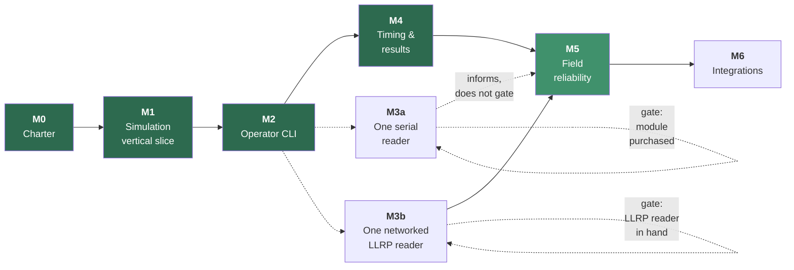

# SplitForge Roadmap

Milestones are ordered by **risk retired**, not by feature appeal. Each has an exit
criterion that is a demonstrable behavior, not a checklist of merged PRs. A milestone is
not done because the code exists; it is done because the exit criterion has been observed.



Solid green is complete. **M5 is the lighter green**: everything in it that can be built
without hardware is built, and what remains — like its exit criterion — needs a Pi.

**M3 and M4 swapped.** The original order put the physical reader first, because reader risk
is the larger risk and this roadmap is ordered by risk retired. That ordering assumed the
hardware would be available when M2 finished; it was not, and Q9 still had no owner. Blocking
on an unbought reader would have stopped the project rather than sequenced it, so M4 — which
needs no hardware at all — was built while M3 waited.

**M3 has since split into M3a and M3b** ([ADR-0024](adr/0024-serial-reader-adapter-before-llrp.md)),
for a reason the swap above had already exposed: the gate was written as one door and is
really two. A current serial module can be bought this week and closes six of the nine
support criteria; a networked LLRP reader closes all nine and nobody has one. Splitting lets
the six be retired now while the other three stay gated exactly as they were.

Nothing was skipped and **no exit criterion was weakened** — M3b's nine criteria are M3's
nine, verbatim, and M5 depends on M3b. M3a informs M5's open measurements without satisfying
its exit criterion, because a real stream of real reads is what those measurements needed and
LLRP was never what made them true.

**Open findings from the 2026-09-13 security review** are listed at the end, under
[Security review](#security-review--2026-09-13). Five were marked to fix before a real event.
All five are fixed: scoring ([ADR-0028](adr/0028-the-gun-decides-which-crossings-count.md)),
the reassembler ([ADR-0030](adr/0030-the-serial-adapter-waits-for-proof.md)), the sidecar as a
write path, a failed append stopping the read path
([ADR-0031](adr/0031-a-failed-write-is-retried-and-an-unstorable-read-is-set-aside.md)), and
`chronyc` under the shipped unit
([ADR-0032](adr/0032-the-service-speaks-ip-to-this-device-only.md)).

---

## Milestone 0 — Project charter

**Status: complete.**

- `README.md` with the project promise, scope, and non-goals
- License settled — **GPL-3.0-or-later** ([ADR-0007](adr/0007-license-selection.md))
- Code of Conduct, contribution guidance, security reporting process
- Architecture, timing model, clock discipline, threat model
- ADRs for the decisions that constrain everything downstream
- Empty Cargo workspace with the crate boundaries in place
- CI running fmt, clippy, tests, audit, deny, and a Pi cross-build

**Exit criterion:** a contributor can read the repository and correctly predict where a
given piece of code belongs, and which rules it must not break.

---

## Milestone 1 — Simulation-first vertical slice

**Status: complete.**

**Build no reader integration.** The point is to prove the data path before adding the
hardware variable.

- [x] `splitforge-simulator` emits synthetic reads through the same `ReaderProvider` port a
      real reader will use
- [x] One fixture event: race, checkpoint, participant roster, chip assignments — two, in
      fact: a 5K and a four-lap criterium
- [x] Raw reads persist to the append-only journal
- [x] A chip crossing a checkpoint many times deduplicates to one accepted read
- [x] Accepted reads visible as CLI JSON output
- [x] Process restart leaves the journal intact
- [x] Fixture-driven tests for a 5K finish and a multi-lap event

**Exit criterion:** a simulated event produces durable raw and accepted reads, entirely
offline, and duplicate reads are preserved raw while reducing to one accepted timing event
— both before and after a process restart.

**Observed:**

```console
$ splitforge simulate --database event.db --fixture five-k --format compact
{"fixture":"five-k","reader":"mat","planned_crossings":24,"reads_scripted":638,
 "reads_received":638,"reads_persisted":638,"journal_total":638,...}

$ splitforge derive --database event.db --fixture five-k --format compact
{"raw_reads":638,"accepted":24,"rejected":614,"timing_events":23,
 "unassigned_crossings":1,"rejections_by_reason":{"duplicate_within_window":614},...}
```

638 raw reads preserved; 24 crossings; 614 suppressed reads each naming the crossing that
suppressed it. Re-deriving in a second process, from the same file, produces byte-identical
output — including the derived identifiers. A process killed mid-race leaves a journal whose
sequence numbers are contiguous from 1.

Four questions were closed on the way: [ADR-0009](adr/0009-rusqlite-for-sqlite-access.md),
[ADR-0010](adr/0010-time-crate-for-timestamps.md),
[ADR-0011](adr/0011-append-only-enforced-by-triggers.md),
[ADR-0012](adr/0012-architecture-rules-enforced-by-tests.md).

**Deliberately not done here:** results, placement, gun/chip time, statuses, or exports.
Milestone 1 proves the evidence path. What is *derived* from that evidence is Milestone 4,
and doing it early would mean doing it before the operator interface exists to check it.

---

## Milestone 2 — Local event console

**Status: complete.**

Minimum operator interface. CLI first; a web UI only after the core behavior is proven.

```bash
splitforge init
splitforge event create   --name "Spring Series"
splitforge race create    --name 5K --start 2026-04-11T08:00:00Z
splitforge checkpoint add --name start  --kind start
splitforge checkpoint add --name finish --kind finish
splitforge roster import  participants.csv
splitforge chips import   assignments.csv
splitforge reader add     --id mat
splitforge reader map     --reader mat --antenna 1 --checkpoint start
splitforge reader map     --reader mat --antenna 2 --checkpoint finish
splitforge policy set     --checkpoint finish --selection-rule first-above-rssi:-62
splitforge race start
splitforge reads --follow
splitforge race stop
splitforge derive
splitforge export crossings --as csv
splitforge backup create  snapshot.db
splitforge doctor
splitforge audit
```

**Exit criterion:** a simulated race can be configured and operated end to end without
ever touching the database directly.

**Observed.** The 5K above, configured from nothing but the commands listed — no fixture,
no SQLite prompt — with the roster and chip assignments arriving as CSV, which is what an
organizer actually has:

```console
$ splitforge roster import participants.csv
{"race":"5K","inserted":12,"updated":0,"unchanged":0,"total":12}

$ splitforge doctor
{"errors":0,"warnings":0,"findings":[]}

$ splitforge simulate --scenario five-k
{"scenario":"five-k","race":"5K","reader":"mat","planned_crossings":24,
 "reads_scripted":638,"reads_persisted":638,"journal_total":638,"first_seq":1,"last_seq":638}

$ splitforge derive
{"race":"5K","raw_reads":638,"accepted":24,"rejected":614,"timing_events":23,
 "unassigned_crossings":1,"rejections_by_reason":{"duplicate_within_window":614}}

$ splitforge export crossings --as csv --output crossings.csv   # 24 rows
$ splitforge backup create snapshot.db
{"bytes":380928,"raw_reads":638}
```

The thirteen audit rows behind that run reconstruct the entire configuration — every
`create`, `import`, `map`, and `set`, with the operator who ran it and the values they
supplied. The one unassigned crossing is a chip that was never on the roster: recorded as
evidence, credited to nobody, and reported rather than dropped.

`crates/splitforge-cli/tests/console.rs` holds the same claim as fourteen tests that reach
for no library type an operator does not have.

**Two corrections to this milestone as originally written**, both made deliberately rather
than silently:

- **`export results` became `export crossings`.** Results — placement, statuses, gun and
  chip time — are Milestone 4, which owns them explicitly. Exporting a column named `place`
  before the scoring rules exist would be a number somebody publishes and nobody can
  defend. M2 exports what it actually knows: crossings joined to the roster.
- **The command list above is longer than the original.** `race create`,
  `checkpoint add`, `reader map`, and `policy set` are not optional extras — without them
  there is no way to reach a configured race, so the exit criterion could not be met by the
  original list.

Two decisions were closed on the way:
[ADR-0014](adr/0014-mutable-configuration-immutable-evidence.md),
[ADR-0015](adr/0015-race-start-records-the-gun.md).

**Deliberately not done here:** placement, statuses, gun/chip time, result revisions, and
any web interface. Also no reader protocol — `reader status` reports configuration and what
the journal has observed, and claims nothing about a connection it has no way to open.

---

## Milestone 3 — One physical reader

**Split into M3a and M3b** by [ADR-0024](adr/0024-serial-reader-adapter-before-llrp.md).
Do not start either from protocol documentation alone — see
[hardware-support.md](hardware-support.md).

The split is not a softening. M3b below is M3 as it was originally written, with all nine
support criteria intact and the same hard gate on it. What changed is that the work which
never needed a *networked* reader — the parser, the port, the Pi-side durability
measurements — stopped being held hostage to one.

---

### Milestone 3a — One serial reader

**Gated on buying the module.** [Q9a](open-questions.md#q9a-first-serial-module) is closed —
the ThingMagic M7E-HECTO, on SparkFun's USB board
([ADR-0035](adr/0035-the-first-module-is-the-m7e-hecto.md)), with a Raspberry Pi 4 to run it
([ADR-0036](adr/0036-raspberry-pi-4-is-the-edge-target.md)) — but nothing has been ordered. It
replaced the M7e-Pico, which was chosen first and never bought, so the work below was written
from the Pico's documents. The Hecto's say the same thing wherever this code depends on them
([finding 23](readers/vendor-documents.md#23-the-protocol-sections-are-the-pico-guides-one-section-later-in--8)).
The steps below that need no hardware did not wait for it, exactly as
[ADR-0004](adr/0004-llrp-first-reader-adapter.md) argues for writing a parser against
captures. There are nine of them, not the three this paragraph once claimed or the seven it
claimed later.

**No hardware required** — meaning these can be *built* without the module. That is a
different question from whether they are **done**, and the boxes answer the second one: a box
is ticked when its claim has been observed, and for anything the module participates in that
means observed on the module. Most of what follows is built and unticked, which is the honest
pair of facts rather than a contradiction.

- [x] `crates/splitforge-thingmagic/` exists, holding the same boundary `splitforge-llrp`
      declares — `splitforge-domain` and `splitforge-reader` and nothing else. The
      hand-edited rows in `dependency_rules.rs` and
      [architecture § 2](architecture.md#dependency-rules) are the point of listing that
      table exhaustively ([ADR-0012](adr/0012-architecture-rules-enforced-by-tests.md))
- [ ] **Framing before semantics.** `0xFF` / length / opcode / payload / CRC-16 as pure
      functions over `&[u8]`, with no I/O near them. Truncated frames, bad CRCs, corrupted
      length fields, and a payload that is itself a whole valid frame are test cases rather
      than hypotheticals. This is the highest-risk code in the project and it was fully
      testable before a module existed. **Unticked, and this crate's own history is the
      argument.** The functions and their thirty-nine tests are done; that these are the
      *right* bytes is a claim about the module, and one of them was already wrong — the CRC
      passed thirty-four self-consistent tests and would have failed on the first frame it
      ever saw. One captured `0x22` response now anchors it, which is real evidence and is
      not a stream
- [ ] **`ReaderProvider` on top of the codec**, and the connection lifecycle under it:
      `reassembly` keeps the buffer a serial port makes necessary, `port` is the only module
      that names `serialport`, and everything between takes a `PortFactory` — so opening,
      reassembly across arbitrary read boundaries, resynchronization after a mid-frame
      disconnect, bounded jittered reconnect, and a timeout that is *not* treated as a
      disconnection are all exercised against ports that fail on demand.
      **The prerequisite this step had was retired first.** The user guide cannot supply the
      command set — § 7 is two framing diagrams and the CRC's covered range, and stops — so the
      opcodes had to come from the MercuryAPI SDK, which is code rather than a specification and
      needed its own archival and its own licensing read first. Both are done: the SDK is MIT,
      and the opcode table, the search flags, and the tag-report layout are recorded in
      [vendor-documents.md](readers/vendor-documents.md#the-command-set-from-the-sdk). Two
      corrections came with them — the antenna byte is a packed tx/rx nibble pair rather than an
      antenna number, and `dspMicros` is named for a unit the vendor's own prose contradicts.
      **Unticked because `port::open` has never opened one.** Every case above is exercised
      against ports that fail on demand, which is the right way to test a lifecycle and is not
      the same as running it: the branch deciding that a timeout is *not* a disconnection turns
      on what a real idle `/dev/ttyUSB0` returns, and getting that wrong reopens the port
      between every pair of runners.
      **`port::open` has now opened a pseudo-terminal**, in
      `crates/splitforge-thingmagic/tests/pty.rs`, and that branch is right on a tty: an idle
      port returns `TimedOut` after its timeout, and a device whose other end has gone returns
      `BrokenPipe` at once, which is a disconnection rather than a quiet reader. It also found
      that `port::open` flattened every failure to `ErrorKind::Other` and named no path, so a
      missing device node and one this account may not open — a udev rule and a group — were
      indistinguishable from each other and from anything else; both are fixed. **Still
      unticked**: a pty is a tty, and a USB serial bridge being unplugged is not the same event
      as a pty controller closing
- [ ] **Decode a tag report into a read.** The one thing the adapter above cannot do, and the
      reason `TagReportDecoder` is a trait this crate ships no implementation of. Field *order*
      was established from the parser itself; which bit selects which field was not.
      **The document blocker is now retired** — a 2023 MercuryAPI was located and archived, and
      `TMR_TRD_METADATA_FLAG_*`, `TMR_SR_STATUS_*`, and the response-type byte that separates a
      tag frame from a status frame are all recorded with hashes
      ([finding 9](readers/vendor-documents.md#9-the-command-set-is-spread-across-three-files-and-one-was-archived),
      [finding 13](readers/vendor-documents.md#13-the-2009-field-order-is-a-prefix-of-the-modern-one)).
      Three things came with it: the flags were never in `tm_reader.h`, so the blocker was a
      wrong filename rather than an old mirror; the modern layout has **five more fields** than
      the nine recorded, so a decoder written against the old list would return a plausible
      wrong chip id; and a status frame must be rejected *before* the flags word is read, or it
      becomes a fabricated read in an append-only table. **What this does not retire is
      [ADR-0004](adr/0004-llrp-first-reader-adapter.md)** — the CRC was documented too, and was
      wrong. A decoder is written now; it is *believed* when a capture agrees with it.
      **Written, and a capture does agree with it.** `StreamDecoder` walks the flag bits
      ascending and is anchored on `CAPTURED_FRAME`, the same real `0x22` response that caught
      the CRC: it decodes to read count 1, RSSI −60 dBm, antenna tx 1 / rx 1, 923.200 MHz,
      295 ms, Gen2, GPIO `0x0F`, and a 96-bit EPC — **consuming to the payload's last byte
      exactly**, which is the assertion that fails first if any width or order is wrong, and
      which is now checked on every frame rather than only in a test. Everything that frame
      does not demonstrate is refused: an opcode other than `0x22` or a non-zero status, a flag
      above `0x0100`, a layout whose option byte does not set `0x10`, a record leaving bytes
      over. Each is a counted decode fault, so a wrong assumption surfaces as no reads and a
      climbing error count on `/health` rather than as a plausible, wrong chip id in an
      append-only table. **Still unticked**: one M6e frame is not a stream
      from an M7E-HECTO, and *"believed when a capture agrees"* is a weaker claim than the one
      this box is for
- [ ] Session-anchored timestamps — the module's relative value is preserved as evidence and
      is **not** authoritative; the Pi's receipt time is
      ([the reader notes](readers/thingmagic-m7e-hecto.md#timestamps)). `SessionAnchor` captures
      both clocks at the instant a connection opens, per connection because that is the scope
      over which the module's counter is continuous — and the wall clock only says *when*,
      because the subtraction rests on the monotonic one
      ([clock discipline § 3](clock-and-time-discipline.md#3-the-three-clocks)). **Unticked:**
      the code is testable and is tested, but *why* the anchor is per connection rests on the
      user guide's account of a counter this project has never watched advance — and
      `dspMicros` is already one place that guide contradicts itself
- [ ] **Detect a disconnection and record it as a bounded gap**, which
      [ADR-0025](adr/0025-m3a-proves-durability-above-the-transport.md) makes a deliverable
      rather than an assumption: a device node that vanishes and a stream that goes silent are
      both recorded, the silent one as *suspected* because a quiet checkpoint looks identical,
      and an open gap degrades health. The gap table and the watchdog are testable against the
      simulator; only *inducing* a real disconnection needs the module.
      **The table, the health reporting and the silence watchdog are built**
      ([ADR-0026](adr/0026-a-reader-gap-is-two-rows.md)). The watchdog opens a *suspected* gap
      when a running race goes quiet for longer than `reader_silence_ms`, and closes whatever
      is open when reads resume; its decision is a pure function in the domain, so the
      boundary cases are tested without a database or a timer. **Confirmed gaps are built
      too**: `ReaderProvider` returns a channel of `ReaderEvent` rather than of reads, so a
      provider can say it connected, produced, and lost the port. A transport that dies opens
      a `confirmed` gap immediately instead of waiting out a silence threshold that was only
      ever a guess, and a reconnection closes it — including one that comes back to an empty
      field, which produces no read to close it with. **This is the change M3b shares**, and
      it is the last of this bullet that could be written without the module. **The box stays
      unchecked deliberately**: what remains is inducing a real disconnection, and this
      milestone does not tick a box because the code exists — it ticks one when the behavior
      has been observed
- [x] **`splitforge-edge` has a read path**, in the ordering
      [architecture § 3](architecture.md#3-data-flow) fixes: sidecar append + fsync completes
      first, always, then the journal append, then notify — `reads_persisted` moves only after
      `append` returns, which is what makes it a different number from `reads_received`.
      Health gained reader state, and the service measures its own `DeviceClockState` rather
      than assuming one, because every read it writes carries one as permanent evidence.
      **This bullet was filed under *needs the module* and did not belong there.** The loop is
      written against `ReaderProvider`, so the module changes which provider is composed and
      nothing else; what needs hardware is the serial adapter, which is the bullet above it
- [ ] **Compose the module.** `splitforge-edge --serial /dev/…` builds a `ThingMagicReader`
      and hands it to the same loop `--simulate` uses; the two flags conflict at the argument
      parser, so nothing arbitrates between a real module and a scripted one at runtime. This
      is the first time the composition root has named a protocol adapter, which is the
      dependency rule `dependency_rules.rs` reserves for it alone.
      **It records no reads**, and is worth having anyway: it is composed with
      `UndecodedReports`, a decoder that counts frames and produces nothing,
      *(since replaced: `StreamDecoder` is composed now, and reads are journaled — see
      *Decode a tag report* above)* so what runs is
      the *connection* half of this milestone — a port that opens, a cable pulled out, a
      reconnection, each recorded as a confirmed gap. That half needs a real cable and no
      parser, and waiting for the decoder would have left it untested on hardware for no
      reason. **Unticked, and this one cannot be ticked from a desk at all**: the flag exists
      to be pointed at a device node, and `/dev/null` in a test is not one.
      **A device node it now is pointed at, in a test.** `apps/splitforge-edge/tests/serial.rs`
      spawns the real binary with `--serial` against a pseudo-terminal and a fake module built
      from the same archived sources the adapter was: the service opens the tty, sends the
      start sequence, journals the reports streamed back, records a confirmed gap when the
      device goes, and never announces a module that refused a command.
      `crates/splitforge-thingmagic/tests/pty.rs` covers `port::open` itself. Still unticked,
      and the reason is unchanged rather than weakened: a pty is not a USB serial bridge, and a
      fake built from the sources the adapter was built from agrees with it by construction —
      which is exactly how `crc.rs` shipped wrong
- [ ] **Start the stream.** Nothing tells the module to read. `Port` is `Box<dyn Read>`, so
      the adapter can only listen. No code sends the `0x22` read command with `TAG_STREAMING`,
      and no document describes a startup sequence or a module profile that starts reading on
      power-up. User guide § 8.8.2 says the module streams *during asynchronous inventory*,
      which the host has to start. As built, the first session on a real module would open the
      port and hear nothing, and after `reader_silence_ms` the watchdog would record a
      *suspected* gap. The bytes are already known: the opcode table and search flags are in
      [vendor-documents.md](readers/vendor-documents.md#search-flags--serial_reader_imph-enum-tmr_sr_searchflag),
      and `encode_command` exists. This can be built and tested at a desk. `Port` becomes
      `Read + Write`. A start sequence runs on every connection, checks each response's opcode
      and status, and requests only metadata flags `StreamDecoder` accepts, with the option
      byte's `0x10` bit set, or the decoder refuses every report it produces. The sequence is
      tested against fake ports that record what was written. **It also moves the session
      anchor.** The guide defines the tag timestamp as relative to
      *"the time the command to read was issued"*, but `SessionAnchor::now()` is taken when the
      port opens. Because the module cannot detect a pulled cable and keeps streaming, a
      reconnection that does not re-issue the command inherits timestamps from the previous
      session. So the per-connection anchor under *Session-anchored timestamps* depends on this
      step. **Unticked until a module answers**: like the parser, a command sequence
      transcribed from the SDK is believed only when real hardware accepts it.
      **Built ([ADR-0033](adr/0033-each-connection-starts-the-stream.md)), and "the bytes are
      already known" was wrong.** The documents recorded the opcodes and a response's layout,
      not the body of a read command or what to configure before one. The archived sources,
      re-verified against their hashes, supplied both. They also showed that the command
      mattered more than expected: `CAPTURED_FRAME` is SparkFun's annotated answer to its own
      start command, echoing that command's option, search flags and metadata flags, while
      MercuryAPI 2023 builds a command whose answers shift every field one byte. So each
      connection sends SparkFun's start, cross-checked command by command against MercuryAPI:
      stop any running stream, version, Gen2, the operator's region, read filter off, start.
      There is no antenna-port command, because the two sources disagree for this module family.
      `splitforge-edge --serial` now requires `--region`, with no default. The connection is
      announced when the start is accepted; a refused step ends it as a new cause,
      `NotStarted`. The anchor moves when the start is sent. **Two more things came out of it.**
      An empty field very likely produces an end-of-cycle frame (`0x22`, status `0x0400`) about
      once a second, which the decoder had been counting as a fault, and which is very likely
      the liveness signal Q14 waits on
      ([finding 17](readers/vendor-documents.md#17-an-empty-field-produces-a-frame-at-the-end-of-every-search-cycle)).
      And SparkFun describes the tag timestamp as time since the last keep-alive, which the
      guide contradicts ([finding 18](readers/vendor-documents.md#18-sparkfun-and-the-user-guide-disagree-on-what-the-tag-timestamp-counts-from)).
      Still unticked: no module has answered one of these commands. **A fake one has**, over a
      pseudo-terminal — see *Compose the module* above

**Needs the module:**

- [ ] `PrivateDevices=no` / `DevicePolicy=closed` / `DeviceAllow=char-ttyUSB rw` in the unit,
      plus a udev rule for a stable device name. The network directives **stay** as
      [ADR-0032](adr/0032-the-service-speaks-ip-to-this-device-only.md) left them — a serial
      adapter opens a file, not a socket.
      **Built, and most of it did not need the module**
      ([ADR-0034](adr/0034-the-service-opens-the-readers-port-and-nothing-else.md)). As shipped,
      `PrivateDevices=yes` hid the port, so the first session would have opened nothing. Under
      systemd 252, with the unit as committed and only `ExecStart` changed, the service ran its
      whole lifecycle against a scripted module on a pseudo-terminal: a gap while unplugged, three
      reads journaled once plugged in, and a confirmed gap when pulled. The filter refused an
      unlisted serial group and allowed a listed one. Doing it found a failure the plan had not
      named: `char-ttyUSB` is looked up in `/proc/devices` when the service starts, so on a Pi
      booted with the reader unplugged the filter would allow nothing, silently at systemd's level.
      `deploy/splitforge.modules-load.conf` loads `usbserial` at boot to prevent it. It also found
      the service had been throwing away the reason a port would not open. **Still unticked**: no
      `ttyUSB` port has been opened, because the container's kernel has no `usbserial`, and the udev
      rule's IDs come from documentation. It now matches the bridge — the CH340C on SparkFun's
      board, `1a86:7523` — and it cannot tell two identical boards apart,
      because CH340-family bridges are not expected to carry a serial number
      ([the reader notes](readers/thingmagic-m7e-hecto.md#deployment-notes))
- [ ] Measure what M5 could not: whether the SD card honors `fsync`, what the second sync per
      reader report costs on real flash, what a full day's journal weighs, and what happens to
      a write in flight when the power goes
- [ ] Measure the Pi's receive-time jitter, which is what actually bounds accuracy on this
      hardware — not the module's throughput specification

**Exit criterion:** a serial module runs for several hours while **every read the host
receives is preserved** through deliberately induced disconnections and service restarts;
**the journal never disagrees with what arrived**; and **every disconnection is detected and
recorded as a bounded gap in the evidence**, rather than passing unnoticed.

**This is the criterion as [ADR-0025](adr/0025-m3a-proves-durability-above-the-transport.md)
restates it**, and the wording it replaced is worth keeping in view: *"…and the count of reads
the module believes it sent matches the count in the journal."*

That clause cannot be evaluated on this interface. The user guide says the module cannot detect
a broken serial connection and goes on streaming into it, and that the interface has no flow
control — so reads emitted during an induced disconnection are simply gone, and no count can
reconcile what the module sent against what arrived. It bundled two claims that TCP had made
one: *SplitForge does not lose a read that reached it*, which is about this project's code and
is provable on any adapter, and *the transport delivered everything the reader emitted*, which
is about the wire and is only askable where the transport tracks delivery.

**The second is named structurally unclosable** on a link with no flow control — the third such
item, beside the reader clock and per-antenna identity, and named by the same rule ADR-0024
already used rather than by a new one. **M3b keeps the original wording verbatim**, because LLRP
runs over TCP and can answer it. **The support matrix stays empty.**

**The criterion did not get easier.** The third clause is new work the old wording never asked
for: the module cannot announce its own failure, so SplitForge has to notice — and a stream that
has gone quiet is indistinguishable from a checkpoint with nobody crossing it, which is why a
silence-derived gap is recorded as *suspected* and never as confirmed. How long silence must
last is [Q14](open-questions.md#q14-reader-silence-threshold), and it is not answered.

**The adapter streams rather than polling the tag buffer**, which was the second of § 7's three
ways out and is rejected on a cost § 7 had underpriced as *"throughput"*. § 8.8.1 deduplicates
in hardware — *"duplicate tag reads do not result in additional entries"* — and every
`SelectionRule` the operator can configure selects from a burst. Polling would leave
`first-above-rssi:-62` a single sample to choose from and make **Milestone 1's** exit criterion
structurally unobservable on this adapter, turning 638 raw reads into roughly 24 entries and a
count. Its 52-entry ceiling also bounds the wrong thing: distinct tags, so a full buffer loses a
runner where streaming loses a redundant read.

**Observed**, the connection lifecycle. The service rendering its own health, with a
provider that lost the port and then got it back:

```console
$ curl -s --unix-socket api.sock http://localhost/health          # the port died
{"status":"degraded","degraded_by":["reader mat has been confirmed gone since
 2026-09-02 17:33:21.914872 +00:00:00; reads from it are not being recorded"],...,
 "reader":{"kind":"simulated","state":"disconnected","reads_received":0,
 "reads_persisted":0,"open_gap":{"detection":"confirmed","open_for_ms":0}}}
                                                                       HTTP 503

$ curl -s --unix-socket api.sock http://localhost/health          # and came back
{"status":"ok","degraded_by":[],...,
 "reader":{"kind":"simulated","state":"connected","reads_received":0,
 "reads_persisted":0,"open_gap":null}}
                                                                       HTTP 200
```

`"detection":"confirmed"` is the milestone. Every gap this service could open before this
change was `suspected`, because silence was the only evidence it had — and the silence
threshold that decides when to open one is
[Q14](open-questions.md#q14-reader-silence-threshold), which is still unanswered and still a
guess. A transport that says the port died needs no
threshold and no guess, and it says so in the same millisecond.

`reads_received` is `0` in both. **A connection is not a read**, and neither is a
disconnection: the lifecycle moves `state` and `open_gap` and touches no counter that claims
to count evidence. It does reset the silence clock, because a connection is the only proof of
life a reader in an empty field will ever produce — without that, the watchdog would open a
*suspected* gap seconds after a real reconnection closed a confirmed one.

**The confirmed half is deliberately not gated on a race running and the suspected half is.**
The asymmetry is the ambiguity rather than an oversight: silence on a bench overnight means
nothing and would teach an operator to ignore the signal, whereas a reader that is *not there*
is a true statement at any hour — and it is the statement an operator most wants before the
gun, when the reason the port will not open is usually that nothing has been plugged into it.

What none of this has seen is a real cable. The provider's lifecycle is exercised against
ports that fail on demand, and the service's against a `Device` on a temporary database;
`apps/splitforge-edge/tests/service.rs` — the file that spawns the real binary and talks over
a real socket — is `#![cfg(unix)]` and was not run on the machine this was written on.
**Inducing a disconnection on hardware is the exit criterion, and it is still open.**

**Observed**, the frame codec. Thirty-nine tests, none of which need hardware, and most of
which feed the parser input that is deliberately wrong. Three carry the claim:

- **Every truncation of a valid frame** — all 12 of them for a 5-byte payload, and 2,000
  random buffers decoded at every possible cut — reports `Incomplete` rather than failing.
  On a serial port a partial buffer is the *ordinary* case, and a codec that treats it as an
  error is one that discards good reads under load.
- **Every single bit flipped** in a frame's opcode, status, payload, or checksum is caught.
  That is a total claim rather than a statistical one, because CRC-16/CCITT detects all
  single-bit errors — so the test fails loudly if the CRC's coverage is ever narrowed to
  exclude a field somebody thought was unimportant.
- **A payload that is itself a complete, valid frame** decodes as a payload. `0xFF` is a
  synchronization hint and not a delimiter, and the fastest way to a permanently
  desynchronized stream is to treat it as one.

Two properties fell out of the wire format rather than being designed in, and both are worth
writing down because they retire risks the plan had listed. The length field is one byte, so
**a frame claiming 64 KB of payload is unrepresentable** — that attack is not mitigated, it
cannot be expressed. The ceiling that follows was initially read off the field's width as 262
bytes; the user guide turned out to cap data at 250 for a command and 248 for a response, so
`MAX_FRAME_LEN` is **255** and both directions reach it exactly
([vendor-documents.md](readers/vendor-documents.md#2-max_data_len-was-wider-than-the-protocol--since-fixed)).
And the
decoder **allocates nothing**: the payload borrows from the caller's buffer, which a test
checks by pointer rather than asserting in prose.

**What none of that could tell you was whether these are the right bytes** — and one of them
was not. The layout and the CRC came from vendor documentation rather than from a capture, and
both were written down as named assumptions in the crate so that the first person holding a
real capture would know where to look. The warning was accurate: **the CRC was wrong.**

`crc.rs` implemented CRC-16/CCITT-FALSE, which is what user guide § 7.3 calls the algorithm.
The module computes something else — the same polynomial, with the data nibble shifted into the
bottom of the register instead of folded into the table index, which MercuryAPI's own source
calls a *"ThingMagic-mutated CRC […] notably, not a CCITT CRC-16, though it looks close."* The
codec would have failed on the first frame it ever saw, in a field, with the parser being the
last place anybody would look.

It was caught by a captured frame — a real `0x22` response carrying the CRC a real module put
on it. Over the bytes § 7.3 covers, the module says `0x561D`; the corrected function says
`0x561D`; CCITT-FALSE says `0xF542`
([vendor-documents.md § 8](readers/vendor-documents.md#8-the-crc-was-not-ccitt-false-and-the-codec-computed-the-wrong-checksum)).

**The test that looked like the external anchor was the one that hid it.** `crc16(b"123456789")
== 0x29B1` is a real published check vector, and it anchored the crate to the wrong function's
catalogue entry — which is worse than no anchor, because it reads like verification. Every other
checksum assertion in the crate is self-consistent: the frame tests build a frame with `crc16`
and check it with `crc16`, so all thirty-four passed with the wrong algorithm and would again.
The anchor is now the captured frame, and `0xF542` is pinned as a regression test because § 7.3
still extends the same invitation to the next reader.

**This is the ordering principle working rather than failing.** The parser was written from
documentation before the hardware was bought, on the theory that a bug found at a desk is
cheaper than one found in a field with cold hands. The parser was wrong, and it was found at a
desk, before the order.

`serialport` **is** a dependency now, on the terms the note that stood here set: ADR-0024
authorized it onto the read path, and it arrived with the code that opens a port rather than
one commit earlier. It is confined to `port::open` — the rest of the crate sees a
`PortFactory`, which is what keeps the lifecycle testable without hardware. Its default
features are off, because they pull in `libudev` for the *target* and the Pi cross-build
installs no such thing; enumeration is not wanted anyway, since the port is named by a udev
rule rather than discovered.

**What M3a explicitly does not do:** put anything in the support matrix. Two of the nine
criteria — a reader clock to measure offset and skew against, and per-antenna identity — are
**structurally** unclosable on a single-port module with no clock, not merely untested. The
gaps are named in [the reader notes](readers/thingmagic-m7e-hecto.md#why-this-cannot-become-supported),
where the module sits as *experimental — under evaluation*.

**One of those two was briefly in doubt, and is not any more.** The Pico's pre-order questions
had turned up documentation that its *carrier board* carried four switched U.FL ports, which
would have made per-antenna identity reachable on one module
([the Pico's notes](readers/thingmagic-m7e-pico.md#question-1-also-challenges-row-5-of-the-checklist-above)).
SparkFun's Hecto board has one RF path, and the Hecto guide says the module refuses any antenna
but 1 ([finding 26](readers/vendor-documents.md#26-one-antenna-port-stated-twice)), so the
criterion is structural again. **The reader-clock criterion was never in doubt** — there is no
clock, and no wiring changes that.

---

### Milestone 3b — One networked LLRP reader

**Gated on having the hardware**, on [Q9b](open-questions.md#q9b-first-llrp-reader-model),
which is exactly as open as Q9 was. Every criterion below is M3's, verbatim.

- `splitforge-llrp`: connect to one specific physical reader
- Log protocol connection lifecycle and reports
- Handle **both** `UTCTimestamp` and `Uptime` correctly — an uptime value must never be
  interpreted as a date ([clock discipline § 6](clock-and-time-discipline.md#6-llrp-timestamp-specifics))
- Continuous offset and skew measurement into `clock_samples`
- Raw protocol captures behind an explicit diagnostic flag
- Reconnect safely after cable removal, reader reboot, and Wi-Fi interruption
- A network outage cannot erase already persisted reads
- Measure CPU, memory, write latency, and recovery behavior on the Pi

This is the milestone that has to widen `IPAddressAllow` to its reader's address, failing
`apps/splitforge-edge/tests/unit_file.rs` until it does so deliberately — which is exactly the
review a quietly added connection would skip. `AF_INET` itself is already allowed, to this
device only, for `chronyc` ([ADR-0032](adr/0032-the-service-speaks-ip-to-this-device-only.md)).

**Exit criterion:** a reader runs for several hours while every read is preserved through
deliberately induced network failures and service restarts, and the count of reads the
reader believes it sent matches the count in the journal.

**Milestone 5 depends on this milestone, not on M3a.**

---

## Milestone 4 — Timing and results

**Status: complete.** Built ahead of Milestone 3, which is gated on hardware — see the note
under the diagram above.

Simple, transparent rules first. Complexity here is where scoring bugs live.

- [x] One start checkpoint, one finish checkpoint
- [x] Gun-time and chip-time calculation
- [x] First valid finish per participant: valid meaning at or after the gun, which
      [ADR-0028](adr/0028-the-gun-decides-which-crossings-count.md) added after the
      2026-09-13 security review found the earliest crossing was being counted instead
- [x] Configurable duplicate window
- [x] Statuses: `Finished`, `DNS`, `DNF`, `DQ`
- [x] Immutable result revisions with policy snapshots
- [x] Overall placement by the selected timing policy
- [x] **Manual entries** — what an operator writes down when the chip does not, entering
      derivation as evidence rather than editing a result
      ([ADR-0023](adr/0023-manual-entries-are-derivation-inputs.md))
- [x] CSV and JSON exports

```bash
splitforge policy set  --start-mode chip        # or gun, the default
splitforge results preview                       # the rehearsal for the irreversible command
splitforge results publish --status provisional --reason "provisional results"
splitforge results declare --bib 104 --status dq --reason "cut the course"
splitforge manual add --bib 109 --checkpoint finish --at 2026-04-11T08:26:41Z --reason "chip failed"
splitforge manual list
splitforge results publish --status final --reason "bib 104 disqualified after review"
splitforge results diff --from 1 --to 2
splitforge results list
splitforge export results --as csv --revision 1
```

**Deliberately excluded:** age-group scoring, waves, complex course layouts, penalties,
relay teams, live public pages. `StartMode` deliberately does not parse `wave` or `rolling`:
a mode that parsed and then scored like `gun` would be a wrong answer that looks like a
right one.

**Exit criterion:** a test event imports a roster, records reads, publishes a provisional
revision, applies a DQ correction, and retains **both** revisions with a complete audit
trail explaining the difference.

**Observed.** The same 5K, configured through the operator commands alone:

```console
$ splitforge results publish --status provisional --reason "provisional results"
{"revision":1,"status":"provisional","digest":"f7ab46341dd35a0c91b372a6870b6a1a",
 "entries":12,"finished":11,"dnf":1,"dns":0,"dq":0,"changed":true}

$ splitforge results declare --bib 104 --status dq --reason "cut the course at the turnaround"
{"seq":1,"bib":"104","status":"dq","actor":"operator"}

$ splitforge results publish --status final --reason "bib 104 disqualified after review"
{"revision":2,"status":"final","digest":"07de72201e2e5b5dbca383037c53b236",
 "entries":12,"finished":10,"dnf":1,"dns":0,"dq":1,"changed":true}

$ splitforge results diff --from 1 --to 2
{"from":1,"to":2,"changed":11,"unchanged":1}
  {"bib":"101","change":"placement","place_from":2,"place_to":1}
  {"bib":"107","change":"placement","place_from":3,"place_to":2}

$ splitforge results show --revision 1
{"revision":1,"bib":"104","status":"finished","place":1,"gun_time":"0:17:32.132"}
```

The last line is the milestone. Revision 2 disqualifies bib 104 and moves ten runners up a
place; revision 1 still says they won, in the words it was published in. Both are in the
database, the audit trail holds both publications with their differing digests, and the
declaration that separates them records who decided it and why.

The one unchanged entry is the runner who did not finish — a DQ ahead of you does not move
you up when you have no place to move.

Two decisions were closed on the way:
[ADR-0016](adr/0016-status-declarations-are-evidence.md),
[ADR-0017](adr/0017-placement-semantics.md). A third was re-scoped rather than answered:
[Q12](open-questions.md#q12-leap-second-handling), which turned out to constrain clock
discipline rather than scoring.

**Observed**, manual entries ([ADR-0023](adr/0023-manual-entries-are-derivation-inputs.md)).
The `five-k` fixture supplies the case without being asked to: bib 109 starts, the chip stops
reporting on course, and the runner is scored `dnf`. That is a correct reading of the
evidence and the wrong answer about the race. A finish marshal saw them cross.

```console
$ splitforge results show --revision 1                      # bib 109, abridged
{"bib":"109","status":"dnf","place":null,"gun_time":null,"chip_time":null,"finish_at":null}

$ splitforge manual add --bib 109 --checkpoint finish --at 2026-04-11T08:26:41Z \
    --reason "chip stopped reporting on course; finish marshal recorded the bib"
{"seq":1,"id":"cfdf52be-3c70-4725-b383-53c0fcabfe85","bib":"109","name":"Runner 109",
 "checkpoint":"finish","at":"2026-04-11T08:26:41Z","recorded_at":"2026-08-24T14:30:42.513467Z",
 "actor":"operator","reason":"chip stopped reporting on course; finish marshal recorded the bib"}

$ splitforge derive
{"race":"5K","raw_reads":638,"accepted":24,"rejected":614,"timing_events":24,...}

$ splitforge results publish --status final --reason "finish recorded by hand after a chip failure"
{"revision":2,"status":"final","digest":"5eb97cfeecad5b389eb663aec39a7d3c",
 "entries":12,"finished":12,"dnf":0,"dns":0,"dq":0,"changed":true}

$ splitforge results show --revision 2                      # bib 109, abridged
{"bib":"109","status":"finished","place":10,"gun_time":"0:26:41.000",
 "chip_time":"0:26:33.872","finish_at":"2026-04-11T08:26:41Z"}

$ splitforge results show --revision 1                      # unchanged
{"bib":"109","status":"dnf","place":null,"gun_time":null,"chip_time":null,"finish_at":null}
```

Four numbers carry the decision. `raw_reads` and `accepted` do not move, because an entry is
not a read and must not pretend to be one — the journal still holds exactly what the hardware
reported. `timing_events` goes from 23 to 24, which is the entry entering derivation as an
input. And `chip_time` is 7 seconds shorter than `gun_time`, because it is measured from this
runner's own start crossing — which the chip *did* record. One result, assembled from both
kinds of evidence.

The last command is the other half. Revision 1 still says `dnf`, in the words it was published
in, with the digest it was published under. It was true about what was known at the time and
somebody may have acted on it; the correction lives in revision 2. Had the finish time been
typed into the results table instead, the next re-derivation would have thrown it away.

Nothing here can be taken back:

```console
>>> UPDATE manual_entries SET reason = 'never mind'
    IntegrityError: manual_entries is append-only: UPDATE is not permitted

>>> DELETE FROM manual_entries
    IntegrityError: manual_entries is append-only: DELETE is not permitted
```

Both statements went straight at the file through a plain SQLite driver, with no SplitForge
code in the path at all.

An operator who enters the wrong bib appends a correction; both rows survive, because the
results published in between depended on the first one. That is
[ADR-0011](adr/0011-append-only-enforced-by-triggers.md) applied to the newest evidence table,
and it is enforced by the database rather than by whoever reviews the pull request.

One thing surfaced that no test would have. Both operator-facing error messages in the new
code had lost their line-continuation backslashes, so `manual add` with an unknown bib printed
`import the` followed by thirty spaces and then `roster first`. That is the second time this
defect has shipped into a review — the wall-clock step work hit it too — and it is invisible
in a passing suite, because the string is still one string. It is obvious the instant a real
command prints it. The two tests that now hold it assert on the absence of a double space in
`stderr`, which is the only part a human would have noticed.

**Deliberately not done here:** any web interface, and any claim about reader behavior. The
scoring path has never seen a physical reader — that is Milestone 3, and it is still gated.

---

## Milestone 5 — Field reliability

**Status: the hardware-free work is complete; the exit criterion needs a Pi.**

Operational safety, not features. This milestone is what separates a demo from a timer.

- [x] systemd service with restart policy and startup ordering — the unit is
      [`deploy/splitforge-edge.service`](../deploy/splitforge-edge.service); it waits for no
      network and never stops restarting
      ([ADR-0022](adr/0022-the-service-never-waits-for-the-network.md))
- [x] Health endpoint — `splitforge-edge` serves it on a Unix socket that binds no port
      ([ADR-0021](adr/0021-local-api-listens-on-a-unix-socket.md)), closing
      [Q5](open-questions.md#q5-local-api-authentication-model)
- [x] Downloadable diagnostic bundle — `splitforge doctor --bundle out.json`, safe to attach
      to a public issue without being read first
      ([ADR-0020](adr/0020-diagnostic-bundles-carry-no-participant-data.md))
- [x] Free-disk warning and defined write-failure behavior
      ([ADR-0019](adr/0019-pre-race-gates-block-but-can-be-overridden.md))
- **Clock discipline** — *partly built.* Two halves are done. Wall-clock step detection: the
  service compares the wall clock against the monotonic clock and records every jump as
  append-only evidence
  ([clock discipline § 10](clock-and-time-discipline.md#10-health-checks-and-alarms)). And
  **determining `DeviceClockState`**, by asking the time daemon rather than the kernel — the
  question this milestone had recorded as blocked on `unsafe`. Still hardware-gated: DS3231
  RTC support, GPS/PPS integration, and Pi as LAN NTP server. Still *question*-gated, which
  is not the same thing: clock state as a **blocking** pre-race check waits on
  [Q11](open-questions.md#q11-clock-error-budget-enforcement)
- [x] Manual backup and **restore drills** — restore is rehearsed, not discovered
- [x] Corruption recovery ([ADR-0018](adr/0018-write-ahead-sidecar-journal.md))
- Graceful shutdown on power loss where the hardware permits
- Pi **field** guide: external power, wired Ethernet first, race-day Wi-Fi treated as a
  known risk. Installing the service is written up in [deployment.md](deployment.md); this
  is the half that needs a Pi in a field to write honestly

**Everything above that needs no hardware is built**, for the same reason Milestone 4 was
built ahead of Milestone 3: leaving it until after the reader arrived would have meant timing
a real event with a recovery story that existed only as an open question. That inverts the
usual framing — these items are not early, the hardware ones are late.

Three questions closed on the way:
[Q5](open-questions.md#q5-local-api-authentication-model), which had blocked the health
endpoint since Milestone 0; [Q7](open-questions.md#q7-corruption-recovery-strategy), by
`backup restore` and `splitforge recover`; and the free-space gate's override rule
([ADR-0019](adr/0019-pre-race-gates-block-but-can-be-overridden.md)).

**Observed.** The same 5K, with a snapshot taken before the gun. Between the second command
and the third, `event.db`, `event.db-wal`, and `event.db-shm` were deleted outright — the
sidecar was left alone, which is the whole point:

```console
$ splitforge backup create pre-race.db
{"bytes":184320,"path":"pre-race.db","raw_reads":0}

$ splitforge simulate --scenario five-k
{"scenario":"five-k","race":"5K","reads_persisted":638,"journal_total":638,...}

$ rm event.db event.db-wal event.db-shm        # the disaster

$ splitforge doctor
{"errors":1,"findings":[{"severity":"error","check":"journal.sidecar",
 "detail":"638 read(s) are in the sidecar but not in the database.
           Run `splitforge recover` to replay them."}]}

$ splitforge backup restore pre-race.db --replace
{"source":"pre-race.db","destination":"event.db","raw_reads":0,
 "displaced":["event.db.superseded.1786986481"],
 "next":"run `splitforge recover` to replay reads the snapshot predates"}

$ splitforge recover
{"sidecar_records":638,"replayed_into_database":638,"backfilled_into_sidecar":0,
 "corrupt_lines":0,"torn_tail_bytes":0}

$ splitforge derive
{"race":"5K","raw_reads":638,"accepted":24,"rejected":614,"timing_events":23,
 "unassigned_crossings":1,"rejections_by_reason":{"duplicate_within_window":614}}
```

That last line is byte-identical to the derivation taken before the database was destroyed —
not merely the same counts, but the same 24 accepted reads carrying the same derived
identifiers. The snapshot supplied the configuration and knew about none of the reads; the
sidecar supplied all 638.

`splitforge doctor` diagnoses and refuses to repair, which is why it appears above the
restore rather than instead of it: a diagnostic that silently fixes things is a diagnostic
describing a state it just changed. `crates/splitforge-cli/tests/recovery.rs` holds the same
claim as nine tests that destroy the file three different ways — deleted, overwritten with
garbage, and with no snapshot to restore from at all.

**Observed**, the free-space gate. The floor here was set to something no machine can
satisfy, which is how the below-the-floor path is reachable on demand:

```console
$ splitforge device show
{"database":"event.db","min_free_mb":256,"free_mb":9407,"total_mb":487070,"above_floor":true}

$ splitforge device set --min-free-mb 999999999
{"min_free_mb":999999999}

$ splitforge doctor
{"errors":1,"findings":[{"severity":"error","check":"storage.free_space",
 "detail":"9407 MB free, below the 999999999 MB floor.
           `splitforge race start` will refuse until this is resolved."}]}

$ splitforge race start
error: 9407 MB free, below the 999999999 MB floor. The journal has to hold the whole
       event, and a disk that fills mid-race stops recording. Free space, lower the floor
       with `splitforge device set --min-free-mb`, or start anyway with `--force --note`.

$ splitforge backup create snap.db
error: 9407 MB free; a snapshot of this database needs 1 MB and must leave the 999999999 MB
       floor behind it. The journal keeps writing — it is the backup that is refused.

$ splitforge race start --force --note "USB SSD attached, floor is stale"
{"action":"start","forced":true,"free_mb":9407,"note":"USB SSD attached, floor is stale",...}

$ splitforge audit --limit 1
[{"action":"race.start","subject":"5K","detail":{"forced":true,"free_mb":9407,
  "reason":"USB SSD attached, floor is stale"}}]
```

The last two commands are the decision that [ADR-0019](adr/0019-pre-race-gates-block-but-can-be-overridden.md)
records: the gate blocks, the organizer can walk past it, and walking past it writes down
who did and why. The backup is refused while the journal keeps accepting reads, which is the
shedding order [architecture.md § 4](architecture.md#4-failure-behavior) asks for.

**Observed**, the diagnostic bundle ([ADR-0020](adr/0020-diagnostic-bundles-carry-no-participant-data.md)).
A bundle is the one artifact SplitForge builds to be sent somewhere — emailed, pasted into
an issue, dropped in a chat channel — and nobody is going to open it first and check what is
inside. So it carries nothing about anybody. Here
the roster deliberately omits chips for two entrants, which is what makes `config.chips`
fire, and `config.chips` reports entrants **by bib**:

```console
$ splitforge doctor
{"errors":0,"warnings":1,"findings":[{"severity":"warning","check":"config.chips",
 "detail":"race \"5K\": 2 entrant(s) have no chip and cannot be timed (104, 109)"}]}

$ splitforge doctor --bundle bundle.json
wrote diagnostic bundle to bundle.json

$ jq '.doctor.findings, .races[0]' bundle.json
[{"severity":"warning","check":"config.chips","detail":null,
  "detail_withheld":"this check's message can name participants;
                     run `splitforge doctor` on the device to read it"}]
{"race":"5K","participants":12,"assignments":10,"participants_without_a_chip":2, ...}
```

The maintainer learns that two entrants cannot be timed and which check said so. Which two
stays on the device.

Bundling the complete 5K instead — run, published, and corrected — gives the other half:
638 reads split `mat/1` 325 and `mat/2` 313, contiguous from sequence 1; a sidecar holding
all 638 with nothing missing in either direction; both revisions with the differing digests
that prove the correction landed; and the audit trail as `fixture.load`, `race.start`,
`results.publish`, `results.declare`, `results.publish`. The one chip read by a mat and
assigned to nobody appears, in that particular file, as `"h:2deab172"` — and as something
else entirely in the next one, because the hash is salted per bundle. It correlates
*inside* this file and is worth nothing outside it, because the salt was thrown away when
the file was written.

`crates/splitforge-cli/tests/bundle.rs` holds the claim as eight tests. The one that matters
runs a full event — roster, race, publication, a disqualification by bib with an operator's
reason naming the runner — then searches the **bytes** of the resulting bundle for every
name, bib, chip, operator, and typed sentence the event contained, and for the temporary
directory it ran in. Searching the parsed JSON instead would only check the fields somebody
thought to look at, and the leak that matters is the one in the field nobody thought of.

Two things surfaced while building it, both worth writing down. The first: an allowlisted
check is not automatically safe. `storage.free_space` reports a measurement failure by
quoting the path it could not read, and a path on anything but a Pi runs through a home
directory and names the operator — so the bundle substitutes the database's directories out
of every message it copies. That is the one filter this design permits, because it replaces
a handful of exactly known strings rather than guessing at prose.

The second removed a field. `recorded_at - received_at` looks exactly like the number
that says whether storage kept up — and it is, for reads a device actually took off a
socket. The simulator stamps `received_at` from the fixture's race day so a restart test can
compare two derivations byte for byte, so the first bundle from a real run reported a write
latency of 128 days. Write latency needs a Pi, and it stays with the rest of the work that
does.

**Observed**, the health endpoint ([ADR-0021](adr/0021-local-api-listens-on-a-unix-socket.md)).
The same 5K, run and left in the journal, with `splitforge-edge` started against it:

```console
$ splitforge-edge --database event.db --socket api.sock &
$ EDGE=$!

$ ls -l api.sock
srw-rw---- 1 root root 0 Aug 24 04:42 api.sock

$ curl -s --unix-socket api.sock http://localhost/health
{"status":"ok","degraded_by":[],"version":"0.0.0","uptime_seconds":0,"database":"event.db",
 "schema_version":5,"raw_reads":638,"free_mb":935969,"min_free_mb":256,"above_floor":true,
 "clock_steps":0}
HTTP 200

$ awk 'NR>1 && $4=="0A"' /proc/$EDGE/net/tcp /proc/$EDGE/net/tcp6 | grep -c .
0

$ splitforge device set --min-free-mb 999999999
{"min_free_mb":999999999}

$ curl -s --unix-socket api.sock http://localhost/health
{"status":"degraded","degraded_by":["935969 MB free, below the 999999999 MB floor;
 `splitforge race start` will refuse"],"version":"0.0.0","uptime_seconds":0,
 "database":"event.db","schema_version":5,"raw_reads":638,"free_mb":935969,
 "min_free_mb":999999999,"above_floor":false,"clock_steps":0}
HTTP 503

$ curl --fail --unix-socket api.sock http://localhost/health >/dev/null; echo $?
22

$ kill -TERM $EDGE
exit 0
socket removed
```

The `0` is the milestone. That is the count of listening TCP sockets in the namespace *while
the endpoint is answering requests* — not a listener bound to loopback, and not a listener
behind a disabled flag. There is no listener. Everything above went over a file.

The two `curl` exit codes are the rest of it: `0` and `22` are the whole monitoring contract,
so a systemd watchdog or a shell script never has to parse the body to know the device is in
trouble. `raw_reads` is read from the journal on every request rather than counted in
memory — the reads above were written by a different process entirely, and a service that
answered from its own tally would have said `0`.

The socket is mode `0660`, which the code sets after binding and a test asserts. It shows
`root root` here because this ran in the CI container; the deployment runs it as
`splitforge:splitforge`, and the group is the whole access-control story — anyone who can
open that file is a fully trusted operator, which is exactly the trust SSH access already
implies.

What health deliberately does **not** report is whether a reader is connected. There is no
field for it, because there is no reader until Milestone 3a and a field that always said
`false` would be read as an outage. That is also the reason this endpoint exists at all
rather than being folded into `splitforge status`: reader connection state will live in the
running process and in no file, so no one-shot command will ever be able to see it.

Two test files hold the claims. `apps/splitforge-edge/tests/service.rs` spawns the actual
binary, talks to it over the actual socket, and sends it an actual SIGTERM — including a
start against a database that was deleted out from under a full sidecar, which comes up
having replayed all 638 reads. `crates/splitforge-api/tests/socket.rs` adds one test that
reads the crate's own source and fails on `TcpListener`, `SocketAddr`, `0.0.0.0`, or
`127.0.0.1`. A port opened behind a feature flag would pass every runtime test in that file
and still be the thing the ADR forbids, so the constraint is checked the way ADR-0012 checks
the dependency rules: by a test, not by whoever reviews the pull request.

**Observed**, the systemd unit ([ADR-0022](adr/0022-the-service-never-waits-for-the-network.md)).
Installed under a real systemd and then attacked: `systemd-analyze verify` clean, `SIGKILL`
restarted by systemd, `systemctl stop` exiting 0 and taking the socket with it, exposure
level 1.0. The full transcript is in [deployment.md](deployment.md#observed), where somebody
installing it will actually be looking.

The part worth repeating here is that **the first run of that unit created the event database
world-readable.** `event.db` and `event.db.reads.jsonl` came out `-rw-r--r--` on a device the
threat model already describes as physically reachable by strangers — participant names and
every raw read in plain text ([ADR-0018](adr/0018-write-ahead-sidecar-journal.md)), which is
the same exposure this repository's own `.gitignore` spends a paragraph warning about,
reproduced on the machine where the data actually lives. `UMask=0007` fixes it.

Nothing about reading the unit file would have found that. It took installing it and running
`ls` — the same reason the diagnostic bundle's write-latency bug and the free-space gate's
path leak were both found by running real commands rather than by passing tests. The
measurement then corrected a claim rather than confirming one: a umask can only remove
permission bits and SQLite asks for `0644`, so the database ends up `0640`, group-readable
but not group-writable.

Three directives in that unit are load-bearing rather than hygiene, and
`apps/splitforge-edge/tests/unit_file.rs` enforces each by comparing the unit against the
binary's own `--help` output rather than against constants restated in the test:

- **No `Wants=` on any network target.** A checkpoint has no DHCP and often no switch;
  `network-online.target` would have delayed every boot by 90 seconds waiting for a network
  that is not coming. Architecture § 6 had specified exactly that, and is corrected there.
- **`StartLimitIntervalSec=0`.** `Restart=always` is not what it sounds like — systemd stops
  a unit permanently after five starts in ten seconds, and a timer that has given up records
  nothing for the rest of the event.
- **`RestrictAddressFamilies=AF_UNIX`.** [ADR-0021](adr/0021-local-api-listens-on-a-unix-socket.md)
  enforced by the kernel rather than by review, including against a dependency, which no
  source-reading test can see. **Since widened by
  [ADR-0032](adr/0032-the-service-speaks-ip-to-this-device-only.md)** to `AF_UNIX AF_INET`
  with `IPAddressDeny=any` and `IPAddressAllow=localhost`, because with `AF_UNIX` alone
  `chronyc` could not reach `chronyd` and every read was stamped `unsynced`. The kernel still
  keeps the network out. **M3b** needs its reader's address in `IPAddressAllow` and will have
  to add it deliberately, failing that test until it does. M3a does not: a serial adapter opens a file, not a socket,
  so of the two adapters the one arriving first is the *less* privileged
  ([ADR-0024](adr/0024-serial-reader-adapter-before-llrp.md)). What M3a widens instead is
  `PrivateDevices`, which as it stands gives the service a private `/dev` that
  `/dev/ttyUSB0` is not in.

**Observed**, wall-clock step detection — the one part of clock discipline that needs no
hardware and no unanswered question. The service was run under `libfaketime` with
`CLOCK_MONOTONIC` deliberately left alone, stepped an hour forward and ten minutes back; the
full transcript is in
[clock discipline § 10](clock-and-time-discipline.md#built-backward-and-forward-wall-clock-steps).

```console
$ curl -s --unix-socket api.sock http://localhost/health
{"status":"degraded","degraded_by":["the device clock has jumped 1 time(s), the largest
 by 3599998 ms; run `splitforge doctor` before publishing"],...,"clock_steps":1}
                                                                           HTTP 503
```

Two clocks and a subtraction. Between two samples ten seconds apart, wall time and monotonic
time should advance by the same amount; when they disagree by more than 250 ms the wall clock
moved, and the difference goes into an append-only table
([ADR-0011](adr/0011-append-only-enforced-by-triggers.md) — this needed no new decision, only
the existing one about evidence).

**Only a long-running process can see this.** A step is a discontinuity between two moments,
and a one-shot command was not there for the first one. After liveness, it is the second
thing the service can report that `splitforge status` structurally cannot — a better argument
for the service existing than the health endpoint alone was.

It matters because [`race start` records the gun](adr/0015-race-start-records-the-gun.md)
from this clock. The design target is ±0.1 s across an event day; the jump above is
3,599,998 ms. `largest_ms` is chosen by magnitude and **keeps its sign**, because backward is
the dangerous direction — it can give a later read an earlier timestamp than one recorded
before it.

**It warns, and blocks nothing.** Health degrades so `curl --fail` and a watchdog see it
without parsing a body, and `doctor` raises a warning. Nothing refuses to start a race and
nothing refuses to publish — which is deliberately *not* an answer to
[Q11](open-questions.md#q11-clock-error-budget-enforcement), which asks about accumulated
drift measured against a reference, needs the GPS and RTC hardware, and stays open.

Two defects surfaced, both from running it rather than from tests passing. `record_clock_step`
returned a timestamp carrying nanoseconds the column had truncated to microseconds, so the
value handed back did not compare equal to the row it described. And every multi-line message
in the new code had lost its line-continuation backslash, so health and `doctor` were emitting
`"the largest by                          3600000 ms"`. Neither is visible in a passing test
suite; both are obvious the moment a real command prints a real string.

**Observed**, the device's time source. `DeviceClockState` has been recorded on every read
since Milestone 1 and `is_trustworthy` has gated publication for as long — but nothing in the
workspace *determined* it, and this milestone recorded the reason as syscalls that
`unsafe_code = "deny"` rules out reaching for. That was the wrong way round the problem. The
unit file already said the way through: *"the service reads the clock and never sets it."*
**So ask the daemon rather than the kernel.** `chronyc -c tracking` prints one CSV line, no
`unsafe` is involved, and `ProtectClock=yes` stays untouched because reading is all that
happens.

```console
$ splitforge doctor                                     # a Pi disciplined by a PPS refclock
{"clock_source":{"measurement":"measured","state":"gps_locked",
 "detail":"chrony reports stratum 1, following a local reference clock",
 "reference_kind":"local","reference":"PPS","stratum":1,"rms_offset_ms":0.000034,
 "leap_pending":false},"errors":0,"warnings":0,"findings":[]}

$ splitforge doctor                                     # a device that has reached nothing
{"clock_source":{"measurement":"measured","state":"unsynced",
 "detail":"chrony reports stratum 0, following no reference at all","stratum":0,
 "rms_offset_ms":0.0,"leap_pending":false},"errors":0,"warnings":1,
 "findings":[{"severity":"warning","check":"clock.source",
 "detail":"the device clock is not synchronized to any time source. Gun and finish times
           will still be recorded from it, and their accuracy is whatever the clock
           happens to be — see docs/clock-and-time-discipline.md."}]}

$ splitforge doctor                                     # chronyd installed and not answering
{"clock_source":{"measurement":"daemon_unreachable","state":null,
 "detail":"`chronyc` could not reach the time daemon: 506 Cannot talk to daemon"},
 "warnings":1,...}
```

`state` is `null` in the last one and that is the point of the field. **"Not measured" and
"measured, and the clock is bad" are different facts that call for opposite reactions**, and
a report that collapsed them would tell an operator their clock was broken because nobody
asked. `measurement` names which of the four happened as a fixed token, so a watchdog never
has to parse the sentence beside it.

Two states are **structurally** unreachable from here, and that corrects
[hardware-plan § 7](hardware-plan.md#7-software-plan), which expected `chronyc` to report an
RTC. It cannot. A Pi whose clock was set from a DS3231 at boot and has reached no source
since reports *"Not synchronised"* — identical to a Pi that booted with no clock at all,
because from chrony's point of view they are the same situation. So both report `Unsynced`,
which is the **safe** direction to be wrong in: `is_trustworthy` is false for `Unsynced` and
true for `Rtc`, so the error is toward warning about a clock that was fine rather than
staying quiet about one that was not.

**It warns and blocks nothing**, for the same reason step detection does. *Which* states
should refuse a `race start` is [Q11](open-questions.md#q11-clock-error-budget-enforcement),
Q11 has no answer, and choosing one in the code would be answering it silently.

A bundle carries the answer, because a set of finish times that are all shifted by the same
amount is explained by this and by almost nothing else. What it does not carry is the
reference's **name** — on a race-day LAN that is an internal address — or the text of a
failure, which is program output nobody can make promises about:

```console
$ splitforge doctor                                     # on the device
{"clock_source":{...,"reference_kind":"network","reference":"192.168.1.1","stratum":3,...}}

$ jq -c '.device.clock_source' bundle.json              # in the file that gets emailed
{"measurement":"measured","state":"ntp_synced","reference_kind":"network","stratum":3,
 "rms_offset_ms":0.067,"leap_pending":false}
```

`reference_kind` survives and `reference` does not, which is the whole design in two fields:
*which kind* of source a device was following is the diagnostic, and the address is not. That
check is on the bundle's allowlist and was put there deliberately rather than by default —
both messages it can emit are compile-time constants with no interpolation at all, which is
the strongest case [ADR-0020](adr/0020-diagnostic-bundles-carry-no-participant-data.md)'s
allowlist can be given.

**One defect surfaced, and again by running it rather than by a test failing.** The first
version classified the reference by asking `is_local_reference`, which answers false for a
network peer *and* false for no reference at all — so a device following **nothing** was
reported as *"following a network time source"*, with `"reference": ""` beside it. That is
the one description that is definitely wrong, and an operator would read it as *the network
is fine, look elsewhere*. It is now a three-way distinction with a test on it. This is the
third time in this milestone that a defect invisible to a green suite was obvious the moment
a real command printed a real string.

**What no test here can tell you is whether a real `chronyd` prints these bytes.** The four
states above were observed end to end through the real subprocess path, against a **stub**
daemon on a development machine — the field layout comes from chrony's documentation, and
`TRACKING_FIELDS` and `looks_plausible` are where the first person running this on a real Pi
should look. Reading the daemon is hardware-free; being sure it is *this* daemon is not.

### Still open — and nearly every item of it needs hardware

**Work:**

- **Graceful shutdown on power loss**, where the hardware permits it.
- **The Pi field guide** — external power, wired Ethernet first, race-day Wi-Fi as a known
  risk. Installing the service is written up in [deployment.md](deployment.md); this is the
  half that cannot be written honestly from a desk.
- **The hardware half of clock discipline** — the DS3231 RTC, GPS/PPS, the Pi as a LAN NTP
  server, and per-reader offset and skew into `clock_samples`. Clock state as a **blocking**
  pre-race check stays gated too, but for a different reason than the rest: not hardware, but
  [Q11](open-questions.md#q11-clock-error-budget-enforcement) — *which* states should refuse
  a start has no answer, and choosing one in the code would be answering it silently.
  **Determining and reporting the state is now built** — see below.

**Measurements nothing here has taken**, because they are properties of real flash and real
power rather than of code: whether an SD card honors `fsync` at all, what the second sync per
reader report ([ADR-0018](adr/0018-write-ahead-sidecar-journal.md)) costs on it, what happens
to a write in flight when the power goes, and what a full day's journal actually weighs — the
256 MiB default floor is a judgement against the 5K fixture, not a measurement.

**None of those four need LLRP** — only a real stream of real reads into a real Pi, which is
why [M3a](#milestone-3a--one-serial-reader) can retire them while M5's exit criterion goes on
waiting for M3b ([ADR-0024](adr/0024-serial-reader-adapter-before-llrp.md)).

**Exit criterion:** a full-length event is timed on real hardware while an observer
randomly pulls power, unplugs Ethernet, and restarts the service — and no acknowledged
read is missing from the journal afterward.

Unchanged by the M3 split, and it **depends on M3b**. "Unplugs Ethernet" is not incidental
phrasing: a serial module has no Ethernet to unplug, so M3a cannot produce this observation
no matter how well it goes.

---

## Milestone 6 — Integrations

Only after the local timer is dependable on its own — which means after Milestone 5's exit
criterion, and therefore after hardware.

- [x] **Versioned JSON results export.** `RESULTS_FORMAT` and `RESULTS_VERSION` ship in the
      envelope of `splitforge export results --as json`
- [x] **Stable CSV export contract.** `RESULTS_CSV_COLUMNS` is the contract, and
      `the_csv_column_list_is_the_contract` fails if a column moves. Every row carries the
      contract version in a trailing `format_version` column
- Optional RaceDay Connect publish adapter
- Signed/credentialed outbound sync
- Local outbox with safe retry
- **Timing never blocks on integration success**

The first two landed with Milestone 4 rather than here: results are a published contract the
moment anyone can export them, and shipping an unversioned one and versioning it later would
have meant breaking the consumers who adopted it first. `splitforge-export` exists to hold
exactly the outputs that carry that promise — the crossings dump stays in the CLI, where it
can change whenever the diagnostic needs it to.

The CSV's marker is a trailing column rather than a preamble line, and per row rather than
per file. A `# splitforge.results 1` line above the header would leave the column contract
untouched and break every consumer that opens the file the way organizers actually do —
Excel would show the marker in row 1 and the header in row 2. Appending is the one column
change a positional reader survives, and a per-row marker still says what produced it after
the file has been split, concatenated, or pasted into a sheet beside another race. Adding
the column did not bump `RESULTS_VERSION`, by the rule the crate already states: a consumer
that ignores unknown fields keeps working.

**Exit criterion:** an event times identically, and produces byte-identical exports, with
integrations enabled and disabled.

---

## Security review — 2026-09-13

A review of `main` at `b457991` against [SECURITY.md](../SECURITY.md)'s scope and the
[threat model](threat-model.md). Each item says how it was established, because this roadmap
treats that as part of the claim:

- **Reproduced**: a throwaway test ran against a scratch copy of `b457991` in the CI
  container and showed the behavior. None of those tests are committed. Each fix should land
  with its own.
- **From code**: read and traced, not executed.
- **Unverified**: probably right, but it depends on a real system nobody here has run it on.

A box is ticked when the fix is merged **and** its test fails on `b457991`.

### Fix before a real event

- [x] **Scoring takes each runner's earliest crossing of a mat, including crossings before
      the gun, so a warm-up can silently change a chip time.** *Reproduced*, against
      `splitforge_results::score`. A runner who walked over the start mat 15 minutes early,
      crossed it again 5 s after the gun, and finished at 20:00 was scored a chip time of
      **35:00**, with no flag, and still placed. A runner who warmed up through the finish
      arch 10 minutes before the gun got `finish_before_start`, no time, and no place. Their
      real 20:00 finish was never considered. The timing model promises *"first valid finish
      per participant"*, and ADR-0017 covers a finish that precedes its start, but neither
      says which crossing counts when there is also a valid one later. The code picks the
      earliest one per checkpoint with no lower bound, and a default chip assignment is valid
      from 24 hours before the scheduled start, so warm-up reads are credited. This needs no
      attacker, only a start mat near the warm-up area. *Fix:* decide which crossing counts
      (for example, the last start crossing before the runner's own finish, and the first
      finish after the gun or after that start) and record the decision in an ADR beside
      ADR-0017. Where there was more than one candidate crossing, flag the result.
      **Fixed by [ADR-0028](adr/0028-the-gun-decides-which-crossings-count.md)**, and not in
      the way the example above suggested. The start is the *first* start crossing at or
      after the gun, not the last, because a course that passes the start mat again would
      silently shorten a chip time. Crossings before the gun are set aside, not deleted. A
      warm-up that is not a runner's only evidence carries no flag. `start_read_before_gun`
      and `finish_read_before_gun` mark the cases where it was the only evidence. With no gun
      recorded, nothing changes. Seven tests in `splitforge-results` hold the rule. Four of
      them (both warm-ups, the runner on the start mat at the gun, and the pre-gun-only
      finish) fail against the scoring code at `b457991`. The other three pin behavior that
      was already right and must stay right: a later pass over the start mat, a crossing at
      the instant of the gun, and a race with no gun recorded.
- [x] **The sidecar is a write path into the append-only journal, and it is guarded less
      than the database.** *Reproduced.* A hand-written `SFJ1` line with a new id and chip
      `FORGED` was replayed into `raw_reads` by `SqliteJournal::open_recovering`, which is
      what `splitforge-edge` runs on every start. The per-line SHA-256 is unkeyed, so it
      catches corruption and not tampering. `UMask=0007` makes the sidecar `0660`, so anyone in
      the `splitforge` group can append to it. [deployment.md](deployment.md#who-can-do-what)
      and `deploy/splitforge.sysusers.conf` describe that group as granting only the health
      endpoint. It also grants read access to the whole roster (`event.db` is `0640`) and,
      through replay, write access to evidence. `recorded_at` comes from the line, so a forged
      read can be backdated. Replay is reported only on stderr, and nothing reaches
      `audit_log`. *Fix:* create the sidecar `0640` (`OpenOptionsExt::mode`), write an audit
      row for every replay with its count and id range, and correct both documents about
      what the group grants.
      **Fixed.** The sidecar asks for `0640` when it is created, whatever the umask, so it is
      also no longer world-readable when the CLI creates it. Every replay writes a
      `journal.replay` audit row in the same transaction as the reads. The row records the
      count, the first and last ids in file order, and the earliest and latest `recorded_at`
      the lines claimed. Read ids are random UUIDs, so an id range means nothing, and the
      time span is where a backdated line shows. `deployment.md`, the sysusers file and the
      unit's comment now say the group grants read access to the roster and every read, and
      write access to none of it. `splitforge recover` already wrote a `journal.recover` row;
      the gap was the replay the edge runs on every start. Both tests fail against the unfixed
      code, which is unchanged here since `b457991`. The file came out `0644` in the CI
      container, and a replayed `FORGED` line left no audit row. A sidecar created before this
      change keeps its mode, and `deployment.md` says how to fix one.
- [x] **One failed append stops recording for the rest of the process's life, and the
      process stays up, so `Restart=always` never fires.** *From code.*
      `read_into_journal` in `apps/splitforge-edge/src/main.rs` returns on the first
      `append` error. Health goes to 503, but every read the module streams after that is
      dropped, and the module has no flow control to hold them. Triggers: a transient `ENOSPC`
      or `EIO` on the SD card, `SQLITE_BUSY` lasting longer than the 5 s busy timeout, or at
      M3b a single value the schema cannot store (an LLRP `Uptime` ≥ 2⁶³ fails `u64_to_i64`).
      *Fix:* retry I/O errors with bounded backoff, or exit non-zero so systemd restarts the
      service and startup recovery replays the sidecar. Quarantine and count a single
      unstorable read instead of letting it stop the read path.
      **Fixed by [ADR-0031](adr/0031-a-failed-write-is-retried-and-an-unstorable-read-is-set-aside.md),
      with retry rather than exit.** Checking the exit option against the code found it would
      have made the unstorable case worse. The sidecar stores an uptime of 2⁶³ µs or more as
      JSON, so that append succeeded, and the database refused the insert. Replay is one
      transaction, so every later start would fail on that line and exit: a crash loop that
      records nothing. A retry had a trap of its own. When only the database half fails, the
      retry writes the sidecar line again, and `raw_reads.id` is unique. So:
      - A failed append is retried with the same read, from 100 ms doubling to 5 s, for as
        long as it takes, and `/health` says so while it does.
      - A read the schema cannot hold is refused before either file is written. It is set
        aside on the audit trail as `journal.unstorable`, with every field, and counted in
        `reads_set_aside`, which keeps health degraded. Recording continues.
      - Replay takes each id once, and counts a line the database cannot hold as damage.
      - A poisoned journal lock exits, so systemd restarts the service and recovery runs.
      Five tests fail against the unfixed code. A write held off by a lock past the 5 s busy
      timeout was never stored, and neither was a normal read behind one with an unstorable
      uptime. That uptime was also left in the sidecar. A sidecar line with that value stopped
      recovery, and so did a line written twice.
- [x] **The reassembler emits a frame embedded in an incomplete frame's payload, and throws
      away the real one.** *Reproduced.* A 20-byte `0x22` payload containing a valid 1-byte
      frame was fed in two chunks, split just after the embedded frame. The reassembler
      emitted the inner frame, and the outer read was discarded as 19 bytes of noise. When the
      whole outer frame arrives in one feed it decodes correctly, and that is the only case
      the existing *"a payload that is itself a complete, valid frame"* test covers. On a
      serial port, partial buffers are the normal case. The `Incomplete` branch of
      `Reassembler::feed` scans ahead inside a header it has already accepted. Honest traffic
      hits this about once per 2¹⁶ `0xFF` bytes that straddle a read boundary. An attacker who
      writes a tag's EPC can place the bytes deliberately, and the decoder does not check the
      opcode that would have stopped them (see *Fix soon*). *Fix:* when the header is plausible, wait for
      `need_at_least` bytes (at most 255) before looking inside it. Test every cut point of a
      frame with an embedded frame.
      **Fixed by [ADR-0030](adr/0030-the-serial-adapter-waits-for-proof.md).** The reassembler
      waits on an incomplete header instead of searching inside it. Waiting alone would hold a
      read behind a false header until the next runner, and this module's receipt time is its
      timestamp. So `Reassembler::flush` settles what is held when the line is quiet for a read
      timeout or the connection ends, and a read can be late by at most one timeout.
      `a_frame_inside_a_payload_is_not_emitted_at_any_cut` tries every cut, and byte at a time.
      It fails against the unfixed code, which is unchanged in this crate since `b457991`, at
      cut 17. One existing test changed. `an_illegal_length_byte_is_not_waited_on` used `0xFF`
      as the illegal length, and that byte also starts a legal header, so the test's frame was
      found only by the search this removes. It now uses 249, and a new test pins the `0xFF`
      case as held and then released.
- [x] **`chronyc` probably cannot reach chronyd under the shipped unit, so every read would
      be recorded as `unsynced` permanently.** *Unverified.* A non-root user reaches chronyd
      either through `/run/chrony` or through UDP on `127.0.0.1:323`.
      `ProtectSystem=strict` makes `/run/chrony` read-only, so chronyc cannot create its
      reply socket there. `RestrictAddressFamilies=AF_UNIX` blocks the UDP fallback. The
      result would be `daemon_unreachable`, and `state_for_evidence` maps that to `Unsynced`
      on every journaled read, including on a GPS-locked Pi. The M5 observation used a stub
      daemon, so it could not have caught this. Startup also awaits this subprocess, with no
      timeout, before the reader is composed. *Check first:*
      `sudo systemd-run --wait --pipe -p User=splitforge -p RestrictAddressFamilies=AF_UNIX -p ProtectSystem=strict chronyc -c tracking`.
      **Reproduced, and fixed by
      [ADR-0032](adr/0032-the-service-speaks-ip-to-this-device-only.md).** Checked on Debian
      bookworm, which Raspberry Pi OS is built on (systemd 252, chrony 4.3), in a systemd
      container with the shipped unit and binary. `/health` reported
      `"measurement":"daemon_unreachable"`, and root's `chronyc` on the same machine got an
      answer. The cause was half the one suspected. `RestrictAddressFamilies=AF_UNIX` alone
      breaks it. `ProtectSystem=strict` does not matter, because `/run/chrony` is
      `0700 _chrony` and chrony serves its Unix socket only to root and its own user, so this
      account only ever had the UDP path. The unit now allows `AF_UNIX AF_INET`, with
      `IPAddressDeny=any` and `IPAddressAllow=localhost`. Under it, `/health` reports
      `measured`, `ntp_synced`. An outbound connection off the device is refused, and a
      listener on `0.0.0.0` answers over loopback and not over the device's network address.
      `SocketBindDeny=any` would have kept "binds no port" too, and it is silently ignored:
      Debian's systemd is built without the BPF framework, and a listener opened under it
      accepted connections. So the kernel no longer refuses a loopback listener, and the
      source test in `splitforge-api` still does. The exposure level moves from 1.0 to 1.1.
      `chronyc` bounds itself, at 7 s against a daemon that never replies, and
      `splitforge-timesource` now stops it at 10 s regardless.

### Fix soon

- [x] **The tag-report decoder ignores the frame's opcode and status.** *Reproduced.* The
      captured payload, re-framed as opcode `0x29` with status `0x0400`, decoded into one
      read with no fault. `StreamDecoder::decode` checks only the option and response-type
      bytes. That goes against the crate's rule that anything the capture does not show is
      refused, because the capture shows `0x22` with status `0x0000`. *Fix:* refuse anything
      else as a counted fault.
      **Fixed.** Both are checked before the payload is read, and each refusal is a counted
      fault. `only_a_successful_0x22_response_is_a_tag_report` fails against the unfixed code.
      A module that sends a non-zero status in an empty field would now show as decode faults
      until the first tag, and [ADR-0030](adr/0030-the-serial-adapter-waits-for-proof.md)
      leaves that for a capture to settle.
- [x] **The reconnect loop never backs off once a port has opened.** *Reproduced.* A port
      whose `read` returns `Ok(0)` produced 29 connections and 28 disconnections in 2 s. Each
      one writes a row to the append-only `reader_gap_events` table, fsynced while holding
      the lock the read path appends through. `ThingMagicReader::run` resets `failures` on
      every successful `open`, so the delay stays at 50–100 ms. The triggers include a wrong
      device node, a loose USB cable, and the exact unverified branch M3a names: what an idle
      `/dev/ttyUSB0` read returns. *Fix:* reset the backoff only after the port has stayed up
      or produced a valid frame, and merge rapid flaps into a single gap.
      **Fixed by [ADR-0030](adr/0030-the-serial-adapter-waits-for-proof.md)**, which also
      changes when `Connected` is sent. A connection is announced, and the backoff reset, only
      at its first verified frame or once it has stayed up for `Backoff::max`. One that ends
      before either is part of the outage it followed, so a run of flaps is one gap. The cost
      is that a quiet module is reported connected up to 5 s late. Two tests fail against the
      unfixed code: a port that ends at once must never be announced, and a flapping port may
      open at most six times in 400 ms, where the old loop opened 27.
- [x] **A torn sidecar tail swallows the next acknowledged read's backup copy.**
      *Reproduced.* After a simulated power cut left half a line, the next append was glued
      onto it. `survey` then reported `corrupt_lines: 1, missing_from_sidecar: 1`. Power loss
      mid-write is O1, the most likely failure in the register. After every such power cut,
      the first read recorded has only one copy until the next restart backfills it, and
      `doctor` keeps reporting the corrupt line. *Fix:* in `Sidecar::open`, append a newline
      if the file does not end in one.
      **Fixed, but not that way.** Reproduced again on `f2835db` with the same counts. The
      consequence was worse than recorded: `doctor` reported the line as an *error*, so
      `doctor && race start` failed after every power cut, for as long as the file existed.
      The suggested fix would not have cured that — the terminated half-line still fails its
      digest — and `Sidecar::open` runs in every process that opens a journal, including
      `reads --follow` and `doctor` while the service appends, so it could have split the
      service's own half-written line. Instead, reading the sidecar finds the complete line
      behind the remains by its tag and keeps it because its digest verifies, and counts the
      remains as a torn write: a `doctor` warning, never an error. Remains that are not the
      start of a line, or zeros, are still damage, and the line behind them is still kept.
      Nothing writes to the file, and a sidecar already in this state reads correctly
      ([ADR-0018, amended](adr/0018-write-ahead-sidecar-journal.md#the-line-format)).
- [ ] **CSV exports do not neutralize spreadsheet formulas.** *From code.* `results_csv` and
      the crossings export write names as given, and names come from public registration.
      The results CSV is built to be opened in Excel (see Milestone 6), so a runner registered
      as `=HYPERLINK(…)` becomes a live formula on the organizer's machine. *Fix:* prefix
      cells that start with `=` `+` `-` `@`, tab, or carriage return. That changes values in a
      stable contract, so decide it under `RESULTS_VERSION`'s rules.
- [ ] **`backup restore` trusts the snapshot's schema.** *From code.* `verify` checks
      `integrity_check` and the maximum migration version and nothing else. A snapshot whose
      `*_no_update` or `*_no_delete` triggers were dropped, or that adds triggers of its own,
      restores cleanly, and migrations do not run again. No connection sets
      `PRAGMA trusted_schema=OFF`. *Fix:* compare `sqlite_master` with the schema the
      migrations produce, in `restore` and in `doctor`, and turn off trusted schema.
- [x] **Framing and decode fault counts never leave the provider thread.** *From code.*
      `Reassembler::stats()` and `StreamDecoder::errors()` are read only in tests, and a
      single `eprintln!` reports the first fault. So M3a's claim that a wrong assumption shows
      up as *"no reads and a climbing error count"* is not visible to an operator. *Fix:* carry
      both counts into `ReaderHealth`, and degrade health when faults climb while reads do
      not.
      **Fixed by [ADR-0030](adr/0030-the-serial-adapter-waits-for-proof.md).**
      `ReaderEvent::Faults` carries both totals to the edge, and `/health` reports them as
      `framing_faults` and `decode_faults`. The degradation rule is narrower than the fix
      above. Health degrades while there are decode faults and no read has decoded. Framing
      faults never degrade it, because a connection that opens mid-frame costs one. Refusals
      after the first decoded read are counted and do not degrade it either, or a frame type
      nobody has captured yet, arriving between runners, would flip health all day. The tests
      use types that did not exist at `b457991`, so there is nothing for them to fail against
      there.
- [x] **`serve_on_socket` deletes whatever file is at the socket path.** *Reproduced.* A
      regular file named `event.db` at the socket path was deleted before the bind. A
      `--socket` typo in a drop-in could delete the event database. *Fix:* remove the path
      only if it is a socket, and refuse to start otherwise.
      **Fixed.** The path is examined with `symlink_metadata`, so a symbolic link is judged as
      itself and never followed. Only a socket is removed. Anything else is left alone and
      returned as `ServeError::NotASocket`, naming the path, and the service exits, so systemd
      restarts it and it refuses again until `--socket` is corrected
      ([deployment.md](deployment.md#operating)). Two tests fail against the unfixed code, which
      is unchanged here since `b457991`: a regular file and a symlink to one were both still
      being served over five seconds later, the file deleted. The stale-socket test had staged
      its leftover as a regular file, which is the behavior removed. It now leaves a real
      socket, as a killed process does.
- [ ] **Audit attribution is whatever `--actor` says.** *From code.* It defaults to
      `operator`, and since the CLI runs as `sudo -u splitforge`, no OS identity is recorded.
      [Threat model § 5](threat-model.md#5-design-decisions-that-follow-from-this-model)
      relies on detecting insider fabrication afterward, and that detection depends on
      attribution. *Fix:* record `SUDO_USER` and the uid beside the claimed actor.
- [ ] **A manual finish replaces a chip finish, and nothing in the published result says
      so.** *Reproduced.* Scoring the same runner with a chip finish at 20:00 alone, then with
      a manual entry at 18:20 added, gave identical rows apart from the time. Both had
      place 1 and no flags. `score` chooses the earliest event regardless of
      `TimingEventOrigin`. `ResultEntry` keeps only the event ids, and no export column or
      `ResultFlag` shows where a time came from. The audit trail records the `manual add`,
      but a CSV reader or a `results diff` cannot see that a published time was typed in.
      `manual add --reason ""` is also accepted (from code), even though `results declare`
      refuses an empty reason and the CLI help calls it *"Required"*. *Fix:* add a
      `manual_start`/`manual_finish` flag. Flag it more strongly when a manual entry beats a
      chip crossing at the same checkpoint. Refuse a blank reason the way `declare` does.
- [ ] **The CI advisory gate audits a different lockfile from the one that ships.** *From
      code.* `cargo generate-lockfile` in `.github/workflows/ci.yml` re-resolves every
      dependency before `cargo audit` runs. A vulnerable version pinned in the committed
      `Cargo.lock` passes if a semver-compatible fix exists, which is exactly the case the gate
      exists to catch. *Fix:* delete that step, and add `--locked` to the build, test, and
      clippy gates.

### Decisions this review raised

- [x] **Is a runner who only warmed up a DNF or a DNS?** *From code.* Scoring makes a runner
      DNF rather than DNS if any timing event names them, and
      [ADR-0028](adr/0028-the-gun-decides-which-crossings-count.md) deliberately left that
      rule alone. So a crossing before the gun still counts as having been seen. A registered
      runner who warms up through the finish arch and never starts is DNF, flagged
      `finish_read_before_gun`. On a course with a start mat, ADR-0028's third rule already
      treats a start read before the gun as a start at the gun, so DNF follows from that rule
      there. The open part is a runner whose only pre-gun reads are at other mats. It shows
      most clearly on a course with no start mat, where every warm-up through the finish
      turns a DNS into a DNF. The difference matters wherever DNS and DNF are reported or
      counted separately. *Decide:* whether "seen" should count only crossings at or after the
      gun, plus a start read before it as ADR-0028 already allows. Record the answer in a new
      ADR that follows ADR-0028, because an accepted ADR is not edited.
      **Decided by the race promoter's requirement and recorded in
      [ADR-0029](adr/0029-a-race-starts-at-the-gun.md).** The promoter starts the race, every
      runner is noted at the starting line when it starts, and each lap is recorded from
      there. So a runner started if they were at the start line when the race started or were
      seen on the course after it; a warm-up alone makes a DNS. Checking the code against that
      found two more places ignoring the gun, both in derivation. Laps counted from a runner's
      first crossing, so a warm-up made the first real lap lap 2. And the minimum lap reached
      back across the gun, so a warm-up could get a criterium start crossing rejected as a
      re-read. Laps now count from the gun, with crossings over before it as lap 0, and the
      minimum lap is not measured across it. **Which side of the gun a crossing is on is
      decided by its last read, not its credited one.** The first version used the credited
      instant, and the four-lap criterium fixture test caught it. That rider crosses at the gun,
      and the credited read is a burst's first, so they came out a lap behind the other five
      for the same start. Fifteen tests hold the rule, five in `splitforge-results` and ten in
      `splitforge-engine`. Ten fail against the code before it:
      - A warm-up through the finish and a pre-gun crossing at a split were DNF.
      - A warm-up got the start crossing rejected, including a start on the mat.
      - Laps came out one too high after a warm-up, at the gun's instant, for a runner on the
        mat at the gun, after a crossing that ended just before it, after a manual entry
        before it, and on each side of it.

      The other five pin what must not change, such as the gun filtering nothing and a race
      with no gun.

### Hygiene

- [x] **Health runs blocking SQLite on an async worker, under the lock the read path writes
      through.** *From code, not measured.* Every request runs `COUNT(*)` over `raw_reads`
      while holding `stores`. S10 says the read path does not go through the API, and that
      is true, but they share a mutex. *Fix:* use `spawn_blocking`, keep the read count
      cheaply (for example as `MAX(seq)`), and give health its own read-only connection.
      **Fixed, two parts of three.** The handler takes the reading in `spawn_blocking`, and a
      reading that panics is answered with a 500 rather than a dropped connection. Health
      reads through `Device::observed`, a journal and configuration handle of its own that
      nothing appends through, so in WAL mode it neither waits for an append nor holds one
      up. **The count stays `COUNT(*)`.** `seq` is `AUTOINCREMENT`, which SQLite promises is
      increasing and not that it is gap-free, so `MAX(seq)` could report more reads than the
      journal holds; off the lock and off the runtime, the scan costs only the health request.
      Both API tests fail against `b457991`: the reading ran on the serving thread, and a
      panicking one took the handler down. The edge test fails against `main` before this
      change, where health waited out a held lock for the full five seconds. It uses helpers
      that did not exist at `b457991`. **Not changed:** the clock monitor and the silence
      watchdog still take `stores` from the runtime, each once every ten seconds, and can wait
      there on an append. The runtime is multi-threaded, so that wait holds one of its worker
      threads rather than the whole of it.
- [ ] **Recovery, `doctor`, and the bundle load the whole journal into memory.** *From code.*
      `Sidecar::scan` reads the entire file, `compare` builds a set of every id, and
      `doctor` and `bundle` call `read_all`. On a 1 GB Pi, an out-of-memory crash during
      startup recovery would become a `Restart=always` crash loop that records nothing.
      *Fix:* stream these reads, and measure them with the full-day journal M3a is meant to
      produce.
- [ ] **The edge, API, and CLI crates do not deny `unwrap` and `expect`.** *From code.* There
      are no violations today, but `splitforge-edge` is the binary CONTRIBUTING's *"no
      `unwrap`/`expect` on any path reachable during an event"* rule matters most for.
- [ ] **`backup create` builds `VACUUM INTO '<path>'` by escaping a string.** *From code.* A
      non-UTF-8 path goes through `to_string_lossy`, so the snapshot is written under a
      different name, and the requested path is then opened as an empty database. *Fix:* bind
      the path as a parameter (`VACUUM INTO ?1`).
- [ ] **Supply-chain pins.** *From code.* Third-party Actions are referenced by mutable tag,
      and the workflow sets no `permissions:`. `docker/Dockerfile` pipes the cargo-binstall
      install script from its `main` branch into bash, and installs unpinned `cargo-deny` and
      `cargo-audit` on a floating `rust:1` base. *Fix:* pin Actions by SHA and tools by
      version, and set `permissions: contents: read`.
- [x] **Stale text tells an operator the wrong thing.** *From code.* When started with
      `--serial`, the edge still logs *"it has no tag-report decoder, so it will record
      connection gaps and no reads"*, but `StreamDecoder` is composed. M3a's *Compose the
      module* bullet above still names `UndecodedReports`. [deployment.md](deployment.md#operating)
      still says the service *"does not write to the journal at all"*.
      **The log line is fixed**, by the start-the-stream change, which rewrote it to name the
      region and the stream it starts. **The deployment.md line is fixed** too, by the change that
      let the unit open the reader's port
      ([ADR-0034](adr/0034-the-service-opens-the-readers-port-and-nothing-else.md)). **The M3a
      bullet is annotated**, by the change that recorded the Hecto: its history stays, with a
      note that `StreamDecoder` replaced `UndecodedReports`. **And `provider.rs`'s module
      documentation is fixed** by the change that narrowed the udev rule: it names
      `StreamDecoder` as what fills the `TagReportDecoder` seam, rather than saying the crate
      ships no implementation. Nothing here is behavior, so nothing fails against `b457991`.

**Checked and held**, so nobody repeats the work: every SQL statement except the `VACUUM
INTO` above binds its parameters. There is no `unsafe`. Frame length is bounded by the wire
format. `Cursor::take` in the tag decoder cannot index out of bounds. The API binds no port.
The bundle's allowlisted checks interpolate only counts, race names, and reader ids.
`manual add` and `results declare` look up the bib and checkpoint inside the selected race
and cannot credit another race's participant. The CLI's
world-readable umask is already recorded as a known gap in
[deployment.md](deployment.md#who-can-do-what), so it is not repeated here.

---

## Ordering principles

1. **Simulation before hardware.** A bug found against a simulator is debugged in seconds;
   the same bug found at a reader is debugged in a field with cold hands.
2. **Durability before correctness.** A wrong result computed from an intact journal is
   fixable. A right result computed from a lossy journal is luck.
3. **Reliability before features.** Every feature added before Milestone 5 is a feature
   that must survive the reliability work.
4. **No hardware claims without hardware.** See
   [hardware-support.md](hardware-support.md).
