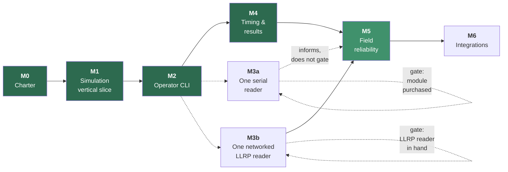

# SplitForge Roadmap

Milestones are ordered by **risk retired**, not by feature appeal. Each has an exit
criterion that is a demonstrable behavior, not a checklist of merged PRs. A milestone is
not done because the code exists; it is done because the exit criterion has been observed.



Solid green is complete. **M5 is the lighter green**: everything in it that can be built
without hardware is built, and what remains — like its exit criterion — needs a Pi.

**M3 and M4 swapped.** The original order put the physical reader first, because reader risk
is the larger risk and this roadmap is ordered by risk retired. That ordering assumed the
hardware would be available when M2 finished; it was not, and Q9 still had no owner. Blocking
on an unbought reader would have stopped the project rather than sequenced it, so M4 — which
needs no hardware at all — was built while M3 waited.

**M3 has since split into M3a and M3b** ([ADR-0024](adr/0024-serial-reader-adapter-before-llrp.md)),
for a reason the swap above had already exposed: the gate was written as one door and is
really two. A current serial module can be bought this week and closes six of the nine
support criteria; a networked LLRP reader closes all nine and nobody has one. Splitting lets
the six be retired now while the other three stay gated exactly as they were.

Nothing was skipped and **no exit criterion was weakened** — M3b's nine criteria are M3's
nine, verbatim, and M5 depends on M3b. M3a informs M5's open measurements without satisfying
its exit criterion, because a real stream of real reads is what those measurements needed and
LLRP was never what made them true.

---

## Milestone 0 — Project charter

**Status: complete.**

- `README.md` with the project promise, scope, and non-goals
- License settled — **GPL-3.0-or-later** ([ADR-0007](adr/0007-license-selection.md))
- Code of Conduct, contribution guidance, security reporting process
- Architecture, timing model, clock discipline, threat model
- ADRs for the decisions that constrain everything downstream
- Empty Cargo workspace with the crate boundaries in place
- CI running fmt, clippy, tests, audit, deny, and a Pi cross-build

**Exit criterion:** a contributor can read the repository and correctly predict where a
given piece of code belongs, and which rules it must not break.

---

## Milestone 1 — Simulation-first vertical slice

**Status: complete.**

**Build no reader integration.** The point is to prove the data path before adding the
hardware variable.

- [x] `splitforge-simulator` emits synthetic reads through the same `ReaderProvider` port a
      real reader will use
- [x] One fixture event: race, checkpoint, participant roster, chip assignments — two, in
      fact: a 5K and a four-lap criterium
- [x] Raw reads persist to the append-only journal
- [x] A chip crossing a checkpoint many times deduplicates to one accepted read
- [x] Accepted reads visible as CLI JSON output
- [x] Process restart leaves the journal intact
- [x] Fixture-driven tests for a 5K finish and a multi-lap event

**Exit criterion:** a simulated event produces durable raw and accepted reads, entirely
offline, and duplicate reads are preserved raw while reducing to one accepted timing event
— both before and after a process restart.

**Observed:**

```console
$ splitforge simulate --database event.db --fixture five-k --format compact
{"fixture":"five-k","reader":"mat","planned_crossings":24,"reads_scripted":638,
 "reads_received":638,"reads_persisted":638,"journal_total":638,...}

$ splitforge derive --database event.db --fixture five-k --format compact
{"raw_reads":638,"accepted":24,"rejected":614,"timing_events":23,
 "unassigned_crossings":1,"rejections_by_reason":{"duplicate_within_window":614},...}
```

638 raw reads preserved; 24 crossings; 614 suppressed reads each naming the crossing that
suppressed it. Re-deriving in a second process, from the same file, produces byte-identical
output — including the derived identifiers. A process killed mid-race leaves a journal whose
sequence numbers are contiguous from 1.

Four questions were closed on the way: [ADR-0009](adr/0009-rusqlite-for-sqlite-access.md),
[ADR-0010](adr/0010-time-crate-for-timestamps.md),
[ADR-0011](adr/0011-append-only-enforced-by-triggers.md),
[ADR-0012](adr/0012-architecture-rules-enforced-by-tests.md).

**Deliberately not done here:** results, placement, gun/chip time, statuses, or exports.
Milestone 1 proves the evidence path. What is *derived* from that evidence is Milestone 4,
and doing it early would mean doing it before the operator interface exists to check it.

---

## Milestone 2 — Local event console

**Status: complete.**

Minimum operator interface. CLI first; a web UI only after the core behavior is proven.

```bash
splitforge init
splitforge event create   --name "Spring Series"
splitforge race create    --name 5K --start 2026-04-11T08:00:00Z
splitforge checkpoint add --name start  --kind start
splitforge checkpoint add --name finish --kind finish
splitforge roster import  participants.csv
splitforge chips import   assignments.csv
splitforge reader add     --id mat
splitforge reader map     --reader mat --antenna 1 --checkpoint start
splitforge reader map     --reader mat --antenna 2 --checkpoint finish
splitforge policy set     --checkpoint finish --selection-rule first-above-rssi:-62
splitforge race start
splitforge reads --follow
splitforge race stop
splitforge derive
splitforge export crossings --as csv
splitforge backup create  snapshot.db
splitforge doctor
splitforge audit
```

**Exit criterion:** a simulated race can be configured and operated end to end without
ever touching the database directly.

**Observed.** The 5K above, configured from nothing but the commands listed — no fixture,
no SQLite prompt — with the roster and chip assignments arriving as CSV, which is what an
organizer actually has:

```console
$ splitforge roster import participants.csv
{"race":"5K","inserted":12,"updated":0,"unchanged":0,"total":12}

$ splitforge doctor
{"errors":0,"warnings":0,"findings":[]}

$ splitforge simulate --scenario five-k
{"scenario":"five-k","race":"5K","reader":"mat","planned_crossings":24,
 "reads_scripted":638,"reads_persisted":638,"journal_total":638,"first_seq":1,"last_seq":638}

$ splitforge derive
{"race":"5K","raw_reads":638,"accepted":24,"rejected":614,"timing_events":23,
 "unassigned_crossings":1,"rejections_by_reason":{"duplicate_within_window":614}}

$ splitforge export crossings --as csv --output crossings.csv   # 24 rows
$ splitforge backup create snapshot.db
{"bytes":380928,"raw_reads":638}
```

The thirteen audit rows behind that run reconstruct the entire configuration — every
`create`, `import`, `map`, and `set`, with the operator who ran it and the values they
supplied. The one unassigned crossing is a chip that was never on the roster: recorded as
evidence, credited to nobody, and reported rather than dropped.

`crates/splitforge-cli/tests/console.rs` holds the same claim as fourteen tests that reach
for no library type an operator does not have.

**Two corrections to this milestone as originally written**, both made deliberately rather
than silently:

- **`export results` became `export crossings`.** Results — placement, statuses, gun and
  chip time — are Milestone 4, which owns them explicitly. Exporting a column named `place`
  before the scoring rules exist would be a number somebody publishes and nobody can
  defend. M2 exports what it actually knows: crossings joined to the roster.
- **The command list above is longer than the original.** `race create`,
  `checkpoint add`, `reader map`, and `policy set` are not optional extras — without them
  there is no way to reach a configured race, so the exit criterion could not be met by the
  original list.

Two decisions were closed on the way:
[ADR-0014](adr/0014-mutable-configuration-immutable-evidence.md),
[ADR-0015](adr/0015-race-start-records-the-gun.md).

**Deliberately not done here:** placement, statuses, gun/chip time, result revisions, and
any web interface. Also no reader protocol — `reader status` reports configuration and what
the journal has observed, and claims nothing about a connection it has no way to open.

---

## Milestone 3 — One physical reader

**Split into M3a and M3b** by [ADR-0024](adr/0024-serial-reader-adapter-before-llrp.md).
Do not start either from protocol documentation alone — see
[hardware-support.md](hardware-support.md).

The split is not a softening. M3b below is M3 as it was originally written, with all nine
support criteria intact and the same hard gate on it. What changed is that the work which
never needed a *networked* reader — the parser, the port, the Pi-side durability
measurements — stopped being held hostage to one.

---

### Milestone 3a — One serial reader

**Gated on buying the module.** [Q9a](open-questions.md#q9a-first-serial-module) is closed —
the ThingMagic M7e-Pico — but nothing has been ordered. The three steps below that need no
hardware can start immediately, and should, exactly as
[ADR-0004](adr/0004-llrp-first-reader-adapter.md) argues for writing a parser against
captures.

**No hardware required:**

- [x] `crates/splitforge-thingmagic/` exists, holding the same boundary `splitforge-llrp`
      declares — `splitforge-domain` and `splitforge-reader` and nothing else. The
      hand-edited rows in `dependency_rules.rs` and
      [architecture § 2](architecture.md#dependency-rules) are the point of listing that
      table exhaustively ([ADR-0012](adr/0012-architecture-rules-enforced-by-tests.md))
- [x] **Framing before semantics.** `0xFF` / length / opcode / payload / CRC-16 as pure
      functions over `&[u8]`, with no I/O near them. Truncated frames, bad CRCs, corrupted
      length fields, and a payload that is itself a whole valid frame are test cases rather
      than hypotheticals. This is the highest-risk code in the project and it was fully
      testable before a module existed
- [ ] Implement `ReaderProvider` on top of the codec. The crate does **not** yet — framing is
      there and nothing above it, which is why `serialport` is not a dependency yet either.
      **This step has a prerequisite the plan did not have.** The user guide cannot supply the
      command set — § 7 is two framing diagrams and the CRC's covered range, and stops — so the
      opcodes have to come from the MercuryAPI SDK, which is code rather than a specification
      and needs its own archival and its own licensing read first
      ([vendor-documents.md](readers/vendor-documents.md#the-command-set-is-not-in-this-document))
- [ ] Session-anchored timestamps — the module's relative value is preserved as evidence and
      is **not** authoritative; the Pi's receipt time is
      ([the reader notes](readers/thingmagic-m7e-pico.md#timestamps))

**Needs the module:**

- [ ] Give `splitforge-edge` a read path, in the ordering
      [architecture § 3](architecture.md#3-data-flow) fixes: sidecar append + fsync completes
      first, always, then the journal append, then notify. Health gains reader connection
      state
- [ ] `PrivateDevices=no` / `DevicePolicy=closed` / `DeviceAllow=char-ttyUSB rw` in the unit,
      plus a udev rule for a stable device name. `RestrictAddressFamilies=AF_UNIX` **stays** —
      a serial adapter opens a file, not a socket
- [ ] Measure what M5 could not: whether the SD card honors `fsync`, what the second sync per
      reader report costs on real flash, what a full day's journal weighs, and what happens to
      a write in flight when the power goes
- [ ] Measure the Pi's receive-time jitter, which is what actually bounds accuracy on this
      hardware — not the module's throughput specification

**Exit criterion:** a serial module runs for several hours while every read is preserved
through deliberately induced disconnections and service restarts, and the count of reads the
module believes it sent matches the count in the journal.

**This criterion is now in doubt, and the doubt is recorded rather than resolved.** The user
guide says the module cannot detect a broken serial connection and goes on streaming into it,
and that the interface has no flow control — so reads emitted during an induced disconnection
are simply gone, and no count can reconcile what the module sent against what arrived. The
criterion quietly assumed a transport that knows what it delivered, and of the two adapters only
M3b has one. **M3b's identical wording is unaffected**, because LLRP runs over TCP. The three
ways out — reword the criterion, poll the tag buffer instead of streaming, or accept that M3a
cannot close it — are laid out in
[vendor-documents.md § 7](readers/vendor-documents.md#7-m3as-exit-criterion-may-not-be-reachable-on-this-interface),
and none is chosen there or here.

**Observed**, the frame codec. Thirty-four tests, none of which need hardware, and most of
which feed the parser input that is deliberately wrong. Three carry the claim:

- **Every truncation of a valid frame** — all 12 of them for a 5-byte payload, and 2,000
  random buffers decoded at every possible cut — reports `Incomplete` rather than failing.
  On a serial port a partial buffer is the *ordinary* case, and a codec that treats it as an
  error is one that discards good reads under load.
- **Every single bit flipped** in a frame's opcode, status, payload, or checksum is caught.
  That is a total claim rather than a statistical one, because CRC-16/CCITT detects all
  single-bit errors — so the test fails loudly if the CRC's coverage is ever narrowed to
  exclude a field somebody thought was unimportant.
- **A payload that is itself a complete, valid frame** decodes as a payload. `0xFF` is a
  synchronization hint and not a delimiter, and the fastest way to a permanently
  desynchronized stream is to treat it as one.

Two properties fell out of the wire format rather than being designed in, and both are worth
writing down because they retire risks the plan had listed. The length field is one byte, so
**a frame claiming 64 KB of payload is unrepresentable** — that attack is not mitigated, it
cannot be expressed. The ceiling that follows was initially read off the field's width as 262
bytes; the user guide turned out to cap data at 250 for a command and 248 for a response, so
`MAX_FRAME_LEN` is **255** and both directions reach it exactly
([vendor-documents.md](readers/vendor-documents.md#2-max_data_len-was-wider-than-the-protocol--since-fixed)).
And the
decoder **allocates nothing**: the payload borrows from the caller's buffer, which a test
checks by pointer rather than asserting in prose.

**What none of that can tell you is whether these are the right bytes.** The layout and the
CRC coverage come from vendor documentation, not from a capture. Both are written down as
named assumptions in the crate — `crc_covered_range` is a public function for exactly that
reason — so the first person holding a real capture knows the two places to look. A parser
that is internally consistent and externally wrong passes all thirty-four.

The one test anchored outside the crate is the CRC's published check vector,
`crc16(b"123456789") == 0x29B1`. Every other checksum assertion here is self-consistent and
would still pass with the wrong polynomial, because the same wrong function computes both
sides.

`serialport` is deliberately **not** a dependency yet. ADR-0024 authorizes it onto the read
path; the crate currently opens nothing, and a dependency that can lose a read is worth
adding with the code that opens the port rather than one commit earlier.

**What M3a explicitly does not do:** put anything in the support matrix. Two of the nine
criteria — a reader clock to measure offset and skew against, and per-antenna identity — are
**structurally** unclosable on a single-port module with no clock, not merely untested. The
gaps are named in [the reader notes](readers/thingmagic-m7e-pico.md#why-this-cannot-become-supported),
where the module sits as *experimental — under evaluation*.

**One of those two is now in doubt, in the direction of being closable.** Answering the
pre-order questions turned up vendor documentation that the *carrier board* — as opposed to
the module — carries four switched U.FL antenna ports, which would make per-antenna identity
reachable on one module and that criterion not structural at all. Nothing above is rewritten
on the strength of a distributor's forum post, and it would still be a time-shared radio
rather than two live antennas; the case is laid out in
[the reader notes](readers/thingmagic-m7e-pico.md#question-1-also-challenges-row-5-of-the-checklist-above).
**The reader-clock criterion is untouched** — there is no clock, and no wiring changes that.

---

### Milestone 3b — One networked LLRP reader

**Gated on having the hardware**, on [Q9b](open-questions.md#q9b-first-llrp-reader-model),
which is exactly as open as Q9 was. Every criterion below is M3's, verbatim.

- `splitforge-llrp`: connect to one specific physical reader
- Log protocol connection lifecycle and reports
- Handle **both** `UTCTimestamp` and `Uptime` correctly — an uptime value must never be
  interpreted as a date ([clock discipline § 6](clock-and-time-discipline.md#6-llrp-timestamp-specifics))
- Continuous offset and skew measurement into `clock_samples`
- Raw protocol captures behind an explicit diagnostic flag
- Reconnect safely after cable removal, reader reboot, and Wi-Fi interruption
- A network outage cannot erase already persisted reads
- Measure CPU, memory, write latency, and recovery behavior on the Pi

This is the milestone that has to widen `RestrictAddressFamilies` to `AF_INET`, failing
`apps/splitforge-edge/tests/unit_file.rs` until it does so deliberately — which is exactly the
review a quietly added listener would skip.

**Exit criterion:** a reader runs for several hours while every read is preserved through
deliberately induced network failures and service restarts, and the count of reads the
reader believes it sent matches the count in the journal.

**Milestone 5 depends on this milestone, not on M3a.**

---

## Milestone 4 — Timing and results

**Status: complete.** Built ahead of Milestone 3, which is gated on hardware — see the note
under the diagram above.

Simple, transparent rules first. Complexity here is where scoring bugs live.

- [x] One start checkpoint, one finish checkpoint
- [x] Gun-time and chip-time calculation
- [x] First valid finish per participant
- [x] Configurable duplicate window
- [x] Statuses: `Finished`, `DNS`, `DNF`, `DQ`
- [x] Immutable result revisions with policy snapshots
- [x] Overall placement by the selected timing policy
- [x] **Manual entries** — what an operator writes down when the chip does not, entering
      derivation as evidence rather than editing a result
      ([ADR-0023](adr/0023-manual-entries-are-derivation-inputs.md))
- [x] CSV and JSON exports

```bash
splitforge policy set  --start-mode chip        # or gun, the default
splitforge results preview                       # the rehearsal for the irreversible command
splitforge results publish --status provisional --reason "provisional results"
splitforge results declare --bib 104 --status dq --reason "cut the course"
splitforge manual add --bib 109 --checkpoint finish --at 2026-04-11T08:26:41Z --reason "chip failed"
splitforge manual list
splitforge results publish --status final --reason "bib 104 disqualified after review"
splitforge results diff --from 1 --to 2
splitforge results list
splitforge export results --as csv --revision 1
```

**Deliberately excluded:** age-group scoring, waves, complex course layouts, penalties,
relay teams, live public pages. `StartMode` deliberately does not parse `wave` or `rolling`:
a mode that parsed and then scored like `gun` would be a wrong answer that looks like a
right one.

**Exit criterion:** a test event imports a roster, records reads, publishes a provisional
revision, applies a DQ correction, and retains **both** revisions with a complete audit
trail explaining the difference.

**Observed.** The same 5K, configured through the operator commands alone:

```console
$ splitforge results publish --status provisional --reason "provisional results"
{"revision":1,"status":"provisional","digest":"f7ab46341dd35a0c91b372a6870b6a1a",
 "entries":12,"finished":11,"dnf":1,"dns":0,"dq":0,"changed":true}

$ splitforge results declare --bib 104 --status dq --reason "cut the course at the turnaround"
{"seq":1,"bib":"104","status":"dq","actor":"operator"}

$ splitforge results publish --status final --reason "bib 104 disqualified after review"
{"revision":2,"status":"final","digest":"07de72201e2e5b5dbca383037c53b236",
 "entries":12,"finished":10,"dnf":1,"dns":0,"dq":1,"changed":true}

$ splitforge results diff --from 1 --to 2
{"from":1,"to":2,"changed":11,"unchanged":1}
  {"bib":"101","change":"placement","place_from":2,"place_to":1}
  {"bib":"107","change":"placement","place_from":3,"place_to":2}

$ splitforge results show --revision 1
{"revision":1,"bib":"104","status":"finished","place":1,"gun_time":"0:17:32.132"}
```

The last line is the milestone. Revision 2 disqualifies bib 104 and moves ten runners up a
place; revision 1 still says they won, in the words it was published in. Both are in the
database, the audit trail holds both publications with their differing digests, and the
declaration that separates them records who decided it and why.

The one unchanged entry is the runner who did not finish — a DQ ahead of you does not move
you up when you have no place to move.

Two decisions were closed on the way:
[ADR-0016](adr/0016-status-declarations-are-evidence.md),
[ADR-0017](adr/0017-placement-semantics.md). A third was re-scoped rather than answered:
[Q12](open-questions.md#q12-leap-second-handling), which turned out to constrain clock
discipline rather than scoring.

**Observed**, manual entries ([ADR-0023](adr/0023-manual-entries-are-derivation-inputs.md)).
The `five-k` fixture supplies the case without being asked to: bib 109 starts, the chip stops
reporting on course, and the runner is scored `dnf`. That is a correct reading of the
evidence and the wrong answer about the race. A finish marshal saw them cross.

```console
$ splitforge results show --revision 1                      # bib 109, abridged
{"bib":"109","status":"dnf","place":null,"gun_time":null,"chip_time":null,"finish_at":null}

$ splitforge manual add --bib 109 --checkpoint finish --at 2026-04-11T08:26:41Z \
    --reason "chip stopped reporting on course; finish marshal recorded the bib"
{"seq":1,"id":"cfdf52be-3c70-4725-b383-53c0fcabfe85","bib":"109","name":"Runner 109",
 "checkpoint":"finish","at":"2026-04-11T08:26:41Z","recorded_at":"2026-08-24T14:30:42.513467Z",
 "actor":"operator","reason":"chip stopped reporting on course; finish marshal recorded the bib"}

$ splitforge derive
{"race":"5K","raw_reads":638,"accepted":24,"rejected":614,"timing_events":24,...}

$ splitforge results publish --status final --reason "finish recorded by hand after a chip failure"
{"revision":2,"status":"final","digest":"5eb97cfeecad5b389eb663aec39a7d3c",
 "entries":12,"finished":12,"dnf":0,"dns":0,"dq":0,"changed":true}

$ splitforge results show --revision 2                      # bib 109, abridged
{"bib":"109","status":"finished","place":10,"gun_time":"0:26:41.000",
 "chip_time":"0:26:33.872","finish_at":"2026-04-11T08:26:41Z"}

$ splitforge results show --revision 1                      # unchanged
{"bib":"109","status":"dnf","place":null,"gun_time":null,"chip_time":null,"finish_at":null}
```

Four numbers carry the decision. `raw_reads` and `accepted` do not move, because an entry is
not a read and must not pretend to be one — the journal still holds exactly what the hardware
reported. `timing_events` goes from 23 to 24, which is the entry entering derivation as an
input. And `chip_time` is 7 seconds shorter than `gun_time`, because it is measured from this
runner's own start crossing — which the chip *did* record. One result, assembled from both
kinds of evidence.

The last command is the other half. Revision 1 still says `dnf`, in the words it was published
in, with the digest it was published under. It was true about what was known at the time and
somebody may have acted on it; the correction lives in revision 2. Had the finish time been
typed into the results table instead, the next re-derivation would have thrown it away.

Nothing here can be taken back:

```console
>>> UPDATE manual_entries SET reason = 'never mind'
    IntegrityError: manual_entries is append-only: UPDATE is not permitted

>>> DELETE FROM manual_entries
    IntegrityError: manual_entries is append-only: DELETE is not permitted
```

Both statements went straight at the file through a plain SQLite driver, with no SplitForge
code in the path at all.

An operator who enters the wrong bib appends a correction; both rows survive, because the
results published in between depended on the first one. That is
[ADR-0011](adr/0011-append-only-enforced-by-triggers.md) applied to the newest evidence table,
and it is enforced by the database rather than by whoever reviews the pull request.

One thing surfaced that no test would have. Both operator-facing error messages in the new
code had lost their line-continuation backslashes, so `manual add` with an unknown bib printed
`import the` followed by thirty spaces and then `roster first`. That is the second time this
defect has shipped into a review — the wall-clock step work hit it too — and it is invisible
in a passing suite, because the string is still one string. It is obvious the instant a real
command prints it. The two tests that now hold it assert on the absence of a double space in
`stderr`, which is the only part a human would have noticed.

**Deliberately not done here:** any web interface, and any claim about reader behavior. The
scoring path has never seen a physical reader — that is Milestone 3, and it is still gated.

---

## Milestone 5 — Field reliability

**Status: the hardware-free work is complete; the exit criterion needs a Pi.**

Operational safety, not features. This milestone is what separates a demo from a timer.

- [x] systemd service with restart policy and startup ordering — the unit is
      [`deploy/splitforge-edge.service`](../deploy/splitforge-edge.service); it waits for no
      network and never stops restarting
      ([ADR-0022](adr/0022-the-service-never-waits-for-the-network.md))
- [x] Health endpoint — `splitforge-edge` serves it on a Unix socket that binds no port
      ([ADR-0021](adr/0021-local-api-listens-on-a-unix-socket.md)), closing
      [Q5](open-questions.md#q5-local-api-authentication-model)
- [x] Downloadable diagnostic bundle — `splitforge doctor --bundle out.json`, safe to attach
      to a public issue without being read first
      ([ADR-0020](adr/0020-diagnostic-bundles-carry-no-participant-data.md))
- [x] Free-disk warning and defined write-failure behavior
      ([ADR-0019](adr/0019-pre-race-gates-block-but-can-be-overridden.md))
- **Clock discipline** — *partly built.* Two halves are done. Wall-clock step detection: the
  service compares the wall clock against the monotonic clock and records every jump as
  append-only evidence
  ([clock discipline § 10](clock-and-time-discipline.md#10-health-checks-and-alarms)). And
  **determining `DeviceClockState`**, by asking the time daemon rather than the kernel — the
  question this milestone had recorded as blocked on `unsafe`. Still hardware-gated: DS3231
  RTC support, GPS/PPS integration, and Pi as LAN NTP server. Still *question*-gated, which
  is not the same thing: clock state as a **blocking** pre-race check waits on
  [Q11](open-questions.md#q11-clock-error-budget-enforcement)
- [x] Manual backup and **restore drills** — restore is rehearsed, not discovered
- [x] Corruption recovery ([ADR-0018](adr/0018-write-ahead-sidecar-journal.md))
- Graceful shutdown on power loss where the hardware permits
- Pi **field** guide: external power, wired Ethernet first, race-day Wi-Fi treated as a
  known risk. Installing the service is written up in [deployment.md](deployment.md); this
  is the half that needs a Pi in a field to write honestly

**Everything above that needs no hardware is built**, for the same reason Milestone 4 was
built ahead of Milestone 3: leaving it until after the reader arrived would have meant timing
a real event with a recovery story that existed only as an open question. That inverts the
usual framing — these items are not early, the hardware ones are late.

Three questions closed on the way:
[Q5](open-questions.md#q5-local-api-authentication-model), which had blocked the health
endpoint since Milestone 0; [Q7](open-questions.md#q7-corruption-recovery-strategy), by
`backup restore` and `splitforge recover`; and the free-space gate's override rule
([ADR-0019](adr/0019-pre-race-gates-block-but-can-be-overridden.md)).

**Observed.** The same 5K, with a snapshot taken before the gun. Between the second command
and the third, `event.db`, `event.db-wal`, and `event.db-shm` were deleted outright — the
sidecar was left alone, which is the whole point:

```console
$ splitforge backup create pre-race.db
{"bytes":184320,"path":"pre-race.db","raw_reads":0}

$ splitforge simulate --scenario five-k
{"scenario":"five-k","race":"5K","reads_persisted":638,"journal_total":638,...}

$ rm event.db event.db-wal event.db-shm        # the disaster

$ splitforge doctor
{"errors":1,"findings":[{"severity":"error","check":"journal.sidecar",
 "detail":"638 read(s) are in the sidecar but not in the database.
           Run `splitforge recover` to replay them."}]}

$ splitforge backup restore pre-race.db --replace
{"source":"pre-race.db","destination":"event.db","raw_reads":0,
 "displaced":["event.db.superseded.1786986481"],
 "next":"run `splitforge recover` to replay reads the snapshot predates"}

$ splitforge recover
{"sidecar_records":638,"replayed_into_database":638,"backfilled_into_sidecar":0,
 "corrupt_lines":0,"torn_tail_bytes":0}

$ splitforge derive
{"race":"5K","raw_reads":638,"accepted":24,"rejected":614,"timing_events":23,
 "unassigned_crossings":1,"rejections_by_reason":{"duplicate_within_window":614}}
```

That last line is byte-identical to the derivation taken before the database was destroyed —
not merely the same counts, but the same 24 accepted reads carrying the same derived
identifiers. The snapshot supplied the configuration and knew about none of the reads; the
sidecar supplied all 638.

`splitforge doctor` diagnoses and refuses to repair, which is why it appears above the
restore rather than instead of it: a diagnostic that silently fixes things is a diagnostic
describing a state it just changed. `crates/splitforge-cli/tests/recovery.rs` holds the same
claim as nine tests that destroy the file three different ways — deleted, overwritten with
garbage, and with no snapshot to restore from at all.

**Observed**, the free-space gate. The floor here was set to something no machine can
satisfy, which is how the below-the-floor path is reachable on demand:

```console
$ splitforge device show
{"database":"event.db","min_free_mb":256,"free_mb":9407,"total_mb":487070,"above_floor":true}

$ splitforge device set --min-free-mb 999999999
{"min_free_mb":999999999}

$ splitforge doctor
{"errors":1,"findings":[{"severity":"error","check":"storage.free_space",
 "detail":"9407 MB free, below the 999999999 MB floor.
           `splitforge race start` will refuse until this is resolved."}]}

$ splitforge race start
error: 9407 MB free, below the 999999999 MB floor. The journal has to hold the whole
       event, and a disk that fills mid-race stops recording. Free space, lower the floor
       with `splitforge device set --min-free-mb`, or start anyway with `--force --note`.

$ splitforge backup create snap.db
error: 9407 MB free; a snapshot of this database needs 1 MB and must leave the 999999999 MB
       floor behind it. The journal keeps writing — it is the backup that is refused.

$ splitforge race start --force --note "USB SSD attached, floor is stale"
{"action":"start","forced":true,"free_mb":9407,"note":"USB SSD attached, floor is stale",...}

$ splitforge audit --limit 1
[{"action":"race.start","subject":"5K","detail":{"forced":true,"free_mb":9407,
  "reason":"USB SSD attached, floor is stale"}}]
```

The last two commands are the decision that [ADR-0019](adr/0019-pre-race-gates-block-but-can-be-overridden.md)
records: the gate blocks, the organizer can walk past it, and walking past it writes down
who did and why. The backup is refused while the journal keeps accepting reads, which is the
shedding order [architecture.md § 4](architecture.md#4-failure-behavior) asks for.

**Observed**, the diagnostic bundle ([ADR-0020](adr/0020-diagnostic-bundles-carry-no-participant-data.md)).
A bundle is the one artifact SplitForge builds to be sent somewhere — emailed, pasted into
an issue, dropped in a chat channel — and nobody is going to open it first and check what is
inside. So it carries nothing about anybody. Here
the roster deliberately omits chips for two entrants, which is what makes `config.chips`
fire, and `config.chips` reports entrants **by bib**:

```console
$ splitforge doctor
{"errors":0,"warnings":1,"findings":[{"severity":"warning","check":"config.chips",
 "detail":"race \"5K\": 2 entrant(s) have no chip and cannot be timed (104, 109)"}]}

$ splitforge doctor --bundle bundle.json
wrote diagnostic bundle to bundle.json

$ jq '.doctor.findings, .races[0]' bundle.json
[{"severity":"warning","check":"config.chips","detail":null,
  "detail_withheld":"this check's message can name participants;
                     run `splitforge doctor` on the device to read it"}]
{"race":"5K","participants":12,"assignments":10,"participants_without_a_chip":2, ...}
```

The maintainer learns that two entrants cannot be timed and which check said so. Which two
stays on the device.

Bundling the complete 5K instead — run, published, and corrected — gives the other half:
638 reads split `mat/1` 325 and `mat/2` 313, contiguous from sequence 1; a sidecar holding
all 638 with nothing missing in either direction; both revisions with the differing digests
that prove the correction landed; and the audit trail as `fixture.load`, `race.start`,
`results.publish`, `results.declare`, `results.publish`. The one chip read by a mat and
assigned to nobody appears, in that particular file, as `"h:2deab172"` — and as something
else entirely in the next one, because the hash is salted per bundle. It correlates
*inside* this file and is worth nothing outside it, because the salt was thrown away when
the file was written.

`crates/splitforge-cli/tests/bundle.rs` holds the claim as eight tests. The one that matters
runs a full event — roster, race, publication, a disqualification by bib with an operator's
reason naming the runner — then searches the **bytes** of the resulting bundle for every
name, bib, chip, operator, and typed sentence the event contained, and for the temporary
directory it ran in. Searching the parsed JSON instead would only check the fields somebody
thought to look at, and the leak that matters is the one in the field nobody thought of.

Two things surfaced while building it, both worth writing down. The first: an allowlisted
check is not automatically safe. `storage.free_space` reports a measurement failure by
quoting the path it could not read, and a path on anything but a Pi runs through a home
directory and names the operator — so the bundle substitutes the database's directories out
of every message it copies. That is the one filter this design permits, because it replaces
a handful of exactly known strings rather than guessing at prose.

The second removed a field. `recorded_at - received_at` looks exactly like the number
that says whether storage kept up — and it is, for reads a device actually took off a
socket. The simulator stamps `received_at` from the fixture's race day so a restart test can
compare two derivations byte for byte, so the first bundle from a real run reported a write
latency of 128 days. Write latency needs a Pi, and it stays with the rest of the work that
does.

**Observed**, the health endpoint ([ADR-0021](adr/0021-local-api-listens-on-a-unix-socket.md)).
The same 5K, run and left in the journal, with `splitforge-edge` started against it:

```console
$ splitforge-edge --database event.db --socket api.sock &
$ EDGE=$!

$ ls -l api.sock
srw-rw---- 1 root root 0 Aug 24 04:42 api.sock

$ curl -s --unix-socket api.sock http://localhost/health
{"status":"ok","degraded_by":[],"version":"0.0.0","uptime_seconds":0,"database":"event.db",
 "schema_version":5,"raw_reads":638,"free_mb":935969,"min_free_mb":256,"above_floor":true,
 "clock_steps":0}
HTTP 200

$ awk 'NR>1 && $4=="0A"' /proc/$EDGE/net/tcp /proc/$EDGE/net/tcp6 | grep -c .
0

$ splitforge device set --min-free-mb 999999999
{"min_free_mb":999999999}

$ curl -s --unix-socket api.sock http://localhost/health
{"status":"degraded","degraded_by":["935969 MB free, below the 999999999 MB floor;
 `splitforge race start` will refuse"],"version":"0.0.0","uptime_seconds":0,
 "database":"event.db","schema_version":5,"raw_reads":638,"free_mb":935969,
 "min_free_mb":999999999,"above_floor":false,"clock_steps":0}
HTTP 503

$ curl --fail --unix-socket api.sock http://localhost/health >/dev/null; echo $?
22

$ kill -TERM $EDGE
exit 0
socket removed
```

The `0` is the milestone. That is the count of listening TCP sockets in the namespace *while
the endpoint is answering requests* — not a listener bound to loopback, and not a listener
behind a disabled flag. There is no listener. Everything above went over a file.

The two `curl` exit codes are the rest of it: `0` and `22` are the whole monitoring contract,
so a systemd watchdog or a shell script never has to parse the body to know the device is in
trouble. `raw_reads` is read from the journal on every request rather than counted in
memory — the reads above were written by a different process entirely, and a service that
answered from its own tally would have said `0`.

The socket is mode `0660`, which the code sets after binding and a test asserts. It shows
`root root` here because this ran in the CI container; the deployment runs it as
`splitforge:splitforge`, and the group is the whole access-control story — anyone who can
open that file is a fully trusted operator, which is exactly the trust SSH access already
implies.

What health deliberately does **not** report is whether a reader is connected. There is no
field for it, because there is no reader until Milestone 3a and a field that always said
`false` would be read as an outage. That is also the reason this endpoint exists at all
rather than being folded into `splitforge status`: reader connection state will live in the
running process and in no file, so no one-shot command will ever be able to see it.

Two test files hold the claims. `apps/splitforge-edge/tests/service.rs` spawns the actual
binary, talks to it over the actual socket, and sends it an actual SIGTERM — including a
start against a database that was deleted out from under a full sidecar, which comes up
having replayed all 638 reads. `crates/splitforge-api/tests/socket.rs` adds one test that
reads the crate's own source and fails on `TcpListener`, `SocketAddr`, `0.0.0.0`, or
`127.0.0.1`. A port opened behind a feature flag would pass every runtime test in that file
and still be the thing the ADR forbids, so the constraint is checked the way ADR-0012 checks
the dependency rules: by a test, not by whoever reviews the pull request.

**Observed**, the systemd unit ([ADR-0022](adr/0022-the-service-never-waits-for-the-network.md)).
Installed under a real systemd and then attacked: `systemd-analyze verify` clean, `SIGKILL`
restarted by systemd, `systemctl stop` exiting 0 and taking the socket with it, exposure
level 1.0. The full transcript is in [deployment.md](deployment.md#observed), where somebody
installing it will actually be looking.

The part worth repeating here is that **the first run of that unit created the event database
world-readable.** `event.db` and `event.db.reads.jsonl` came out `-rw-r--r--` on a device the
threat model already describes as physically reachable by strangers — participant names and
every raw read in plain text ([ADR-0018](adr/0018-write-ahead-sidecar-journal.md)), which is
the same exposure this repository's own `.gitignore` spends a paragraph warning about,
reproduced on the machine where the data actually lives. `UMask=0007` fixes it.

Nothing about reading the unit file would have found that. It took installing it and running
`ls` — the same reason the diagnostic bundle's write-latency bug and the free-space gate's
path leak were both found by running real commands rather than by passing tests. The
measurement then corrected a claim rather than confirming one: a umask can only remove
permission bits and SQLite asks for `0644`, so the database ends up `0640`, group-readable
but not group-writable.

Three directives in that unit are load-bearing rather than hygiene, and
`apps/splitforge-edge/tests/unit_file.rs` enforces each by comparing the unit against the
binary's own `--help` output rather than against constants restated in the test:

- **No `Wants=` on any network target.** A checkpoint has no DHCP and often no switch;
  `network-online.target` would have delayed every boot by 90 seconds waiting for a network
  that is not coming. Architecture § 6 had specified exactly that, and is corrected there.
- **`StartLimitIntervalSec=0`.** `Restart=always` is not what it sounds like — systemd stops
  a unit permanently after five starts in ten seconds, and a timer that has given up records
  nothing for the rest of the event.
- **`RestrictAddressFamilies=AF_UNIX`.** [ADR-0021](adr/0021-local-api-listens-on-a-unix-socket.md)
  enforced by the kernel rather than by review, including against a dependency, which no
  source-reading test can see. **M3b** needs `AF_INET` and will have to add it deliberately,
  failing that test until it does. M3a does not: a serial adapter opens a file, not a socket,
  so of the two adapters the one arriving first is the *less* privileged
  ([ADR-0024](adr/0024-serial-reader-adapter-before-llrp.md)). What M3a widens instead is
  `PrivateDevices`, which as it stands gives the service a private `/dev` that
  `/dev/ttyUSB0` is not in.

**Observed**, wall-clock step detection — the one part of clock discipline that needs no
hardware and no unanswered question. The service was run under `libfaketime` with
`CLOCK_MONOTONIC` deliberately left alone, stepped an hour forward and ten minutes back; the
full transcript is in
[clock discipline § 10](clock-and-time-discipline.md#built-backward-and-forward-wall-clock-steps).

```console
$ curl -s --unix-socket api.sock http://localhost/health
{"status":"degraded","degraded_by":["the device clock has jumped 1 time(s), the largest
 by 3599998 ms; run `splitforge doctor` before publishing"],...,"clock_steps":1}
                                                                           HTTP 503
```

Two clocks and a subtraction. Between two samples ten seconds apart, wall time and monotonic
time should advance by the same amount; when they disagree by more than 250 ms the wall clock
moved, and the difference goes into an append-only table
([ADR-0011](adr/0011-append-only-enforced-by-triggers.md) — this needed no new decision, only
the existing one about evidence).

**Only a long-running process can see this.** A step is a discontinuity between two moments,
and a one-shot command was not there for the first one. After liveness, it is the second
thing the service can report that `splitforge status` structurally cannot — a better argument
for the service existing than the health endpoint alone was.

It matters because [`race start` records the gun](adr/0015-race-start-records-the-gun.md)
from this clock. The design target is ±0.1 s across an event day; the jump above is
3,599,998 ms. `largest_ms` is chosen by magnitude and **keeps its sign**, because backward is
the dangerous direction — it can give a later read an earlier timestamp than one recorded
before it.

**It warns, and blocks nothing.** Health degrades so `curl --fail` and a watchdog see it
without parsing a body, and `doctor` raises a warning. Nothing refuses to start a race and
nothing refuses to publish — which is deliberately *not* an answer to
[Q11](open-questions.md#q11-clock-error-budget-enforcement), which asks about accumulated
drift measured against a reference, needs the GPS and RTC hardware, and stays open.

Two defects surfaced, both from running it rather than from tests passing. `record_clock_step`
returned a timestamp carrying nanoseconds the column had truncated to microseconds, so the
value handed back did not compare equal to the row it described. And every multi-line message
in the new code had lost its line-continuation backslash, so health and `doctor` were emitting
`"the largest by                          3600000 ms"`. Neither is visible in a passing test
suite; both are obvious the moment a real command prints a real string.

**Observed**, the device's time source. `DeviceClockState` has been recorded on every read
since Milestone 1 and `is_trustworthy` has gated publication for as long — but nothing in the
workspace *determined* it, and this milestone recorded the reason as syscalls that
`unsafe_code = "deny"` rules out reaching for. That was the wrong way round the problem. The
unit file already said the way through: *"the service reads the clock and never sets it."*
**So ask the daemon rather than the kernel.** `chronyc -c tracking` prints one CSV line, no
`unsafe` is involved, and `ProtectClock=yes` stays untouched because reading is all that
happens.

```console
$ splitforge doctor                                     # a Pi disciplined by a PPS refclock
{"clock_source":{"measurement":"measured","state":"gps_locked",
 "detail":"chrony reports stratum 1, following a local reference clock",
 "reference_kind":"local","reference":"PPS","stratum":1,"rms_offset_ms":0.000034,
 "leap_pending":false},"errors":0,"warnings":0,"findings":[]}

$ splitforge doctor                                     # a device that has reached nothing
{"clock_source":{"measurement":"measured","state":"unsynced",
 "detail":"chrony reports stratum 0, following no reference at all","stratum":0,
 "rms_offset_ms":0.0,"leap_pending":false},"errors":0,"warnings":1,
 "findings":[{"severity":"warning","check":"clock.source",
 "detail":"the device clock is not synchronized to any time source. Gun and finish times
           will still be recorded from it, and their accuracy is whatever the clock
           happens to be — see docs/clock-and-time-discipline.md."}]}

$ splitforge doctor                                     # chronyd installed and not answering
{"clock_source":{"measurement":"daemon_unreachable","state":null,
 "detail":"`chronyc` could not reach the time daemon: 506 Cannot talk to daemon"},
 "warnings":1,...}
```

`state` is `null` in the last one and that is the point of the field. **"Not measured" and
"measured, and the clock is bad" are different facts that call for opposite reactions**, and
a report that collapsed them would tell an operator their clock was broken because nobody
asked. `measurement` names which of the four happened as a fixed token, so a watchdog never
has to parse the sentence beside it.

Two states are **structurally** unreachable from here, and that corrects
[hardware-plan § 7](hardware-plan.md#7-software-plan), which expected `chronyc` to report an
RTC. It cannot. A Pi whose clock was set from a DS3231 at boot and has reached no source
since reports *"Not synchronised"* — identical to a Pi that booted with no clock at all,
because from chrony's point of view they are the same situation. So both report `Unsynced`,
which is the **safe** direction to be wrong in: `is_trustworthy` is false for `Unsynced` and
true for `Rtc`, so the error is toward warning about a clock that was fine rather than
staying quiet about one that was not.

**It warns and blocks nothing**, for the same reason step detection does. *Which* states
should refuse a `race start` is [Q11](open-questions.md#q11-clock-error-budget-enforcement),
Q11 has no answer, and choosing one in the code would be answering it silently.

A bundle carries the answer, because a set of finish times that are all shifted by the same
amount is explained by this and by almost nothing else. What it does not carry is the
reference's **name** — on a race-day LAN that is an internal address — or the text of a
failure, which is program output nobody can make promises about:

```console
$ splitforge doctor                                     # on the device
{"clock_source":{...,"reference_kind":"network","reference":"192.168.1.1","stratum":3,...}}

$ jq -c '.device.clock_source' bundle.json              # in the file that gets emailed
{"measurement":"measured","state":"ntp_synced","reference_kind":"network","stratum":3,
 "rms_offset_ms":0.067,"leap_pending":false}
```

`reference_kind` survives and `reference` does not, which is the whole design in two fields:
*which kind* of source a device was following is the diagnostic, and the address is not. That
check is on the bundle's allowlist and was put there deliberately rather than by default —
both messages it can emit are compile-time constants with no interpolation at all, which is
the strongest case [ADR-0020](adr/0020-diagnostic-bundles-carry-no-participant-data.md)'s
allowlist can be given.

**One defect surfaced, and again by running it rather than by a test failing.** The first
version classified the reference by asking `is_local_reference`, which answers false for a
network peer *and* false for no reference at all — so a device following **nothing** was
reported as *"following a network time source"*, with `"reference": ""` beside it. That is
the one description that is definitely wrong, and an operator would read it as *the network
is fine, look elsewhere*. It is now a three-way distinction with a test on it. This is the
third time in this milestone that a defect invisible to a green suite was obvious the moment
a real command printed a real string.

**What no test here can tell you is whether a real `chronyd` prints these bytes.** The four
states above were observed end to end through the real subprocess path, against a **stub**
daemon on a development machine — the field layout comes from chrony's documentation, and
`TRACKING_FIELDS` and `looks_plausible` are where the first person running this on a real Pi
should look. Reading the daemon is hardware-free; being sure it is *this* daemon is not.

### Still open — and nearly every item of it needs hardware

**Work:**

- **Graceful shutdown on power loss**, where the hardware permits it.
- **The Pi field guide** — external power, wired Ethernet first, race-day Wi-Fi as a known
  risk. Installing the service is written up in [deployment.md](deployment.md); this is the
  half that cannot be written honestly from a desk.
- **The hardware half of clock discipline** — the DS3231 RTC, GPS/PPS, the Pi as a LAN NTP
  server, and per-reader offset and skew into `clock_samples`. Clock state as a **blocking**
  pre-race check stays gated too, but for a different reason than the rest: not hardware, but
  [Q11](open-questions.md#q11-clock-error-budget-enforcement) — *which* states should refuse
  a start has no answer, and choosing one in the code would be answering it silently.
  **Determining and reporting the state is now built** — see below.

**Measurements nothing here has taken**, because they are properties of real flash and real
power rather than of code: whether an SD card honors `fsync` at all, what the second sync per
reader report ([ADR-0018](adr/0018-write-ahead-sidecar-journal.md)) costs on it, what happens
to a write in flight when the power goes, and what a full day's journal actually weighs — the
256 MiB default floor is a judgement against the 5K fixture, not a measurement.

**None of those four need LLRP** — only a real stream of real reads into a real Pi, which is
why [M3a](#milestone-3a--one-serial-reader) can retire them while M5's exit criterion goes on
waiting for M3b ([ADR-0024](adr/0024-serial-reader-adapter-before-llrp.md)).

**Exit criterion:** a full-length event is timed on real hardware while an observer
randomly pulls power, unplugs Ethernet, and restarts the service — and no acknowledged
read is missing from the journal afterward.

Unchanged by the M3 split, and it **depends on M3b**. "Unplugs Ethernet" is not incidental
phrasing: a serial module has no Ethernet to unplug, so M3a cannot produce this observation
no matter how well it goes.

---

## Milestone 6 — Integrations

Only after the local timer is dependable on its own — which means after Milestone 5's exit
criterion, and therefore after hardware.

- [x] **Versioned JSON results export.** `RESULTS_FORMAT` and `RESULTS_VERSION` ship in the
      envelope of `splitforge export results --as json`
- [x] **Stable CSV export contract.** `RESULTS_CSV_COLUMNS` is the contract, and
      `the_csv_column_list_is_the_contract` fails if a column moves. Every row carries the
      contract version in a trailing `format_version` column
- Optional RaceDay Connect publish adapter
- Signed/credentialed outbound sync
- Local outbox with safe retry
- **Timing never blocks on integration success**

The first two landed with Milestone 4 rather than here: results are a published contract the
moment anyone can export them, and shipping an unversioned one and versioning it later would
have meant breaking the consumers who adopted it first. `splitforge-export` exists to hold
exactly the outputs that carry that promise — the crossings dump stays in the CLI, where it
can change whenever the diagnostic needs it to.

The CSV's marker is a trailing column rather than a preamble line, and per row rather than
per file. A `# splitforge.results 1` line above the header would leave the column contract
untouched and break every consumer that opens the file the way organizers actually do —
Excel would show the marker in row 1 and the header in row 2. Appending is the one column
change a positional reader survives, and a per-row marker still says what produced it after
the file has been split, concatenated, or pasted into a sheet beside another race. Adding
the column did not bump `RESULTS_VERSION`, by the rule the crate already states: a consumer
that ignores unknown fields keeps working.

**Exit criterion:** an event times identically, and produces byte-identical exports, with
integrations enabled and disabled.

---

## Ordering principles

1. **Simulation before hardware.** A bug found against a simulator is debugged in seconds;
   the same bug found at a reader is debugged in a field with cold hands.
2. **Durability before correctness.** A wrong result computed from an intact journal is
   fixable. A right result computed from a lossy journal is luck.
3. **Reliability before features.** Every feature added before Milestone 5 is a feature
   that must survive the reliability work.
4. **No hardware claims without hardware.** See
   [hardware-support.md](hardware-support.md).
