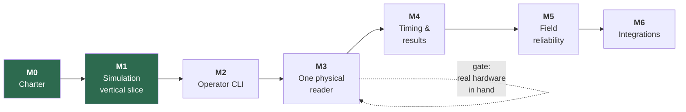

# SplitForge Roadmap

Milestones are ordered by **risk retired**, not by feature appeal. Each has an exit
criterion that is a demonstrable behavior, not a checklist of merged PRs. A milestone is
not done because the code exists; it is done because the exit criterion has been observed.



---

## Milestone 0 — Project charter

**Status: complete.**

- `README.md` with the project promise, scope, and non-goals
- License settled — **GPL-3.0-or-later** ([ADR-0007](adr/0007-license-selection.md))
- Code of Conduct, contribution guidance, security reporting process
- Architecture, timing model, clock discipline, threat model
- ADRs for the decisions that constrain everything downstream
- Empty Cargo workspace with the crate boundaries in place
- CI running fmt, clippy, tests, audit, deny, and a Pi cross-build

**Exit criterion:** a contributor can read the repository and correctly predict where a
given piece of code belongs, and which rules it must not break.

---

## Milestone 1 — Simulation-first vertical slice

**Status: this pull request.**

**Build no reader integration.** The point is to prove the data path before adding the
hardware variable.

- [x] `splitforge-simulator` emits synthetic reads through the same `ReaderProvider` port a
      real reader will use
- [x] One fixture event: race, checkpoint, participant roster, chip assignments — two, in
      fact: a 5K and a four-lap criterium
- [x] Raw reads persist to the append-only journal
- [x] A chip crossing a checkpoint many times deduplicates to one accepted read
- [x] Accepted reads visible as CLI JSON output
- [x] Process restart leaves the journal intact
- [x] Fixture-driven tests for a 5K finish and a multi-lap event

**Exit criterion:** a simulated event produces durable raw and accepted reads, entirely
offline, and duplicate reads are preserved raw while reducing to one accepted timing event
— both before and after a process restart.

**Observed:**

```console
$ splitforge simulate --database event.db --fixture five-k --format compact
{"fixture":"five-k","reader":"mat","planned_crossings":24,"reads_scripted":638,
 "reads_received":638,"reads_persisted":638,"journal_total":638,...}

$ splitforge derive --database event.db --fixture five-k --format compact
{"raw_reads":638,"accepted":24,"rejected":614,"timing_events":23,
 "unassigned_crossings":1,"rejections_by_reason":{"duplicate_within_window":614},...}
```

638 raw reads preserved; 24 crossings; 614 suppressed reads each naming the crossing that
suppressed it. Re-deriving in a second process, from the same file, produces byte-identical
output — including the derived identifiers. A process killed mid-race leaves a journal whose
sequence numbers are contiguous from 1.

Four questions were closed on the way: [ADR-0009](adr/0009-rusqlite-for-sqlite-access.md),
[ADR-0010](adr/0010-time-crate-for-timestamps.md),
[ADR-0011](adr/0011-append-only-enforced-by-triggers.md),
[ADR-0012](adr/0012-architecture-rules-enforced-by-tests.md).

**Deliberately not done here:** results, placement, gun/chip time, statuses, or exports.
Milestone 1 proves the evidence path. What is *derived* from that evidence is Milestone 4,
and doing it early would mean doing it before the operator interface exists to check it.

---

## Milestone 2 — Local event console

Minimum operator interface. CLI first; a web UI only after the core behavior is proven.

```bash
splitforge init
splitforge event create
splitforge roster import participants.csv
splitforge chips import assignments.csv
splitforge reader add
splitforge reader status
splitforge reads tail
splitforge race start
splitforge race stop
splitforge export results --format csv
splitforge backup create
splitforge doctor
```

**Exit criterion:** a simulated race can be configured and operated end to end without
ever touching the database directly.

---

## Milestone 3 — One physical reader

**Gated on having the hardware.** Do not start this milestone from protocol documentation
alone — see [hardware-support.md](hardware-support.md).

- `splitforge-llrp`: connect to one specific physical reader
- Log protocol connection lifecycle and reports
- Handle **both** `UTCTimestamp` and `Uptime` correctly — an uptime value must never be
  interpreted as a date ([clock discipline § 6](clock-and-time-discipline.md#6-llrp-timestamp-specifics))
- Continuous offset and skew measurement into `clock_samples`
- Raw protocol captures behind an explicit diagnostic flag
- Reconnect safely after cable removal, reader reboot, and Wi-Fi interruption
- A network outage cannot erase already persisted reads
- Measure CPU, memory, write latency, and recovery behavior on the Pi

**Exit criterion:** a reader runs for several hours while every read is preserved through
deliberately induced network failures and service restarts, and the count of reads the
reader believes it sent matches the count in the journal.

---

## Milestone 4 — Timing and results

Simple, transparent rules first. Complexity here is where scoring bugs live.

- One start checkpoint, one finish checkpoint
- Gun-time and chip-time calculation
- First valid finish per participant
- Configurable duplicate window
- Statuses: `Finished`, `DNS`, `DNF`, `DQ`
- Immutable result revisions with policy snapshots
- Overall placement by the selected timing policy
- CSV and JSON exports

**Deliberately excluded:** age-group scoring, waves, complex course layouts, penalties,
relay teams, live public pages.

**Exit criterion:** a test event imports a roster, records reads, publishes a provisional
revision, applies a DQ correction, and retains **both** revisions with a complete audit
trail explaining the difference.

---

## Milestone 5 — Field reliability

Operational safety, not features. This milestone is what separates a demo from a timer.

- systemd service with restart policy and startup ordering
- Health endpoint and downloadable diagnostic bundle
- Free-disk warning and defined write-failure behavior
- **Clock discipline:** DS3231 RTC support, GPS/PPS integration, Pi as LAN NTP server,
  clock state as a blocking pre-race check
  ([clock discipline § 10](clock-and-time-discipline.md#10-health-checks-and-alarms))
- Manual backup and **restore drills** — restore is rehearsed, not discovered
- Graceful shutdown on power loss where the hardware permits
- Pi deployment guide: external power, wired Ethernet first, race-day Wi-Fi treated as a
  known risk

**Exit criterion:** a full-length event is timed on real hardware while an observer
randomly pulls power, unplugs Ethernet, and restarts the service — and no acknowledged
read is missing from the journal afterward.

---

## Milestone 6 — Integrations

Only after the local timer is dependable on its own.

- Stable, versioned CSV export contract
- Versioned JSON results export
- Optional RaceDay Connect publish adapter
- Signed/credentialed outbound sync
- Local outbox with safe retry
- **Timing never blocks on integration success**

**Exit criterion:** an event times identically, and produces byte-identical exports, with
integrations enabled and disabled.

---

## Ordering principles

1. **Simulation before hardware.** A bug found against a simulator is debugged in seconds;
   the same bug found at a reader is debugged in a field with cold hands.
2. **Durability before correctness.** A wrong result computed from an intact journal is
   fixable. A right result computed from a lossy journal is luck.
3. **Reliability before features.** Every feature added before Milestone 5 is a feature
   that must survive the reliability work.
4. **No hardware claims without hardware.** See
   [hardware-support.md](hardware-support.md).
