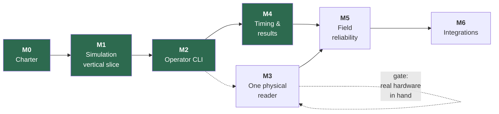

# SplitForge Roadmap

Milestones are ordered by **risk retired**, not by feature appeal. Each has an exit
criterion that is a demonstrable behavior, not a checklist of merged PRs. A milestone is
not done because the code exists; it is done because the exit criterion has been observed.



**M3 and M4 swapped.** The original order put the physical reader first, because reader risk
is the larger risk and this roadmap is ordered by risk retired. That ordering assumed the
hardware would be available when M2 finished; it was not, and
[Q9](open-questions.md#q9-first-reader-model) still has no owner. Blocking on an unbought
reader would have stopped the project rather than sequenced it, so M4 — which needs no
hardware at all — was built while M3 waits.

Nothing was skipped and no exit criterion was weakened. M3 remains gated exactly as written,
and M5 now depends on both.

---

## Milestone 0 — Project charter

**Status: complete.**

- `README.md` with the project promise, scope, and non-goals
- License settled — **GPL-3.0-or-later** ([ADR-0007](adr/0007-license-selection.md))
- Code of Conduct, contribution guidance, security reporting process
- Architecture, timing model, clock discipline, threat model
- ADRs for the decisions that constrain everything downstream
- Empty Cargo workspace with the crate boundaries in place
- CI running fmt, clippy, tests, audit, deny, and a Pi cross-build

**Exit criterion:** a contributor can read the repository and correctly predict where a
given piece of code belongs, and which rules it must not break.

---

## Milestone 1 — Simulation-first vertical slice

**Status: complete.**

**Build no reader integration.** The point is to prove the data path before adding the
hardware variable.

- [x] `splitforge-simulator` emits synthetic reads through the same `ReaderProvider` port a
      real reader will use
- [x] One fixture event: race, checkpoint, participant roster, chip assignments — two, in
      fact: a 5K and a four-lap criterium
- [x] Raw reads persist to the append-only journal
- [x] A chip crossing a checkpoint many times deduplicates to one accepted read
- [x] Accepted reads visible as CLI JSON output
- [x] Process restart leaves the journal intact
- [x] Fixture-driven tests for a 5K finish and a multi-lap event

**Exit criterion:** a simulated event produces durable raw and accepted reads, entirely
offline, and duplicate reads are preserved raw while reducing to one accepted timing event
— both before and after a process restart.

**Observed:**

```console
$ splitforge simulate --database event.db --fixture five-k --format compact
{"fixture":"five-k","reader":"mat","planned_crossings":24,"reads_scripted":638,
 "reads_received":638,"reads_persisted":638,"journal_total":638,...}

$ splitforge derive --database event.db --fixture five-k --format compact
{"raw_reads":638,"accepted":24,"rejected":614,"timing_events":23,
 "unassigned_crossings":1,"rejections_by_reason":{"duplicate_within_window":614},...}
```

638 raw reads preserved; 24 crossings; 614 suppressed reads each naming the crossing that
suppressed it. Re-deriving in a second process, from the same file, produces byte-identical
output — including the derived identifiers. A process killed mid-race leaves a journal whose
sequence numbers are contiguous from 1.

Four questions were closed on the way: [ADR-0009](adr/0009-rusqlite-for-sqlite-access.md),
[ADR-0010](adr/0010-time-crate-for-timestamps.md),
[ADR-0011](adr/0011-append-only-enforced-by-triggers.md),
[ADR-0012](adr/0012-architecture-rules-enforced-by-tests.md).

**Deliberately not done here:** results, placement, gun/chip time, statuses, or exports.
Milestone 1 proves the evidence path. What is *derived* from that evidence is Milestone 4,
and doing it early would mean doing it before the operator interface exists to check it.

---

## Milestone 2 — Local event console

**Status: complete.**

Minimum operator interface. CLI first; a web UI only after the core behavior is proven.

```bash
splitforge init
splitforge event create   --name "Spring Series"
splitforge race create    --name 5K --start 2026-04-11T08:00:00Z
splitforge checkpoint add --name start  --kind start
splitforge checkpoint add --name finish --kind finish
splitforge roster import  participants.csv
splitforge chips import   assignments.csv
splitforge reader add     --id mat
splitforge reader map     --reader mat --antenna 1 --checkpoint start
splitforge reader map     --reader mat --antenna 2 --checkpoint finish
splitforge policy set     --checkpoint finish --selection-rule first-above-rssi:-62
splitforge race start
splitforge reads --follow
splitforge race stop
splitforge derive
splitforge export crossings --as csv
splitforge backup create  snapshot.db
splitforge doctor
splitforge audit
```

**Exit criterion:** a simulated race can be configured and operated end to end without
ever touching the database directly.

**Observed.** The 5K above, configured from nothing but the commands listed — no fixture,
no SQLite prompt — with the roster and chip assignments arriving as CSV, which is what an
organizer actually has:

```console
$ splitforge roster import participants.csv
{"race":"5K","inserted":12,"updated":0,"unchanged":0,"total":12}

$ splitforge doctor
{"errors":0,"warnings":0,"findings":[]}

$ splitforge simulate --scenario five-k
{"scenario":"five-k","race":"5K","reader":"mat","planned_crossings":24,
 "reads_scripted":638,"reads_persisted":638,"journal_total":638,"first_seq":1,"last_seq":638}

$ splitforge derive
{"race":"5K","raw_reads":638,"accepted":24,"rejected":614,"timing_events":23,
 "unassigned_crossings":1,"rejections_by_reason":{"duplicate_within_window":614}}

$ splitforge export crossings --as csv --output crossings.csv   # 24 rows
$ splitforge backup create snapshot.db
{"bytes":380928,"raw_reads":638}
```

The thirteen audit rows behind that run reconstruct the entire configuration — every
`create`, `import`, `map`, and `set`, with the operator who ran it and the values they
supplied. The one unassigned crossing is a chip that was never on the roster: recorded as
evidence, credited to nobody, and reported rather than dropped.

`crates/splitforge-cli/tests/console.rs` holds the same claim as fourteen tests that reach
for no library type an operator does not have.

**Two corrections to this milestone as originally written**, both made deliberately rather
than silently:

- **`export results` became `export crossings`.** Results — placement, statuses, gun and
  chip time — are Milestone 4, which owns them explicitly. Exporting a column named `place`
  before the scoring rules exist would be a number somebody publishes and nobody can
  defend. M2 exports what it actually knows: crossings joined to the roster.
- **The command list above is longer than the original.** `race create`,
  `checkpoint add`, `reader map`, and `policy set` are not optional extras — without them
  there is no way to reach a configured race, so the exit criterion could not be met by the
  original list.

Two decisions were closed on the way:
[ADR-0014](adr/0014-mutable-configuration-immutable-evidence.md),
[ADR-0015](adr/0015-race-start-records-the-gun.md).

**Deliberately not done here:** placement, statuses, gun/chip time, result revisions, and
any web interface. Also no reader protocol — `reader status` reports configuration and what
the journal has observed, and claims nothing about a connection it has no way to open.

---

## Milestone 3 — One physical reader

**Gated on having the hardware.** Do not start this milestone from protocol documentation
alone — see [hardware-support.md](hardware-support.md).

[hardware-plan.md](hardware-plan.md) proposes splitting this milestone into **M3a** (a serial
reader, purchasable now) and **M3b** (a networked LLRP reader, keeping every exit criterion
below verbatim). That split is not adopted — it needs an amendment here and an ADR first.

- `splitforge-llrp`: connect to one specific physical reader
- Log protocol connection lifecycle and reports
- Handle **both** `UTCTimestamp` and `Uptime` correctly — an uptime value must never be
  interpreted as a date ([clock discipline § 6](clock-and-time-discipline.md#6-llrp-timestamp-specifics))
- Continuous offset and skew measurement into `clock_samples`
- Raw protocol captures behind an explicit diagnostic flag
- Reconnect safely after cable removal, reader reboot, and Wi-Fi interruption
- A network outage cannot erase already persisted reads
- Measure CPU, memory, write latency, and recovery behavior on the Pi

**Exit criterion:** a reader runs for several hours while every read is preserved through
deliberately induced network failures and service restarts, and the count of reads the
reader believes it sent matches the count in the journal.

---

## Milestone 4 — Timing and results

**Status: complete.** Built ahead of Milestone 3, which is gated on hardware — see the note
under the diagram above.

Simple, transparent rules first. Complexity here is where scoring bugs live.

- [x] One start checkpoint, one finish checkpoint
- [x] Gun-time and chip-time calculation
- [x] First valid finish per participant
- [x] Configurable duplicate window
- [x] Statuses: `Finished`, `DNS`, `DNF`, `DQ`
- [x] Immutable result revisions with policy snapshots
- [x] Overall placement by the selected timing policy
- [x] CSV and JSON exports

```bash
splitforge policy set  --start-mode chip        # or gun, the default
splitforge results preview                       # the rehearsal for the irreversible command
splitforge results publish --status provisional --reason "provisional results"
splitforge results declare --bib 104 --status dq --reason "cut the course"
splitforge results publish --status final --reason "bib 104 disqualified after review"
splitforge results diff --from 1 --to 2
splitforge results list
splitforge export results --as csv --revision 1
```

**Deliberately excluded:** age-group scoring, waves, complex course layouts, penalties,
relay teams, live public pages. `StartMode` deliberately does not parse `wave` or `rolling`:
a mode that parsed and then scored like `gun` would be a wrong answer that looks like a
right one.

**Exit criterion:** a test event imports a roster, records reads, publishes a provisional
revision, applies a DQ correction, and retains **both** revisions with a complete audit
trail explaining the difference.

**Observed.** The same 5K, configured through the operator commands alone:

```console
$ splitforge results publish --status provisional --reason "provisional results"
{"revision":1,"status":"provisional","digest":"f7ab46341dd35a0c91b372a6870b6a1a",
 "entries":12,"finished":11,"dnf":1,"dns":0,"dq":0,"changed":true}

$ splitforge results declare --bib 104 --status dq --reason "cut the course at the turnaround"
{"seq":1,"bib":"104","status":"dq","actor":"operator"}

$ splitforge results publish --status final --reason "bib 104 disqualified after review"
{"revision":2,"status":"final","digest":"07de72201e2e5b5dbca383037c53b236",
 "entries":12,"finished":10,"dnf":1,"dns":0,"dq":1,"changed":true}

$ splitforge results diff --from 1 --to 2
{"from":1,"to":2,"changed":11,"unchanged":1}
  {"bib":"101","change":"placement","place_from":2,"place_to":1}
  {"bib":"107","change":"placement","place_from":3,"place_to":2}

$ splitforge results show --revision 1
{"revision":1,"bib":"104","status":"finished","place":1,"gun_time":"0:17:32.132"}
```

The last line is the milestone. Revision 2 disqualifies bib 104 and moves ten runners up a
place; revision 1 still says they won, in the words it was published in. Both are in the
database, the audit trail holds both publications with their differing digests, and the
declaration that separates them records who decided it and why.

The one unchanged entry is the runner who did not finish — a DQ ahead of you does not move
you up when you have no place to move.

Two decisions were closed on the way:
[ADR-0016](adr/0016-status-declarations-are-evidence.md),
[ADR-0017](adr/0017-placement-semantics.md). A third was re-scoped rather than answered:
[Q12](open-questions.md#q12-leap-second-handling), which turned out to constrain clock
discipline rather than scoring.

**Deliberately not done here:** any web interface, and any claim about reader behavior. The
scoring path has never seen a physical reader — that is Milestone 3, and it is still gated.

---

## Milestone 5 — Field reliability

Operational safety, not features. This milestone is what separates a demo from a timer.

- [x] systemd service with restart policy and startup ordering — the unit is
      [`deploy/splitforge-edge.service`](../deploy/splitforge-edge.service); it waits for no
      network and never stops restarting
      ([ADR-0022](adr/0022-the-service-never-waits-for-the-network.md))
- [x] Health endpoint — `splitforge-edge` serves it on a Unix socket that binds no port
      ([ADR-0021](adr/0021-local-api-listens-on-a-unix-socket.md)), closing
      [Q5](open-questions.md#q5-local-api-authentication-model)
- [x] Downloadable diagnostic bundle — `splitforge doctor --bundle out.json`, safe to attach
      to a public issue without being read first
      ([ADR-0020](adr/0020-diagnostic-bundles-carry-no-participant-data.md))
- [x] Free-disk warning and defined write-failure behavior
      ([ADR-0019](adr/0019-pre-race-gates-block-but-can-be-overridden.md))
- **Clock discipline:** DS3231 RTC support, GPS/PPS integration, Pi as LAN NTP server,
  clock state as a blocking pre-race check
  ([clock discipline § 10](clock-and-time-discipline.md#10-health-checks-and-alarms))
- [x] Manual backup and **restore drills** — restore is rehearsed, not discovered
- [x] Corruption recovery ([ADR-0018](adr/0018-write-ahead-sidecar-journal.md))
- Graceful shutdown on power loss where the hardware permits
- Pi **field** guide: external power, wired Ethernet first, race-day Wi-Fi treated as a
  known risk. Installing the service is written up in [deployment.md](deployment.md); this
  is the half that needs a Pi in a field to write honestly

**Six items landed early**, for the same reason Milestone 4 did: they need no hardware, and
leaving them until after Milestone 3 would have meant timing a real event with a recovery
story that existed only as an open question. `backup restore` and `splitforge recover` are
built and tested; [Q7](open-questions.md#q7-corruption-recovery-strategy) is closed, and so
is [Q5](open-questions.md#q5-local-api-authentication-model), which had blocked the health
endpoint since Milestone 0.

**Observed.** The same 5K, with a snapshot taken before the gun. Between the second command
and the third, `event.db`, `event.db-wal`, and `event.db-shm` were deleted outright — the
sidecar was left alone, which is the whole point:

```console
$ splitforge backup create pre-race.db
{"bytes":184320,"path":"pre-race.db","raw_reads":0}

$ splitforge simulate --scenario five-k
{"scenario":"five-k","race":"5K","reads_persisted":638,"journal_total":638,...}

$ rm event.db event.db-wal event.db-shm        # the disaster

$ splitforge doctor
{"errors":1,"findings":[{"severity":"error","check":"journal.sidecar",
 "detail":"638 read(s) are in the sidecar but not in the database.
           Run `splitforge recover` to replay them."}]}

$ splitforge backup restore pre-race.db --replace
{"source":"pre-race.db","destination":"event.db","raw_reads":0,
 "displaced":["event.db.superseded.1786986481"],
 "next":"run `splitforge recover` to replay reads the snapshot predates"}

$ splitforge recover
{"sidecar_records":638,"replayed_into_database":638,"backfilled_into_sidecar":0,
 "corrupt_lines":0,"torn_tail_bytes":0}

$ splitforge derive
{"race":"5K","raw_reads":638,"accepted":24,"rejected":614,"timing_events":23,
 "unassigned_crossings":1,"rejections_by_reason":{"duplicate_within_window":614}}
```

That last line is byte-identical to the derivation taken before the database was destroyed —
not merely the same counts, but the same 24 accepted reads carrying the same derived
identifiers. The snapshot supplied the configuration and knew about none of the reads; the
sidecar supplied all 638.

`splitforge doctor` diagnoses and refuses to repair, which is why it appears above the
restore rather than instead of it: a diagnostic that silently fixes things is a diagnostic
describing a state it just changed. `crates/splitforge-cli/tests/recovery.rs` holds the same
claim as nine tests that destroy the file three different ways — deleted, overwritten with
garbage, and with no snapshot to restore from at all.

**Observed**, the free-space gate. The floor here was set to something no machine can
satisfy, which is how the below-the-floor path is reachable on demand:

```console
$ splitforge device show
{"database":"event.db","min_free_mb":256,"free_mb":9407,"total_mb":487070,"above_floor":true}

$ splitforge device set --min-free-mb 999999999
{"min_free_mb":999999999}

$ splitforge doctor
{"errors":1,"findings":[{"severity":"error","check":"storage.free_space",
 "detail":"9407 MB free, below the 999999999 MB floor.
           `splitforge race start` will refuse until this is resolved."}]}

$ splitforge race start
error: 9407 MB free, below the 999999999 MB floor. The journal has to hold the whole
       event, and a disk that fills mid-race stops recording. Free space, lower the floor
       with `splitforge device set --min-free-mb`, or start anyway with `--force --note`.

$ splitforge backup create snap.db
error: 9407 MB free; a snapshot of this database needs 1 MB and must leave the 999999999 MB
       floor behind it. The journal keeps writing — it is the backup that is refused.

$ splitforge race start --force --note "USB SSD attached, floor is stale"
{"action":"start","forced":true,"free_mb":9407,"note":"USB SSD attached, floor is stale",...}

$ splitforge audit --limit 1
[{"action":"race.start","subject":"5K","detail":{"forced":true,"free_mb":9407,
  "reason":"USB SSD attached, floor is stale"}}]
```

The last two commands are the decision that [ADR-0019](adr/0019-pre-race-gates-block-but-can-be-overridden.md)
records: the gate blocks, the organizer can walk past it, and walking past it writes down
who did and why. The backup is refused while the journal keeps accepting reads, which is the
shedding order [architecture.md § 4](architecture.md#4-failure-behavior) asks for.

**Observed**, the diagnostic bundle ([ADR-0020](adr/0020-diagnostic-bundles-carry-no-participant-data.md)).
A bundle is the one artifact SplitForge builds to be sent somewhere — emailed, pasted into an issue, dropped in a chat channel — and nobody is
going to open it first and check what is inside. So it carries nothing about anybody. Here
the roster deliberately omits chips for two entrants, which is what makes `config.chips`
fire, and `config.chips` reports entrants **by bib**:

```console
$ splitforge doctor
{"errors":0,"warnings":1,"findings":[{"severity":"warning","check":"config.chips",
 "detail":"race \"5K\": 2 entrant(s) have no chip and cannot be timed (104, 109)"}]}

$ splitforge doctor --bundle bundle.json
wrote diagnostic bundle to bundle.json

$ jq '.doctor.findings, .races[0]' bundle.json
[{"severity":"warning","check":"config.chips","detail":null,
  "detail_withheld":"this check's message can name participants;
                     run `splitforge doctor` on the device to read it"}]
{"race":"5K","participants":12,"assignments":10,"participants_without_a_chip":2, ...}
```

The maintainer learns that two entrants cannot be timed and which check said so. Which two
stays on the device.

Bundling the complete 5K instead — run, published, and corrected — gives the other half:
638 reads split `mat/1` 325 and `mat/2` 313, contiguous from sequence 1; a sidecar holding
all 638 with nothing missing in either direction; both revisions with the differing digests
that prove the correction landed; and the audit trail as `fixture.load`, `race.start`,
`results.publish`, `results.declare`, `results.publish`. The one chip read by a mat and
assigned to nobody appears, in that particular file, as `"h:2deab172"` — and as something
else entirely in the next one, because the hash is salted per bundle. It correlates
*inside* this file and is worth nothing outside it, because the salt was thrown away when
the file was written.

`crates/splitforge-cli/tests/bundle.rs` holds the claim as eight tests. The one that matters
runs a full event — roster, race, publication, a disqualification by bib with an operator's
reason naming the runner — then searches the **bytes** of the resulting bundle for every
name, bib, chip, operator, and typed sentence the event contained, and for the temporary
directory it ran in. Searching the parsed JSON instead would only check the fields somebody
thought to look at, and the leak that matters is the one in the field nobody thought of.

Two things surfaced while building it, both worth writing down. The first: an allowlisted
check is not automatically safe. `storage.free_space` reports a measurement failure by
quoting the path it could not read, and a path on anything but a Pi runs through a home
directory and names the operator — so the bundle substitutes the database's directories out
of every message it copies. That is the one filter this design permits, because it replaces
a handful of exactly known strings rather than guessing at prose.

The second removed a field. `recorded_at - received_at` looks exactly like the number
that says whether storage kept up — and it is, for reads a device actually took off a
socket. The simulator stamps `received_at` from the fixture's race day so a restart test can
compare two derivations byte for byte, so the first bundle from a real run reported a write
latency of 128 days. Write latency needs a Pi, and it stays with the rest of the work that
does.

What this does **not** retire is the reliability work that needs a Pi: whether an SD card
honors `fsync` at all, what the second sync per reader report costs on real flash, what
happens to a write in flight when the power goes, and what a full day's journal actually
weighs — the 256 MiB default is a judgement against the 5K fixture, not a measurement.
Those stay exactly where they were.

**Observed**, the health endpoint ([ADR-0021](adr/0021-local-api-listens-on-a-unix-socket.md)).
The same 5K, run and left in the journal, with `splitforge-edge` started against it:

```console
$ splitforge-edge --database event.db --socket api.sock &

$ ls -l api.sock
srw-rw---- 1 root root 0 Aug 18 15:51 api.sock

$ curl -s --unix-socket api.sock http://localhost/health
{"status":"ok","degraded_by":[],"version":"0.0.0","uptime_seconds":0,"database":"event.db",
 "schema_version":4,"raw_reads":638,"free_mb":936503,"min_free_mb":256,"above_floor":true}
HTTP 200

$ awk 'NR>1 && $4=="0A"' /proc/$EDGE/net/tcp /proc/$EDGE/net/tcp6 | grep -c .
0

$ splitforge device set --min-free-mb 999999999
{"min_free_mb":999999999}

$ curl -s --unix-socket api.sock http://localhost/health
{"status":"degraded","degraded_by":["936503 MB free, below the 999999999 MB floor;
 `splitforge race start` will refuse"],"version":"0.0.0","uptime_seconds":0,
 "database":"event.db","schema_version":4,"raw_reads":638,"free_mb":936503,
 "min_free_mb":999999999,"above_floor":false}
HTTP 503

$ curl --fail --unix-socket api.sock http://localhost/health >/dev/null; echo $?
22

$ kill -TERM $EDGE
exit 0
socket removed
```

The `0` is the milestone. That is the count of listening TCP sockets in the namespace *while
the endpoint is answering requests* — not a listener bound to loopback, and not a listener
behind a disabled flag. There is no listener. Everything above went over a file.

The two `curl` exit codes are the rest of it: `0` and `22` are the whole monitoring contract,
so a systemd watchdog or a shell script never has to parse the body to know the device is in
trouble. `raw_reads` is read from the journal on every request rather than counted in
memory — the reads above were written by a different process entirely, and a service that
answered from its own tally would have said `0`.

The socket is mode `0660`, which the code sets after binding and a test asserts. It shows
`root root` here because this ran in the CI container; the deployment runs it as
`splitforge:splitforge`, and the group is the whole access-control story — anyone who can
open that file is a fully trusted operator, which is exactly the trust SSH access already
implies.

What health deliberately does **not** report is whether a reader is connected. There is no
field for it, because there is no reader until Milestone 3 and a field that always said
`false` would be read as an outage. That is also the reason this endpoint exists at all
rather than being folded into `splitforge status`: reader connection state will live in the
running process and in no file, so no one-shot command will ever be able to see it.

Two test files hold the claims. `apps/splitforge-edge/tests/service.rs` spawns the actual
binary, talks to it over the actual socket, and sends it an actual SIGTERM — including a
start against a database that was deleted out from under a full sidecar, which comes up
having replayed all 638 reads. `crates/splitforge-api/tests/socket.rs` adds one test that
reads the crate's own source and fails on `TcpListener`, `SocketAddr`, `0.0.0.0`, or
`127.0.0.1`. A port opened behind a feature flag would pass every runtime test in that file
and still be the thing the ADR forbids, so the constraint is checked the way ADR-0012 checks
the dependency rules: by a test, not by whoever reviews the pull request.

**Observed**, the systemd unit ([ADR-0022](adr/0022-the-service-never-waits-for-the-network.md)).
Installed the way [deployment.md](deployment.md) says to install it, under a real systemd,
and then attacked:

```console
$ systemd-analyze verify /etc/systemd/system/splitforge-edge.service; echo $?
0

$ systemctl enable --now splitforge-edge && systemctl is-active splitforge-edge
active

$ ls -l /run/splitforge /var/lib/splitforge
srw-rw---- 1 splitforge splitforge      0 api.sock
-rw-r----- 1 splitforge splitforge   4096 event.db
-rw-r----- 1 splitforge splitforge  32768 event.db-shm
-rw-r----- 1 splitforge splitforge 230752 event.db-wal
-rw-rw---- 1 splitforge splitforge      0 event.db.reads.jsonl

$ kill -9 $(systemctl show -p MainPID --value splitforge-edge)
$ systemctl is-active splitforge-edge
active                                           # pid 392 -> 428

$ systemctl stop splitforge-edge
$ systemctl show -p Result -p ExecMainStatus splitforge-edge
Result=success
ExecMainStatus=0
$ ls /run/splitforge
ls: cannot access '/run/splitforge': No such file or directory

$ systemd-analyze security splitforge-edge.service | tail -1
→ Overall exposure level for splitforge-edge.service: 1.0 OK :-)
```

`SIGKILL` is the only signal that actually tests `Restart=always`, and the missing
`/run/splitforge` afterwards is the graceful path working: the service removed its socket on
SIGTERM and systemd removed the directory with the service. Neither of those is the
interesting part.

**The interesting part is the file modes, because the first run of this unit got them
wrong.** `event.db` and `event.db.reads.jsonl` came out `-rw-r--r--` — world-readable — on a
device the threat model already describes as physically reachable by strangers. The database
holds participant names and the sidecar holds every raw read in plain text
([ADR-0018](adr/0018-write-ahead-sidecar-journal.md)), so that is the same exposure the
repository's own `.gitignore` spends a paragraph warning about, reproduced on the machine
where the data actually lives. `UMask=0007` fixes it, and the modes above are what the unit
produces now rather than what it intends.

Nothing about reading the unit file would have found that. It took installing it and running
`ls`, which is the same reason the diagnostic bundle's write-latency bug and the free-space
gate's path leak were both found by running real commands rather than by passing tests.

The measurement also corrected a claim rather than confirming one: a umask can only remove
permission bits, and SQLite asks the kernel for `0644`, so the database ends up `0640` — the
group can read the event but not write it. The comment in the unit now says that, and
[deployment.md](deployment.md) documents the two access tiers that follow.

Three things in that unit are load-bearing rather than hygiene, and each is enforced by
`apps/splitforge-edge/tests/unit_file.rs`, which compares the unit against the binary's own
`--help` output and against `splitforge_api::DEFAULT_SOCKET_PATH` rather than against
constants restated in the test:

- **No `Wants=` on any network target.** A checkpoint has no DHCP and often no switch;
  `network-online.target` would have delayed every boot by 90 seconds waiting for a network
  that is not coming. Architecture § 6 had specified exactly that, and it is corrected there.
- **`StartLimitIntervalSec=0`.** `Restart=always` is not what it sounds like — systemd stops
  a unit permanently after five starts in ten seconds. A timer that has given up records
  nothing for the rest of the event.
- **`RestrictAddressFamilies=AF_UNIX`.** [ADR-0021](adr/0021-local-api-listens-on-a-unix-socket.md)
  enforced by the kernel rather than by review, including against a dependency, which no
  source-reading test can see. Milestone 3 needs `AF_INET` for the reader and will have to
  add it deliberately, failing this test until it does.

**Still open in this milestone:** graceful shutdown on power loss, the Pi field guide, and
every part of clock discipline — the RTC, GPS/PPS, the Pi as a LAN NTP server, and clock
state as a pre-race gate. That last one is not hardware-free the way it looks: nothing in
the codebase determines `DeviceClockState` today, determining it needs syscalls this
workspace's `unsafe_code = "deny"` rules out reaching for directly, and *which* states
should block a start is [Q11](open-questions.md#q11-clock-error-budget-enforcement), which
has no answer yet. Building it now would mean silently choosing one.

**Exit criterion:** a full-length event is timed on real hardware while an observer
randomly pulls power, unplugs Ethernet, and restarts the service — and no acknowledged
read is missing from the journal afterward.

---

## Milestone 6 — Integrations

Only after the local timer is dependable on its own.

- Stable, versioned CSV export contract
- Versioned JSON results export
- Optional RaceDay Connect publish adapter
- Signed/credentialed outbound sync
- Local outbox with safe retry
- **Timing never blocks on integration success**

**Exit criterion:** an event times identically, and produces byte-identical exports, with
integrations enabled and disabled.

---

## Ordering principles

1. **Simulation before hardware.** A bug found against a simulator is debugged in seconds;
   the same bug found at a reader is debugged in a field with cold hands.
2. **Durability before correctness.** A wrong result computed from an intact journal is
   fixable. A right result computed from a lossy journal is luck.
3. **Reliability before features.** Every feature added before Milestone 5 is a feature
   that must survive the reliability work.
4. **No hardware claims without hardware.** See
   [hardware-support.md](hardware-support.md).
