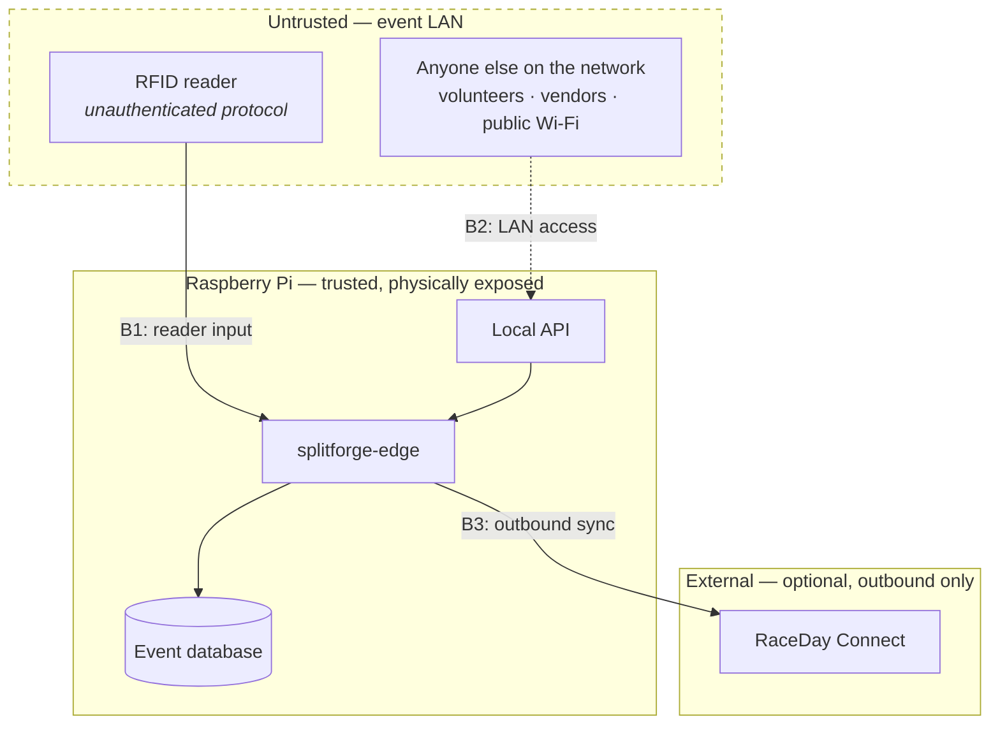

# Threat Model and Operational Risk Register

> Status: proposed. Scope is Milestones 0–5. Revisit before any public release.

SplitForge's operating environment is unusual and worth stating plainly: **an unattended
Linux box on an untrusted temporary network, in weather, on battery, holding data that
determines competitive outcomes, operated by a volunteer, with no ability to phone home.**

Most of the realistic risk is operational rather than adversarial. A race is far more
likely to be ruined by a full SD card than by an attacker. Both are in scope, and the risk
register below does not separate them, because on race morning the distinction is
academic.

## 1. Assets

| Asset | Why it matters | Loss impact |
|---|---|---|
| **`raw_reads` journal** | The evidence. Everything else is derived | Catastrophic — unrecoverable. Results cannot be reconstructed |
| `manual_entries` | Evidence for chip failures | Severe — affects specific participants irrecoverably |
| Result revisions | The published record | High — regenerable from evidence if the journal survives |
| Roster and chip assignments | Maps reads to people | High — re-importable if the source file exists |
| Timing policy config | Determines scoring | Moderate — regenerable, but silent changes are dangerous |
| Integration credentials | Access to downstream services | Moderate — revocable |
| Audit log | Ability to defend a result | High — its absence is only discovered during a dispute |

The asymmetry is the point: **the journal is the only thing that cannot be rebuilt.**
Every design tradeoff resolves in its favor.

## 2. Trust boundaries

| Boundary | Assumption |
|---|---|
| **B1 — reader input** | Fully untrusted. LLRP has no authentication; anything on the LAN can impersonate a reader or send malformed frames |
| **B2 — LAN access** | Untrusted. Event networks are shared, ad hoc, and often built by whoever brought a switch |
| **B3 — outbound sync** | Failure-tolerant by design. Compromise leaks data but cannot stop timing |
| **Physical** | The device is reachable by strangers. Mitigated operationally, not in software |

## 3. Adversaries

| Actor | Capability | Motivation | Priority |
|---|---|---|---|
| **Entropy** | Power loss, disk wear, clock drift, cable snags | None. It just happens | **Highest** |
| Well-meaning volunteer | Physical and operator access | Trying to help; deletes the wrong thing | **High** |
| Competitor seeking advantage | LAN access, chip tampering | A podium place, prize money, qualifying time | Medium |
| Opportunistic LAN attacker | Same network | Curiosity, disruption | Medium |
| Targeted attacker | Sophisticated, prepared | Rare at this scale | Low |

Ranking entropy above every human adversary is a deliberate statement about where
engineering effort belongs.

## 4. Risk register

Severity is impact on a live event. **M#** is the milestone that owns the mitigation.

### Operational risks

| # | Risk | Severity | Mitigation | M# |
|---|---|---|---|---|
| O1 | **Power loss mid-write** | Critical | SQLite WAL, `synchronous=FULL` on journal appends. A read is acknowledged only after the append returns. Crash-during-write is a tested scenario, not an assumption | M1, M5 |
| O2 | **Storage exhaustion** | Critical | Warn at configurable threshold; shed non-essential writes first (diagnostic captures, exports) and keep the journal writable longest. Pre-race free-space check is blocking | M5 |
| O3 | **SD card wear/failure** | Critical | Recommend high-endurance media or USB SSD. Pre-race snapshot. Periodic backup to separate media. Restore rehearsed, not improvised | M5 |
| O4 | **Database corruption** | Critical | Write-ahead text sidecar fsynced before every database write, so the evidence survives the file ([ADR-0018](adr/0018-write-ahead-sidecar-journal.md)). Integrity check in `splitforge doctor`; `backup restore` for the configuration, `splitforge recover` for the reads; append-only journal limits blast radius | M4 |
| O5 | **Clock wrong or drifting** | High | Full analysis in [clock and time discipline](clock-and-time-discipline.md). RTC + GPS/PPS, continuous offset/skew measurement, clock state as a blocking pre-race check | M3, M5 |
| O6 | **Reader disconnect** | High | Bounded jittered backoff reconnect. Disconnection is visible in health output and `reader status`, never silent. Reads already journaled are unaffected | M3 |
| O7 | **Reads lost between reader and journal** | Critical | "Received" and "persisted" are separate counters and the gap is monitored. Read-count reconciliation against the reader is a Milestone 3 exit criterion | M3 |
| O8 | **Duplicate reads inflating results** | Medium | Dedup with per-checkpoint windows; unique message identity where the reader supplies one. Duplicates are *preserved raw* and reduced at derivation | M1, M4 |
| O9 | **Accidental event-data deletion** | Critical | Destructive CLI commands require explicit confirmation naming the event; automatic pre-race snapshot; no `DELETE` path for `raw_reads` at all, and `BEFORE UPDATE`/`BEFORE DELETE` triggers that abort ([ADR-0011](adr/0011-append-only-enforced-by-triggers.md)) | M2, M5 |
| O10 | **Operator misconfiguration** (wrong roster, wrong policy) | High | Config changes audit-logged; policy snapshotted into each revision; re-import re-derives rather than destroying | M2, M4 |
| O11 | **Pi thermal throttling / brownout under load** | Medium | Measure CPU, memory, and write latency on hardware during Milestone 3. Modest scope: one reader, one checkpoint | M3, M5 |
| O12 | **Wi-Fi congestion at the venue** | Medium | Wired Ethernet first, documented as the supported topology. Wi-Fi treated as a known race-day risk | M5 |

### Security risks

| # | Risk | Severity | Mitigation | M# |
|---|---|---|---|---|
| S1 | **Malformed reader data** — crash, hang, or memory exhaustion | High | Parsing returns errors, never panics. Bounded frame sizes and allocation limits. Fuzz the LLRP decoder. Rust removes the memory-safety class; it does not remove `unwrap()` | M3 |
| S2 | **Unauthorized LAN access to the local API** | High | Bind to a specific interface, not `0.0.0.0`, by default. Authentication required for any mutating endpoint. **OPEN:** [Q5](open-questions.md#q5-local-api-authentication-model) | M2, M5 |
| S3 | **Reader impersonation** — a rogue device on the LAN injecting reads | Medium | Reader identity pinned by configuration, not discovery. Reads from unconfigured sources are journaled and quarantined, not accepted | M3 |
| S4 | **Fabricated timing events via the API** | High | Mutating endpoints authenticated; every manual entry attributed and audit-logged. Fabrication should be *detectable*, since preventing it entirely is not achievable | M4, M5 |
| S5 | **Chip cloning / EPC spoofing** | Medium | **Not solvable in software** — see [SECURITY.md](../SECURITY.md). Mitigated by audit trails that make tampering detectable after the fact, and by duplicate-EPC anomaly flagging | M4 |
| S6 | **Integration credential exposure** | Medium | Credentials in local config with restrictive file permissions; never logged; never required for startup; absence disables sync, not timing | M6 |
| S7 | **Tampering with results between generation and publication** | Medium | Revisions immutable; exports carry the revision identity. **OPEN:** signing exports — [Q11](open-questions.md#q11-clock-error-budget-enforcement) relates | M6 |
| S8 | **Physical device access** | High | Out of scope for software. Operational guidance: secure the device, disk encryption is a documented option with an availability tradeoff (a Pi that cannot unlock unattended cannot time a race) | M5 |
| S9 | **Supply chain — dependency compromise** | Medium | `cargo audit` and `cargo deny` in CI; committed `Cargo.lock`; dependency count kept deliberately small | M0 |
| S10 | **Denial of service against the local API** | Medium | API failure must never stop journaling. The read path does not traverse the API | M5 |

## 5. Design decisions that follow from this model

1. **The read path has no dependencies.** No network, no API, no cloud, no auth service.
   The fewer things that can stop a read being written, the better.
2. **Append-only is a security control**, not just a data-modeling preference. It removes
   an entire class of both attacks and accidents.
3. **Detection over prevention** where prevention is impossible. Chip cloning and insider
   fabrication cannot be prevented by this system; they can be made visible afterward.
4. **Fail loud, never silent.** A read that cannot be persisted must produce an alarm, not
   a dropped packet and a clean-looking log.
5. **Availability is a security property here.** A timer that refuses to run because a
   security check failed has caused the harm it was protecting against.

## 6. Pre-race operational checklist

Blocking items. Any failure stops the race start, not the timing.

- [ ] Free disk space above threshold
- [ ] **Clock state acceptable** — GPS locked, or RTC + recent sync; never `unsynced`
- [ ] Reader connected, reporting, antenna mapping verified
- [ ] Reader timestamp type confirmed (`UTCTimestamp` vs `Uptime`), offset within threshold
- [ ] Test read from a known chip appears in `reads tail`
- [ ] Roster imported, count matches the registration system
- [ ] Chip assignments imported and validated for duplicates
- [ ] Pre-race snapshot taken **and restore verified**
- [ ] Power source confirmed; runtime estimate exceeds event duration
- [ ] `splitforge doctor` clean

## 7. Out of scope for now

- Multi-device coordination and distributed trust
- Public-facing live results endpoints
- Formal cryptographic result signing (revisit at Milestone 6)
- Regulatory compliance beyond basic participant data hygiene
- Nation-state or well-funded targeted adversaries
