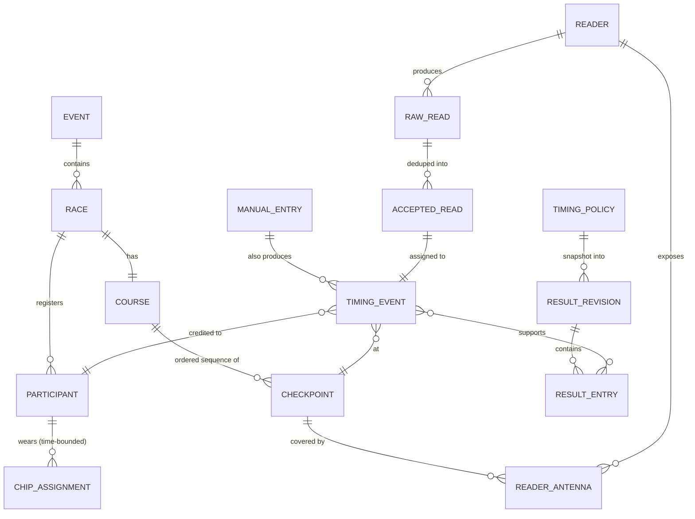
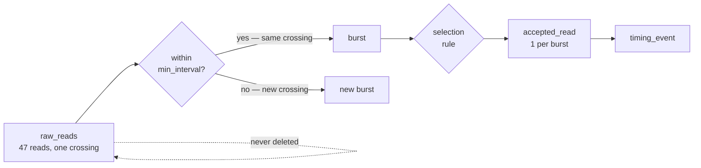
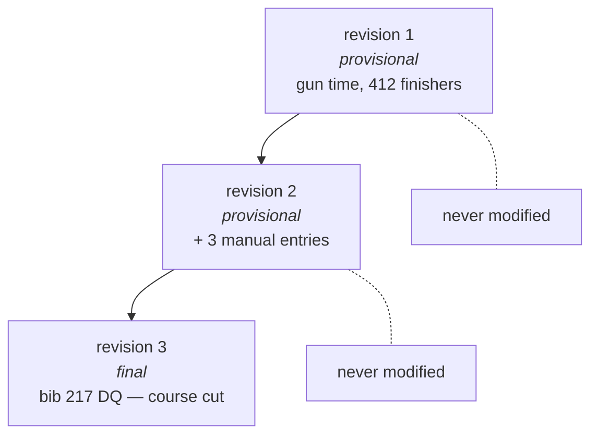

# SplitForge Timing Model

> Status: proposed. Nothing here is implemented yet. Decisions marked **OPEN** are
> tracked in [open-questions.md](open-questions.md).

This document defines what SplitForge stores, what it derives, and what it refuses to
change. It is the contract that makes results defensible when a runner disputes them.

## 1. The evidence principle

SplitForge separates two kinds of data, and never confuses them:

| | **Evidence** | **Derivation** |
|---|---|---|
| What | What a device actually reported | What we concluded from it |
| Examples | `raw_reads`, `manual_entries` | `accepted_reads`, `timing_events`, `result_entries` |
| Mutability | **Append-only. Never updated, never deleted.** | Regenerated freely |
| On a bad rule | Untouched | Recomputed |
| On a dispute | The answer | The thing being disputed |

Every derived record carries references to the evidence that produced it. If you cannot
walk from a runner's finish time back to the specific byte sequence a reader sent, the
model is broken.

## 2. Entity model



### Chip assignments are time-bounded

A chip is not permanently a person. Chips get reused across races in a day, reassigned
after a DNS, and swapped when one fails at the start line. `chip_assignments` therefore
carries `valid_from` / `valid_until`, and chip→participant resolution is **a function of
the read's timestamp**, not a lookup of current state.

This is the single most common source of wrong results in chip timing, and it is a
data-model problem, not a bug to be fixed later.

## 3. Timestamp semantics

Three timestamps, three different meanings. All stored, all UTC, none interchangeable.

| Column | Source | Role |
|---|---|---|
| `reader_timestamp_utc` | The reader's own clock | **Authoritative timing value when present** |
| `received_at_utc` | Pi clock, when the frame was read off the socket | Diagnostic. Clock drift, network delay, reader fault |
| `recorded_at_utc` | Pi clock, at database insert | Diagnostic. Write latency, storage stalls |

`reader_timestamp_utc` wins because the reader stamps the read at detection, before
network buffering, adapter scheduling, or a busy Pi can add jitter.

### The qualifier that makes this safe

A reader timestamp is only as good as the reader's clock, and many RFID readers ship with
an unsynchronized clock — LLRP's `UTCTimestamp` is microseconds since the Unix epoch as
*the reader believes it*. A reader that has never been synchronized will happily report
timestamps years off, and a naive "reader wins" rule would make that authoritative.
Readers with no clock set report `Uptime` instead, which a careless adapter will read as a
date in 1970.

So the rule is implemented as stated, with two guardrails:

1. **Per-reader timestamp trust.** Each reader is configured as `trusted`, `untrusted`
   (use `received_at_utc`, record why), or `auto`.
2. **Offset and skew recording.** Every raw read stores
   `clock_offset_ms = received_at_utc - reader_timestamp_utc`, and offset/skew are tracked
   continuously in `clock_samples`. A reader whose offset is large or drifting is a health
   alarm, and the measurements are retained so a systematically skewed reader can be
   corrected *at derivation time* — never by rewriting the journal.

### Device clock health

The Pi's own clock is also suspect: a Pi 3 has **no battery-backed RTC**, so it boots
believing it is whenever it last shut down. Every raw read records the device's clock
state at the time of the read. A read taken before synchronization is flagged, not
discarded.

> **This is the hardest unsolved problem in the design.** Offline-first removes NTP, which
> is exactly what would normally keep these clocks honest, and an uncompensated oscillator
> exhausts the ±0.1 s accuracy budget within about 30–90 minutes. The full analysis —
> error budgets, which measurements clock error actually corrupts, `Uptime` vs
> `UTCTimestamp`, offset estimation, and the hardware recommendation — is in
> **[clock-and-time-discipline.md](clock-and-time-discipline.md)**.
>
> Short version: fit a DS3231 RTC and a GPS/PPS receiver, and make the Pi the LAN's NTP
> server so the readers share its clock domain.

## 4. Raw read

```rust
pub struct RawRead {
    pub id: Uuid,
    pub source: ReaderId,
    pub antenna: Option<u16>,
    pub epc: String,
    pub reader_timestamp: Option<DateTime<Utc>>,
    pub received_at: DateTime<Utc>,
    pub rssi_dbm: Option<i16>,
    pub raw_payload: Vec<u8>,
}
```

Storage adds `recorded_at`, `received_at_monotonic_ns`, `reader_uptime_us`,
`clock_offset_ms`, `device_clock_state`, `timestamp_source`, `payload_sha256`, and the
reader's message identity where one exists. The clock-related fields are specified in
[clock-and-time-discipline.md § 8](clock-and-time-discipline.md#8-what-every-raw-read-records).

Rules:

- **Append-only.** No `UPDATE`, no `DELETE` on any normal path. Enforced by convention
  now, **and** enforced by `BEFORE UPDATE` / `BEFORE DELETE` triggers that abort — see
  [ADR-0011](adr/0011-append-only-enforced-by-triggers.md).
- **Store before deciding.** The read is persisted before dedup, before chip resolution,
  before anything looks at whether it "makes sense."
- **Store unrecognized chips.** An EPC with no participant mapping is still recorded. It
  is frequently a roster error, not a stray tag, and discovering that after the race
  requires having kept it.
- **Retain the payload.** Full bytes in diagnostic capture mode, `payload_sha256` always.
  Deduplication bugs are diagnosed from bytes, not from summaries.
- **Unique message identity where available.** If the reader supplies a stable message ID,
  enforce a unique constraint so an adapter replay after reconnect cannot double-insert.
  If it does not, keep everything and let the engine deduplicate — losing a read is worse
  than storing a duplicate.

## 5. Deduplication

A runner crossing a mat generates tens to hundreds of reads. Exactly one should become a
timing event.



**Grouping key:** `(chip_epc, checkpoint_id, burst)` where a burst is a run of reads
separated by less than `min_interval_ms` for that checkpoint.

**Selection rule** — which read in the burst becomes the accepted one. Configurable per
checkpoint, because the right answer depends on physics:

| Rule | Picks | Use when |
|---|---|---|
| `first` | Earliest read in the burst | Default. A finish line credits the first credible detection |
| `first_above_rssi` | Earliest read above an RSSI floor | Antennas with reach beyond the mat — rejects early pickup from a runner still approaching |
| `peak_rssi` | Strongest read | Closest physical approach matters more than earliest detection |

`first` is the default and the conventional choice, but it is genuinely a tradeoff: an
over-powered antenna can detect a chip several meters out, and `first` will credit that
moment. `first_above_rssi` exists for that case and needs on-site calibration.

**Lap and checkpoint logic:**

- `min_interval_ms` per checkpoint — suppresses the same crossing
- `min_lap_ms` per course — a lap credited faster than this is rejected as a re-read, not
  an impossibly fast lap
- Checkpoint sequence — a course declares its expected checkpoint order; out-of-sequence
  events are recorded and **flagged**, never silently dropped
- Expected lap count — used for completion status, not for discarding reads

Every rejected or suppressed read keeps a row explaining *which rule rejected it*.
"Missing from results" and "rejected by rule X at time T" are very different answers to
give a runner.

## 6. Timing events and manual entries

A `timing_event` says: *participant P was at checkpoint C at time T, per this evidence.*

It has exactly one origin:

- an `accepted_read` (derived from raw reads), or
- a `manual_entry` (an operator typed it)

Manual entries are **evidence too** — append-only, recording who entered it, when, why,
and what they claimed. An operator writing down a bib at the finish because a chip failed
is producing a primary record, and it deserves the same immutability as a reader report.

Timing events themselves are derived and may be regenerated. Their evidence cannot.

## 7. Results and revisions



A `result_revision` is immutable and records:

- monotonically increasing revision number, scoped to the race
- `generated_at`, and the operator who generated it
- `status`: `provisional` | `final`
- a **snapshot of the timing policy** used — not a reference to mutable config
- the set of timing events it was derived from
- a reason for the revision

That policy snapshot matters. "Revision 2 used a 5000 ms dedup window; revision 3 used
3000 ms" is the kind of question that surfaces three weeks later, and a foreign key into
a settings table that has since been edited cannot answer it.

**Corrections never edit a revision.** A DQ, a corrected chip assignment, a late manual
entry — each produces a new revision. Revision 1 remains exactly as published, which is
the point: it was published, someone screenshotted it, and denying that is worse than
superseding it.

### First-version scoring scope

Deliberately minimal (see [roadmap](roadmap.md) Milestone 4):

- One start checkpoint, one finish checkpoint
- Gun time and chip time
- First valid finish per participant
- Statuses: `Finished`, `DNS`, `DNF`, `DQ`
- Overall placement by the configured timing policy

Explicitly **not** in the first version: age-group scoring, waves, complex course
layouts, penalties, relay teams, live public pages. Each is a source of scoring bugs, and
none should be built before the basic flow is provably correct.

### Start time policy

Configured per race, snapshotted per revision: `gun`, `chip`, `wave`, or `rolling`. Chip
time requires a start-line detection; a participant with no start read under a `chip`
policy is a flagged condition with a defined fallback, not a null.

## 8. Auditability

`audit_log` records every operator action that could change a published outcome: policy
edits, status changes, chip reassignments, roster re-imports, manual entries, revision
publication, backup and restore. Each row carries actor, timestamp, action, and
before/after state.

The test for whether the audit model is sufficient:

> Given a finished event and a disputed result, can you reconstruct — from the database
> alone, without logs, without asking anyone — *why* that participant received that time,
> and *what changed* between the provisional and final results?

If the answer is no, the model is incomplete regardless of how clean the code is.

## 9. Core tables

```text
events                 races                  courses
checkpoints            readers                reader_antennas
participants           chip_assignments       timing_policies
raw_reads          ←   append-only evidence
manual_entries     ←   append-only evidence
accepted_reads         timing_events          rejected_reads
clock_samples          time_corrections
result_revisions       result_entries
audit_log              outbox_messages        schema_migrations
```

Operational requirements on the schema:

- Backups are one CLI command, plus an automatic pre-race snapshot
- Sudden process termination during a write, and during a reader reconnect, are tested
  scenarios — not assumptions
- Restore is rehearsed before an event, not discovered during one
